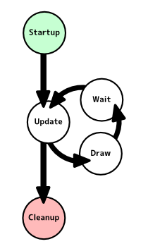
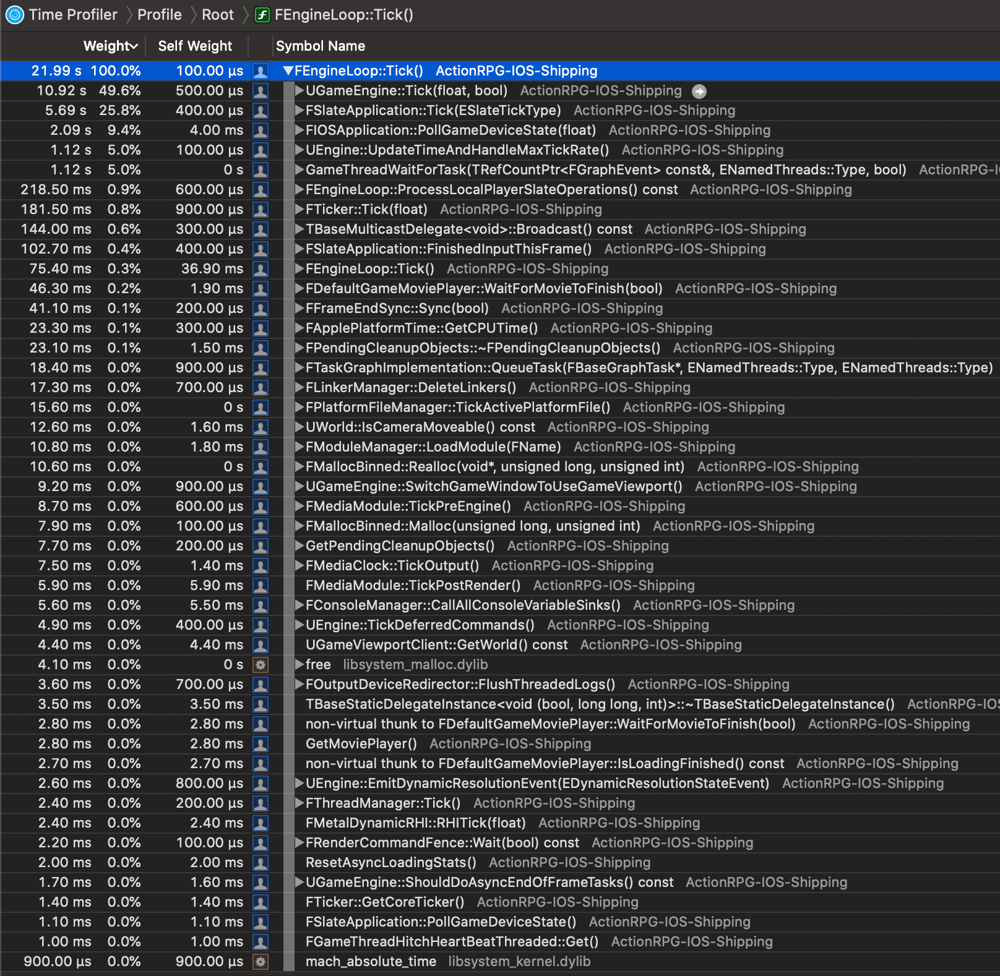

# [WIP] Unreal Source Explained

Unreal Source Explained (USE) is an Unreal source code analysis, based on profilers.  
For more infomation, see the [repo](https://github.com/donaldwuid/unreal_source_explained) in github.

## Contents

1. [Overview](main.md)
1. [Initialization](initialization.md)
1. [Loop](loop.md)
1. [Memory Management](memory.md)
1. [Thread Management](thread.md)
1. [Blueprint Visual Scripting](scripting.md)
1. [Rendering](rendering.md)
1. [Gameplay](gameplay.md)

#Loop

Every game is running frame by frame. Inside one frame, several submodules are called sequentially. This routine is known as *Game Loop*.

Inside `FEngineLoop::Tick()`([link](https://github.com/EpicGames/UnrealEngine/blob/42cbf957ad0e713dec57a5828f72d116c8083011/Engine/Source/Runtime/Launch/Private/LaunchEngineLoop.cpp#L4012)), there are many hardcoded submodules' ticks get called sequetially. This following image is the tick overview, however, it's sorted by the CPU Time, not the calling order.

Calling order is important, it's one of the reasons that lead to one-frame-off bugs.

The general rule is: if statusa is depended by statusb, then statusa should gets updated earlier than statusb inside one frame.  
This seems to be easy, but if there are lots of status, and the dependecies are complicated, it needs lots of effort to achieve correct status update order.   
But luckily, lots status dependecy don't care correct update order at all because their one-frame-off usually dont't result in visually noticeable motion. For other crucial status (e.g., camera, character), they still demands correct update order.

So, here is some important call extractions from `FEngineLoop::Tick()`, sorted by the calling order:
- broadcast the frame begin event([link](https://github.com/EpicGames/UnrealEngine/blob/42cbf957ad0e713dec57a5828f72d116c8083011/Engine/Source/Runtime/Launch/Private/LaunchEngineLoop.cpp#L4083)): `FCoreDelegates::OnBeginFrame`([link](https://github.com/EpicGames/UnrealEngine/blob/5a8595da4c1427e70707158a8173b4ac774faa8e/Engine/Source/Runtime/Core/Private/Misc/CoreDelegates.cpp#L83));
- update the time stamp, max tick rate of this frame([link](https://github.com/EpicGames/UnrealEngine/blob/42cbf957ad0e713dec57a5828f72d116c8083011/Engine/Source/Runtime/Launch/Private/LaunchEngineLoop.cpp#L4101)): `UEngine::UpdateTimeAndHandleMaxTickRate()`([link](https://github.com/EpicGames/UnrealEngine/blob/7256ed00bd50ce4c8d099e9e8495d37b0e5130e5/Engine/Source/Runtime/Engine/Private/UnrealEngine.cpp#L1862))
- get the input data from the OS([link](https://github.com/EpicGames/UnrealEngine/blob/42cbf957ad0e713dec57a5828f72d116c8083011/Engine/Source/Runtime/Launch/Private/LaunchEngineLoop.cpp#L4230)) : `FIOSApplication::PollGameDeviceState()`([link](https://github.com/EpicGames/UnrealEngine/blob/a00dbfadf5baa73b564eecd774305226e4d031b1/Engine/Source/Runtime/ApplicationCore/Private/IOS/IOSApplication.cpp#L73));
- **update the world of objects!**([link](https://github.com/EpicGames/UnrealEngine/blob/42cbf957ad0e713dec57a5828f72d116c8083011/Engine/Source/Runtime/Launch/Private/LaunchEngineLoop.cpp#L4251)): `UGameEngine::Tick()`([link](https://github.com/EpicGames/UnrealEngine/blob/2f53e5141feb2eaaf521f9193b07bd6103d69230/Engine/Source/Runtime/Engine/Private/GameEngine.cpp#L1539)), this is the **most important call** among others;
- process slate operations accumulated in the world ticks([link](https://github.com/EpicGames/UnrealEngine/blob/42cbf957ad0e713dec57a5828f72d116c8083011/Engine/Source/Runtime/Launch/Private/LaunchEngineLoop.cpp#L4354)): `FEngineLoop::ProcessLocalPlayerSlateOperations()`([link](https://github.com/EpicGames/UnrealEngine/blob/42cbf957ad0e713dec57a5828f72d116c8083011/Engine/Source/Runtime/Launch/Private/LaunchEngineLoop.cpp#L3733));
- rearrange and paint the UI([link](https://github.com/EpicGames/UnrealEngine/blob/42cbf957ad0e713dec57a5828f72d116c8083011/Engine/Source/Runtime/Launch/Private/LaunchEngineLoop.cpp#L4357)): `FSlateApplication::Tick()`([link](https://github.com/EpicGames/UnrealEngine/blob/fd945f737de41823c384f819fd0c0f39444288e4/Engine/Source/Runtime/Slate/Private/Framework/Application/SlateApplication.cpp#L1689));
- custom registered tick is called([link](https://github.com/EpicGames/UnrealEngine/blob/42cbf957ad0e713dec57a5828f72d116c8083011/Engine/Source/Runtime/Launch/Private/LaunchEngineLoop.cpp#L4456)): `FTicker::Tick()`([link](https://github.com/EpicGames/UnrealEngine/blob/cbfcbbb93b3d40c36067a9e962b01e2e35149ead/Engine/Source/Runtime/Core/Private/Containers/Ticker.cpp#L56))
- broadcast the frame end event([link](https://github.com/EpicGames/UnrealEngine/blob/42cbf957ad0e713dec57a5828f72d116c8083011/Engine/Source/Runtime/Launch/Private/LaunchEngineLoop.cpp#L4470)): `FCoreDelegates::OnEndFrame`([link](https://github.com/EpicGames/UnrealEngine/blob/5a8595da4c1427e70707158a8173b4ac774faa8e/Engine/Source/Runtime/Core/Private/Misc/CoreDelegates.cpp#L84))

