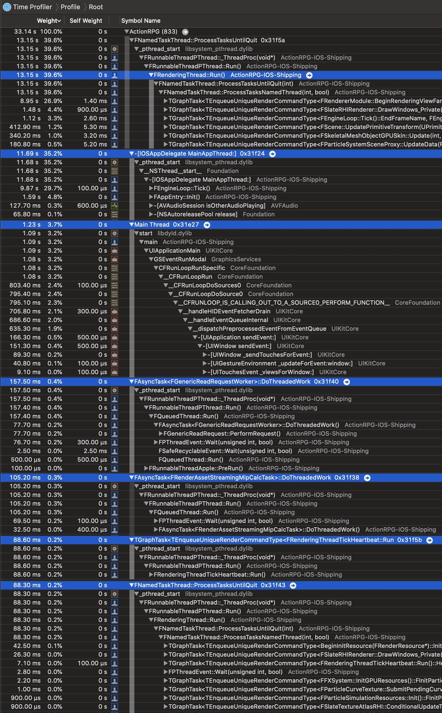
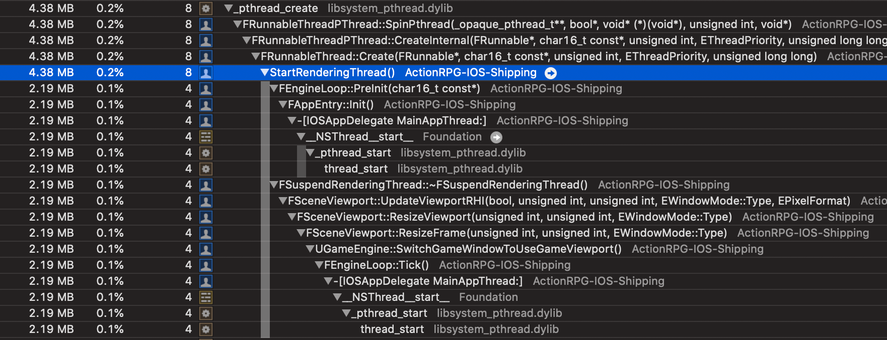
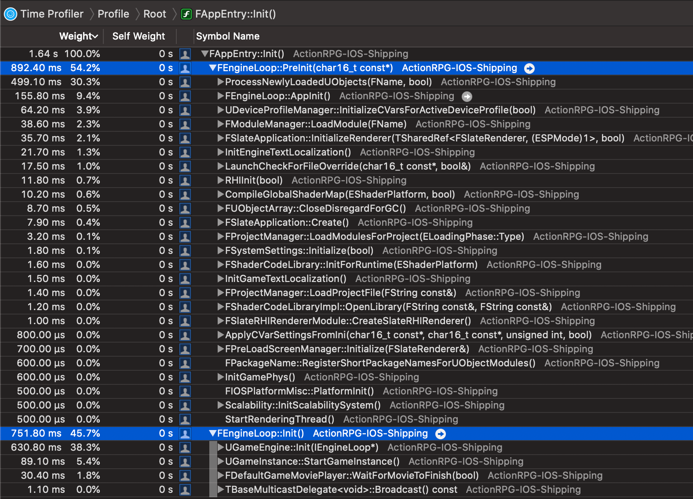
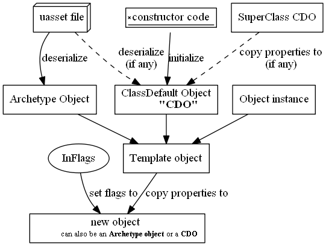
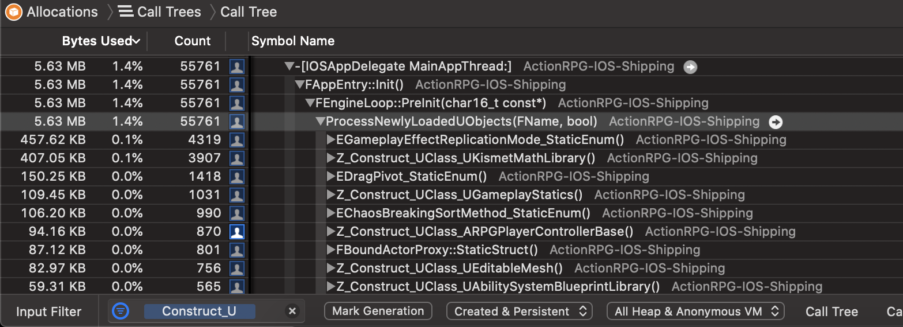

# [WIP] Unreal Source Explained

[toc]

Unreal Source Explained (USE) is an Unreal source code analysis, based on profilers.  
For more infomation, see the [repo](https://github.com/donaldwuid/unreal_source_explained) in github.

## Thread Overview
Unreal has these several important threads:
- Game thread
- Main thread
- Task Threads
	- Render thread (maybe with the additional RHI thread)
	- File I/O threads
	- Mipmap streaming calculations
	- etc.

This following image is the *threads overview* in the profiler. Threads are sorted by their CPU Time, which usually infer their importance.


We'll briefly discuss some important threads below.

### Game Thread
> see "`[IOSAppDelegate MainAppThread:]`" in the above thread overview image.

Game thread's main mission is running `FEngineLoop`([link](https://github.com/EpicGames/UnrealEngine/blob/33e9eedc27e80b9e67c1d1a2667672ed23c7531b/Engine/Source/Runtime/Launch/Public/LaunchEngineLoop.h#L21)), including its initialization `PreInit()`([link](https://github.com/EpicGames/UnrealEngine/blob/42cbf957ad0e713dec57a5828f72d116c8083011/Engine/Source/Runtime/Launch/Private/LaunchEngineLoop.cpp#L1158)) and tick `Tick()`([link](https://github.com/EpicGames/UnrealEngine/blob/42cbf957ad0e713dec57a5828f72d116c8083011/Engine/Source/Runtime/Launch/Private/LaunchEngineLoop.cpp#L4012)).  
Every game is running frame by frame. Inside one frame, several submodules are called sequentially. This routine is known as *Game Loop*.  
`FEngineLoop` is Unreal's game loop. Each time `FEngineLoop::Tick()` is called, that means one new frame has just begun.

Note that in Unreal, game thread's name is `[IOSAppDelegate MainAppThread:]`, it's Unreal's "main thread", do not confuse with the process's main thread.

### Main Thread
> see "`Main Thread`" in the above thread overview image.

This thread is the iOS process's main thread, it's the first thread that gets created and the entry point gets called.  
In Unreal, Main thread doesn't carry out heavy jobs, it just handles some native iOS messages, such as touch event.

### Task Threads
Unreal has several ways to assign tasks to threads, these threads are called *Task Threads*. This task threads management will be discussed in future chapters.  
These following threads are implemented as task threads.
#### Render Threads
> see "`FRenderingThread::Run()`" in the above thread overview image.

Render thread calls `FRenderingThread::Run()`([link](https://github.com/EpicGames/UnrealEngine/blob/b4a54829162aa07a28846da2e91147912a7b67d8/Engine/Source/Runtime/RenderCore/Private/RenderingThread.cpp#L458)), and takes charge of all the rendering tasks, such as updating pritimitives' transform, updating particle systems, drawing slate ui elements, etc. These rendering tasks usually update and prepare rendering data for the GPU to run.

Render thread and the game thread are usually the heaviest 2 threads in most games. You can see the render thread is actually the heaviest thread in this profiling.

Render thread is created in `FEngineLoop::PreInit()`([link](https://github.com/EpicGames/UnrealEngine/blob/42cbf957ad0e713dec57a5828f72d116c8083011/Engine/Source/Runtime/Launch/Private/LaunchEngineLoop.cpp#L2339)). You can observe the thread creation in the Allocation profiler, because each thread creation comes along with some amount of thread stack memory allocation.

Note the thread creation call stack is reversed, the caller is under the callee.

Notice that sometimes you can see there seems to be another thread running `FRenderingThread::Run()` in the Time Profiler, this is because render thread will be recreated during viewport resizes([link](https://github.com/EpicGames/UnrealEngine/blob/b4a54829162aa07a28846da2e91147912a7b67d8/Engine/Source/Runtime/RenderCore/Private/RenderingThread.cpp#L171)), and the Time Profiler captures both the destroyed and recreated render threads. There is only one render thread at any given time.

##### RHI Thread
What's more, Unreal can be [Parallel Rendering](https://docs.unrealengine.com/en-US/Programming/Rendering/ParallelRendering/index.html) with the RHI (Render Hardware Interface) thread, which translates the render thread's render commands into specific device GPU commands. This RHI thread may improve performance in some platform.   
However, in iOS the RHI thread is disabled, because `GRHISupportsRHIThread`([link](https://github.com/EpicGames/UnrealEngine/blob/697a6f07ef518d03ef3611efdafc2e9a89b0fc3c/Engine/Source/Runtime/Apple/MetalRHI/Private/MetalRHI.cpp#L395)) and `bSupportsRHIThread`([link](https://github.com/EpicGames/UnrealEngine/blob/697a6f07ef518d03ef3611efdafc2e9a89b0fc3c/Engine/Source/Runtime/Apple/MetalRHI/Private/MetalRHI.cpp#L226)) is disabled. Unreal has this comment([link](https://github.com/EpicGames/UnrealEngine/blob/bcc5bcf128a758f0de72c4e460a16423a200d915/Engine/Source/Runtime/Apple/MetalRHI/Public/MetalResources.h#L15)):
```c++
/** Parallel execution is available on Mac but not iOS for the moment - it needs to be tested because it isn't cost-free */
```
You might modify the source code to enable the RHI thread in mobile devices with proper device capability test.

#### File I/O Threads
> see "`FAsyncTask<FGenericReadRequestWorker>::DoThreadedWork()`" in the above thread overview image.


## Initialization
<!-- TODO: Change this to life-cycle and include both Initialization and Finalization -->

###  Engine Initialization Overview


As you can see in the image above, Unreal is initialized by two main steps: `FEngineLoop::PreInit()`([link](https://github.com/EpicGames/UnrealEngine/blob/42cbf957ad0e713dec57a5828f72d116c8083011/Engine/Source/Runtime/Launch/Private/LaunchEngineLoop.cpp#L993)) and `FEngineLoop::Init()`([link](https://github.com/EpicGames/UnrealEngine/blob/42cbf957ad0e713dec57a5828f72d116c8083011/Engine/Source/Runtime/Launch/Private/LaunchEngineLoop.cpp#L3410)). They are called in `FAppEntry::Init()`([link](https://github.com/EpicGames/UnrealEngine/blob/395c9713d5b5eee9daf8b7077bcac311c85a63a1/Engine/Source/Runtime/Launch/Private/IOS/LaunchIOS.cpp#L372)) in iOS, and `AndroidMain()`([link](https://github.com/EpicGames/UnrealEngine/blob/8951e6117b483a89befe98ac2102caad2ce26cab/Engine/Source/Runtime/Launch/Private/Android/LaunchAndroid.cpp#L445)) in Android.

You may think `PreInit()` is the low-level initializaiton and `Init()` is the high-level.

Note in Unreal there are two ways to manage submodules: [*Module*](https://docs.unrealengine.com/en-US/Programming/BuildTools/UnrealBuildTool/ModuleFiles/index.html) and [*Plugins*](https://docs.unrealengine.com/en-US/Programming/Plugins/index.html). Module conatains only code, while Plugin can contain assets and/or Modules.

To name a few things get initialized in `PreInit()`, in order:
- load core module([link](https://github.com/EpicGames/UnrealEngine/blob/42cbf957ad0e713dec57a5828f72d116c8083011/Engine/Source/Runtime/Launch/Private/LaunchEngineLoop.cpp#L1719)): `LoadCoreModules()`([link](https://github.com/EpicGames/UnrealEngine/blob/42cbf957ad0e713dec57a5828f72d116c8083011/Engine/Source/Runtime/Launch/Private/LaunchEngineLoop.cpp#L3122)) for "CoreUObject";
- fundamental modules([link](https://github.com/EpicGames/UnrealEngine/blob/42cbf957ad0e713dec57a5828f72d116c8083011/Engine/Source/Runtime/Launch/Private/LaunchEngineLoop.cpp#L1838)): `LoadPreInitModules()`([link](https://github.com/EpicGames/UnrealEngine/blob/42cbf957ad0e713dec57a5828f72d116c8083011/Engine/Source/Runtime/Launch/Private/LaunchEngineLoop.cpp#L3136)) for "Engine", "Renderer", "AnimGraphRuntime", "Landscape", "RenderCore";
- "application-like" modules([link](https://github.com/EpicGames/UnrealEngine/blob/42cbf957ad0e713dec57a5828f72d116c8083011/Engine/Source/Runtime/Launch/Private/LaunchEngineLoop.cpp#L1861)): `FEngineLoop::AppInit()`([link](https://github.com/EpicGames/UnrealEngine/blob/42cbf957ad0e713dec57a5828f72d116c8083011/Engine/Source/Runtime/Launch/Private/LaunchEngineLoop.cpp#L4635))
	- localization([link](https://github.com/EpicGames/UnrealEngine/blob/42cbf957ad0e713dec57a5828f72d116c8083011/Engine/Source/Runtime/Launch/Private/LaunchEngineLoop.cpp#L4639)): `BeginInitTextLocalization()`([link](https://github.com/EpicGames/UnrealEngine/blob/068ca68f0b37e2c65bf02254c713fd604d4fc211/Engine/Source/Runtime/Core/Private/Internationalization/TextLocalizationManager.cpp#L293))
	- plugins ([link](https://github.com/EpicGames/UnrealEngine/blob/42cbf957ad0e713dec57a5828f72d116c8083011/Engine/Source/Runtime/Launch/Private/LaunchEngineLoop.cpp#L4778)): `FPluginManager::LoadModulesForEnabledPlugins()` ([link](https://github.com/EpicGames/UnrealEngine/blob/c33049fcbde20fb59e44dfc32b25dc610561314c/Engine/Source/Runtime/Projects/Private/PluginManager.cpp#L985));
	- configs ([link](https://github.com/EpicGames/UnrealEngine/blob/42cbf957ad0e713dec57a5828f72d116c8083011/Engine/Source/Runtime/Launch/Private/LaunchEngineLoop.cpp#L4772)): `FConfigCacheIni::InitializeConfigSystem()`([link](https://github.com/EpicGames/UnrealEngine/blob/73fe4c86de84d8e4d98861f5f3793b1dedbc5190/Engine/Source/Runtime/Core/Private/Misc/ConfigCacheIni.cpp#L3409))
- scalability([link](https://github.com/EpicGames/UnrealEngine/blob/42cbf957ad0e713dec57a5828f72d116c8083011/Engine/Source/Runtime/Launch/Private/LaunchEngineLoop.cpp#L1922)): `InitScalabilitySystem()`([link](https://github.com/EpicGames/UnrealEngine/blob/cbfcbbb93b3d40c36067a9e962b01e2e35149ead/Engine/Source/Runtime/Engine/Private/Scalability.cpp#L337)). *[Scalability](https://docs.unrealengine.com/en-US/Engine/Performance/Scalability/ScalabilityReference/index.html)* adjusts the quality of various features in order to maintain the best performance for your game on different platforms and hardware;
- game physics([link](https://github.com/EpicGames/UnrealEngine/blob/42cbf957ad0e713dec57a5828f72d116c8083011/Engine/Source/Runtime/Launch/Private/LaunchEngineLoop.cpp#L2081)): `InitGamePhys()`([link](https://github.com/EpicGames/UnrealEngine/blob/f9b3324b32be95b1fd37235e7b7f2fbb502db285/Engine/Source/Runtime/Engine/Private/PhysicsEngine/PhysLevel.cpp#L274))
- slate application([link](https://github.com/EpicGames/UnrealEngine/blob/42cbf957ad0e713dec57a5828f72d116c8083011/Engine/Source/Runtime/Launch/Private/LaunchEngineLoop.cpp#L2181)): `FSlateApplication::Create()`([link](https://github.com/EpicGames/UnrealEngine/blob/fd945f737de41823c384f819fd0c0f39444288e4/Engine/Source/Runtime/Slate/Private/Framework/Application/SlateApplication.cpp#L911))
- RHI([link](https://github.com/EpicGames/UnrealEngine/blob/42cbf957ad0e713dec57a5828f72d116c8083011/Engine/Source/Runtime/Launch/Private/LaunchEngineLoop.cpp#L2222)): `RHIInit()`([link](https://github.com/EpicGames/UnrealEngine/blob/b8a9b7a193fa1942002ef3d78520d318dd324ed1/Engine/Source/Runtime/RHI/Private/DynamicRHI.cpp#L192))
- global shaders resources([link](https://github.com/EpicGames/UnrealEngine/blob/42cbf957ad0e713dec57a5828f72d116c8083011/Engine/Source/Runtime/Launch/Private/LaunchEngineLoop.cpp#L2291)): `CompileGlobalShaderMap()`([link](https://github.com/EpicGames/UnrealEngine/blob/c8686161530e05e1013572a4c34ccb52ba197057/Engine/Source/Runtime/Engine/Private/ShaderCompiler/ShaderCompiler.cpp#L4327))
- render thread ([link](https://github.com/EpicGames/UnrealEngine/blob/42cbf957ad0e713dec57a5828f72d116c8083011/Engine/Source/Runtime/Launch/Private/LaunchEngineLoop.cpp#L2339)): `StartRenderingThread()`([link](https://github.com/EpicGames/UnrealEngine/blob/b4a54829162aa07a28846da2e91147912a7b67d8/Engine/Source/Runtime/RenderCore/Private/RenderingThread.cpp#L658));
- most `UObject`s' reflection data([link](https://github.com/EpicGames/UnrealEngine/blob/42cbf957ad0e713dec57a5828f72d116c8083011/Engine/Source/Runtime/Launch/Private/LaunchEngineLoop.cpp#L2557)): `ProcessNewlyLoadedUObjects()`([link](https://github.com/EpicGames/UnrealEngine/blob/b4a54829162aa07a28846da2e91147912a7b67d8/Engine/Source/Runtime/CoreUObject/Private/UObject/UObjectBase.cpp#L983));
- start-up modules: ([link](https://github.com/EpicGames/UnrealEngine/blob/42cbf957ad0e713dec57a5828f72d116c8083011/Engine/Source/Runtime/Launch/Private/LaunchEngineLoop.cpp#L2614)): `LoadStartupCoreModules()`([link](https://github.com/EpicGames/UnrealEngine/blob/42cbf957ad0e713dec57a5828f72d116c8083011/Engine/Source/Runtime/Launch/Private/LaunchEngineLoop.cpp#L3185)): "Core", "Networking", "Messaging", "Slate", "UMG";
- load task graph module([link](https://github.com/EpicGames/UnrealEngine/blob/42cbf957ad0e713dec57a5828f72d116c8083011/Engine/Source/Runtime/Launch/Private/LaunchEngineLoop.cpp#L3078));
- engine and game localizaiton([link](https://github.com/EpicGames/UnrealEngine/blob/42cbf957ad0e713dec57a5828f72d116c8083011/Engine/Source/Runtime/Launch/Private/LaunchEngineLoop.cpp#L3093));

and `Init()` initializes these in order:
- Create the high-level game engine objects([link](https://github.com/EpicGames/UnrealEngine/blob/42cbf957ad0e713dec57a5828f72d116c8083011/Engine/Source/Runtime/Launch/Private/LaunchEngineLoop.cpp#L3481)): `UGameEngine::Init()`([link](https://github.com/EpicGames/UnrealEngine/blob/2f53e5141feb2eaaf521f9193b07bd6103d69230/Engine/Source/Runtime/Engine/Private/GameEngine.cpp#L1012))
	- `UEngine::Init()`([link](https://github.com/EpicGames/UnrealEngine/blob/7256ed00bd50ce4c8d099e9e8495d37b0e5130e5/Engine/Source/Runtime/Engine/Private/UnrealEngine.cpp#L1338)), `UEngine` is abstract base class of `UGameEngine` and `UEdtiorEngine`, and is responsible for management of systems critical to editor or game systems.;
	- `UGameUserSettings::LoadSettings()`([link](https://github.com/EpicGames/UnrealEngine/blob/d803c718c982800f1baf27cd141028b4b48ae95b/Engine/Source/Runtime/Engine/Private/GameUserSettings.cpp#L509));
	- `UGameInstance`([link](https://github.com/EpicGames/UnrealEngine/blob/c33049fcbde20fb59e44dfc32b25dc610561314c/Engine/Source/Runtime/Engine/Classes/Engine/GameInstance.h#L119)), `UGameInstance` is high-level manager object for an instance of the running game
		- create `UWorld` in `UGameInstance::InitializeStandalone()`([link](https://github.com/EpicGames/UnrealEngine/blob/252049ac8a00469d7d2044469fe23d931d6aabea/Engine/Source/Runtime/Engine/Private/GameInstance.cpp#L146)), `UWorld` is the top level object representing a map or a sandbox in which Actors and Components will exist and be rendered;
	- `UGameViewportClient` ([link](https://github.com/EpicGames/UnrealEngine/blob/786a4c405633f103fccfaf501e7813f8a7424c68/Engine/Source/Runtime/Engine/Classes/Engine/GameViewportClient.h#L53))
		- create localplayer for the viewport([link](https://github.com/EpicGames/UnrealEngine/blob/2f53e5141feb2eaaf521f9193b07bd6103d69230/Engine/Source/Runtime/Engine/Private/GameEngine.cpp#L1094)): `UGameViewportClient::SetupInitialLocalPlayer()`([link](https://github.com/EpicGames/UnrealEngine/blob/7256ed00bd50ce4c8d099e9e8495d37b0e5130e5/Engine/Source/Runtime/Engine/Private/GameViewportClient.cpp#L2019))
- and start the high level game engine([link](https://github.com/EpicGames/UnrealEngine/blob/42cbf957ad0e713dec57a5828f72d116c8083011/Engine/Source/Runtime/Launch/Private/LaunchEngineLoop.cpp#L3521)): `UGameEngine::Start()`([link](https://github.com/EpicGames/UnrealEngine/blob/2f53e5141feb2eaaf521f9193b07bd6103d69230/Engine/Source/Runtime/Engine/Private/GameEngine.cpp#L1119))


### UObject Initialization

### Archetype and CDO

To manage `UObject`s, Unreal uses `UObjectBase::ObjectFlags`([link](https://github.com/EpicGames/UnrealEngine/blob/bf95c2cbc703123e08ab54e3ceccdd47e48d224a/Engine/Source/Runtime/CoreUObject/Public/UObject/UObjectBase.h#L239)) to record a `UObject` instance's states.

A `UObject` instance is called *Archetype* object if it has `RF_ArchetypeObject` flag, and it's called *Class Default Object (CDO)* if it has `RF_ClassDefaultObject`.


Unreal eventually calls `StaticConstructObject_Internal()`([link](https://github.com/EpicGames/UnrealEngine/blob/bf95c2cbc703123e08ab54e3ceccdd47e48d224a/Engine/Source/Runtime/CoreUObject/Public/UObject/UObjectGlobals.h#L281)) to create every `UObject` instance, no matter it's via user's `NewObject<T>()` call ([link](https://github.com/EpicGames/UnrealEngine/blob/bf95c2cbc703123e08ab54e3ceccdd47e48d224a/Engine/Source/Runtime/CoreUObject/Public/UObject/UObjectGlobals.h#L1238)) or via Unreal's internal call. Here the most important 3 parameters of `StaticConstructObject_Internal()` are its 
- `UClass* Class`: The class of the object to create. The return value of `Class->GetDefaultObject()` is indeed the CDO;
- `UObject* Template`: If specified, the property values from this object will be copied to the new object, and the new object's ObjectArchetype value will be set to this object. If nullptr, the class default object is used instead.
- `EObjectFlags	InFlags`: The ObjectFlags to assign to the new object.

Parameter `Template` has higher priority than the CDO to copy its property value to the new object([link](https://github.com/EpicGames/UnrealEngine/blob/bf95c2cbc703123e08ab54e3ceccdd47e48d224a/Engine/Source/Runtime/CoreUObject/Private/UObject/UObjectGlobals.cpp#L2717)).

```c++
FObjectInitializer::~FObjectInitializer()
{
	//...
	UObject* Defaults = ObjectArchetype ? ObjectArchetype : BaseClass->GetDefaultObject(false);
	InitProperties(Obj, BaseClass, Defaults, bCopyTransientsFromClassDefaults);
	//...
}
```


The new object's flag is set by the `InFlags` argument. **Usually** it doesn't have `RF_ArchetypeObject` nor `RF_ClassDefaultObject` flag, therefore, the new object is just a normal instance.   
However that's not the case when the new object is a new Archetype object or a new CDO.

So what's archetype and CDO anyway, what's their similarity and difference?



As the above image shows, either an Archetype object, a CDO, or any `UObject` instance can be a **template object** to copy its properties' values into a new object.   

Any `UObject` instance can be a template object, with or without `RF_ArchetypeObject` or `RF_ClassDefaultObject` flag.

Archetype object iteself is initialized from **asset data** (e.g. uasset) in the disk. Its `RF_ArchetypeObject` flag is set when loading the asset in `FLinkerLoad::CreateExport()`([link](https://github.com/EpicGames/UnrealEngine/blob/bc6b9211003ae9e975689bf2b33718f832483a71/Engine/Source/Runtime/CoreUObject/Private/UObject/LinkerLoad.cpp#L4288)):

```c++
UObject* FLinkerLoad::CreateExport( int32 Index )
{
	FObjectExport& Export = ExportMap[ Index ];
	...
	// RF_ArchetypeObject and other flags
	EObjectFlags ObjectLoadFlags = Export.ObjectFlags;
	...
	Export.Object = StaticConstructObject_Internal
	(
		LoadClass,
		ThisParent,
		NewName,
		ObjectLoadFlags,
		EInternalObjectFlags::None,
		Template
	);
}
```

CDO itself is initialized by 
- its **constructor code**, 
- its **Superclass's CDO** if it has `SuperClass`([link](https://github.com/EpicGames/UnrealEngine/blob/749698e58259778b9488e040d2af58e49973d45e/Engine/Source/Runtime/CoreUObject/Private/UObject/Class.cpp#L3020)), 
- and also, by its asset data if it has linked asset in `UClass::SerializeDefaultObject()`([link](https://github.com/EpicGames/UnrealEngine/blob/749698e58259778b9488e040d2af58e49973d45e/Engine/Source/Runtime/CoreUObject/Private/UObject/Class.cpp#L3889)).

CDOs have both the `RF_ClassDefaultObject` **and** `RF_ArchetypeObject` flags, they are set and explained when creating the CDO ([link](https://github.com/EpicGames/UnrealEngine/blob/bf95c2cbc703123e08ab54e3ceccdd47e48d224a/Engine/Source/Runtime/CoreUObject/Private/UObject/Class.cpp#L3073)):
```c++
UObject* UClass::CreateDefaultObject()
{
	...
	// RF_ArchetypeObject flag is often redundant to RF_ClassDefaultObject, but we need to tag
	// the CDO as RF_ArchetypeObject in order to propagate that flag to any default sub objects.
	ClassDefaultObject = StaticAllocateObject(this, GetOuter(), NAME_None, EObjectFlags(RF_Public|RF_ClassDefaultObject|RF_ArchetypeObject));
	...
}
```
For the same reason, all *Default Subobject*s have both `RF_DefaultSubObject` and `RF_ArchetypeObject` flags.

### AActor and UComponent initialization


### Class reflection data
Most (near all) `Z_Construct_UClass_XXX()` fuctions are called only in the initialization stage via `ProcessNewlyLoadedUObjects()`([link](https://github.com/EpicGames/UnrealEngine/blob/b4a54829162aa07a28846da2e91147912a7b67d8/Engine/Source/Runtime/CoreUObject/Private/UObject/UObjectBase.cpp#L983)).


`Z_Construct_UClass_XXX()` are functions that construct the Unreal intrinsic "class reflection data". These functions' code are generated by macro in `IMPLEMENT_INTRINSIC_CLASS`([link](https://github.com/EpicGames/UnrealEngine/blob/0f9ad9685896e0581d0fe963034b1cb82b1a4e3b/Engine/Source/Runtime/CoreUObject/Public/UObject/ObjectMacros.h#L1604)):

```C++
#define IMPLEMENT_INTRINSIC_CLASS(TClass, TRequiredAPI, TSuperClass, TSuperRequiredAPI, TPackage, InitCode) \
	IMPLEMENT_CLASS(TClass, 0) \
	TRequiredAPI UClass* Z_Construct_UClass_##TClass(); \
	struct Z_Construct_UClass_##TClass##_Statics \
	{ \
		static UClass* Construct() \
		{ \
			extern TSuperRequiredAPI UClass* Z_Construct_UClass_##TSuperClass(); \
			UClass* SuperClass = Z_Construct_UClass_##TSuperClass(); \
			UClass* Class = TClass::StaticClass(); \
			UObjectForceRegistration(Class); \
			check(Class->GetSuperClass() == SuperClass); \
			InitCode \
			Class->StaticLink(); \
			return Class; \
		} \
	}; \
	UClass* Z_Construct_UClass_##TClass() \
	{ \
		static UClass* Class = NULL; \
		if (!Class) \
		{ \
			Class = Z_Construct_UClass_##TClass##_Statics::Construct();\
		} \
		check(Class->GetClass()); \
		return Class; \
	} \

    ...
```

## Loop
Every game is running frame by frame. Inside one frame, several submodules are called sequentially. This routine is known as *Game Loop*.


Inside `FEngineLoop::Tick()`([link](https://github.com/EpicGames/UnrealEngine/blob/42cbf957ad0e713dec57a5828f72d116c8083011/Engine/Source/Runtime/Launch/Private/LaunchEngineLoop.cpp#L4012)), there are many hardcoded submodules' ticks get called sequetially. This following image is the tick overview, however, it's sorted by the CPU Time, not the calling order.


Calling order is important, it's one of the reasons that lead to one-frame-off bugs.

The general rule is: if status<sub>a</sub> is depended by status<sub>b</sub>, then status<sub>a</sub> should gets updated earlier than status<sub>b</sub> inside one frame.  
This seems to be easy, but if there are lots of status, and the dependecies are complicated, it needs lots of effort to achieve correct status update order.   
But luckily, lots status dependecy don't care correct update order at all because their one-frame-off usually dont't result in visually noticeable motion. For other crucial status (e.g., camera, character), they still demands correct update order.

So, here is some important call extractions from `FEngineLoop::Tick()`, sorted by the calling order:
- broadcast the frame begin event([link](https://github.com/EpicGames/UnrealEngine/blob/42cbf957ad0e713dec57a5828f72d116c8083011/Engine/Source/Runtime/Launch/Private/LaunchEngineLoop.cpp#L4083)): `FCoreDelegates::OnBeginFrame`([link](https://github.com/EpicGames/UnrealEngine/blob/5a8595da4c1427e70707158a8173b4ac774faa8e/Engine/Source/Runtime/Core/Private/Misc/CoreDelegates.cpp#L83));
- update the time stamp, max tick rate of this frame([link](https://github.com/EpicGames/UnrealEngine/blob/42cbf957ad0e713dec57a5828f72d116c8083011/Engine/Source/Runtime/Launch/Private/LaunchEngineLoop.cpp#L4101)): `UEngine::UpdateTimeAndHandleMaxTickRate()`([link](https://github.com/EpicGames/UnrealEngine/blob/7256ed00bd50ce4c8d099e9e8495d37b0e5130e5/Engine/Source/Runtime/Engine/Private/UnrealEngine.cpp#L1862))
- get the input data from the OS([link](https://github.com/EpicGames/UnrealEngine/blob/42cbf957ad0e713dec57a5828f72d116c8083011/Engine/Source/Runtime/Launch/Private/LaunchEngineLoop.cpp#L4230)) : `FIOSApplication::PollGameDeviceState()`([link](https://github.com/EpicGames/UnrealEngine/blob/a00dbfadf5baa73b564eecd774305226e4d031b1/Engine/Source/Runtime/ApplicationCore/Private/IOS/IOSApplication.cpp#L73));
- **update the world of objects!**([link](https://github.com/EpicGames/UnrealEngine/blob/42cbf957ad0e713dec57a5828f72d116c8083011/Engine/Source/Runtime/Launch/Private/LaunchEngineLoop.cpp#L4251)): `UGameEngine::Tick()`([link](https://github.com/EpicGames/UnrealEngine/blob/2f53e5141feb2eaaf521f9193b07bd6103d69230/Engine/Source/Runtime/Engine/Private/GameEngine.cpp#L1539)), this is the **most important call** among others;
- process slate operations accumulated in the world ticks([link](https://github.com/EpicGames/UnrealEngine/blob/42cbf957ad0e713dec57a5828f72d116c8083011/Engine/Source/Runtime/Launch/Private/LaunchEngineLoop.cpp#L4354)): `FEngineLoop::ProcessLocalPlayerSlateOperations()`([link](https://github.com/EpicGames/UnrealEngine/blob/42cbf957ad0e713dec57a5828f72d116c8083011/Engine/Source/Runtime/Launch/Private/LaunchEngineLoop.cpp#L3733));
- rearrange and paint the UI([link](https://github.com/EpicGames/UnrealEngine/blob/42cbf957ad0e713dec57a5828f72d116c8083011/Engine/Source/Runtime/Launch/Private/LaunchEngineLoop.cpp#L4357)): `FSlateApplication::Tick()`([link](https://github.com/EpicGames/UnrealEngine/blob/fd945f737de41823c384f819fd0c0f39444288e4/Engine/Source/Runtime/Slate/Private/Framework/Application/SlateApplication.cpp#L1689));
- custom registered tick is called([link](https://github.com/EpicGames/UnrealEngine/blob/42cbf957ad0e713dec57a5828f72d116c8083011/Engine/Source/Runtime/Launch/Private/LaunchEngineLoop.cpp#L4456)): `FTicker::Tick()`([link](https://github.com/EpicGames/UnrealEngine/blob/cbfcbbb93b3d40c36067a9e962b01e2e35149ead/Engine/Source/Runtime/Core/Private/Containers/Ticker.cpp#L56))
- broadcast the frame end event([link](https://github.com/EpicGames/UnrealEngine/blob/42cbf957ad0e713dec57a5828f72d116c8083011/Engine/Source/Runtime/Launch/Private/LaunchEngineLoop.cpp#L4470)): `FCoreDelegates::OnEndFrame`([link](https://github.com/EpicGames/UnrealEngine/blob/5a8595da4c1427e70707158a8173b4ac774faa8e/Engine/Source/Runtime/Core/Private/Misc/CoreDelegates.cpp#L84))


## Thread Management

### RunnableThread and Runnable


`FRunnableThread`([link](https://github.com/EpicGames/UnrealEngine/blob/bf95c2cbc703123e08ab54e3ceccdd47e48d224a/Engine/Source/Runtime/Core/Public/HAL/RunnableThread.h#L19)) is a cross platfrom abstract "native thread" interface in Unreal. It has different implementaion in different OS, for example, `FRunnableThreadWin`([link](https://github.com/EpicGames/UnrealEngine/blob/bf95c2cbc703123e08ab54e3ceccdd47e48d224a/Engine/Source/Runtime/Core/Private/Windows/WindowsRunnableThread.h#L22)) in Windows, `FRunnableThreadPThread`([link](https://github.com/EpicGames/UnrealEngine/blob/bf95c2cbc703123e08ab54e3ceccdd47e48d224a/Engine/Source/Runtime/Core/Private/HAL/PThreadRunnableThread.h#L23)) in [POSIX-compliant](https://en.wikipedia.org/wiki/POSIX) OS, i.e., iOS and Android.

`FRunnable`([link](https://github.com/EpicGames/UnrealEngine/blob/bf95c2cbc703123e08ab54e3ceccdd47e48d224a/Engine/Source/Runtime/Core/Public/HAL/Runnable.h#L19))'s inherited class represets the actual running workload, e.g., `FRenderingThread`([link](https://github.com/EpicGames/UnrealEngine/blob/bf95c2cbc703123e08ab54e3ceccdd47e48d224a/Engine/Source/Runtime/RenderCore/Private/RenderingThread.cpp#L394)).

Each `FRunnableThread` runs **one** `FRunnable`.

Take the POSIX `FRunnableThreadPThread` for example, static function `_ThreadProc()`([link](https://github.com/EpicGames/UnrealEngine/blob/bf95c2cbc703123e08ab54e3ceccdd47e48d224a/Engine/Source/Runtime/Core/Private/HAL/PThreadRunnableThread.h#L161)) is the thread entry point and it calls every `FRunnableThreadPThread::Run()`, as follows.
```c++
/**
	* The thread entry point. Simply forwards the call on to the right
	* thread main function
	*/
static void *STDCALL _ThreadProc(void *pThis)
{
	FRunnableThreadPThread* ThisThread = (FRunnableThreadPThread*)pThis;

	...

	// run the thread!
	ThisThread->PreRun();
	ThisThread->Run();
	ThisThread->PostRun();

	pthread_exit(NULL);
	return NULL;
}
```


then, `FRunnableThreadPThread::Run()` calls `FRunnable::Run()`([link](https://github.com/EpicGames/UnrealEngine/blob/bf95c2cbc703123e08ab54e3ceccdd47e48d224a/Engine/Source/Runtime/Core/Private/HAL/PThreadRunnableThread.cpp#L25)).

RunnableThread and Runnable is the low-level thread management in Unreal. The following Async Task and Task Graph depend on Runnable.

### Queued Thread and Async Task
Queued Thread and Async Task is Unreal's [*thread pool*](https://en.wikipedia.org/wiki/Thread_pool) implementation. All kinds of tasks are scheduled among a pool of threads.  


`FQueuedThreadPoolBase`([link](https://github.com/EpicGames/UnrealEngine/blob/bf95c2cbc703123e08ab54e3ceccdd47e48d224a/Engine/Source/Runtime/Core/Private/HAL/ThreadingBase.cpp#L599)) manages this task queue and thread queue, as follow,
```c++
/**
 * Implementation of a queued thread pool.
 */
class FQueuedThreadPoolBase : public FQueuedThreadPool
{
protected:

	/** The work queue to pull from. */
	TArray<IQueuedWork*> QueuedWork;
	
	/** The thread pool to dole work out to. */
	TArray<FQueuedThread*> QueuedThreads;

	/** All threads in the pool. */
	TArray<FQueuedThread*> AllThreads;
	
	...
}
```

There are 4 threads pools([link](https://github.com/EpicGames/UnrealEngine/blob/bf95c2cbc703123e08ab54e3ceccdd47e48d224a/Engine/Source/Runtime/Core/Private/HAL/ThreadingBase.cpp#L19)) in maximum, but the most important is the `GThreadPool`, which is the default thread pool for most tasks.

`FQueuedThread`([link](https://github.com/EpicGames/UnrealEngine/blob/bf95c2cbc703123e08ab54e3ceccdd47e48d224a/Engine/Source/Runtime/Core/Private/HAL/ThreadingBase.cpp#L462)) inherits from `FRunnable`, it represents the task worker thread. Its `Run()` waits for its `DoWorkEvent`, if signaled, it runs its current `QueuedWork` by calling `IQueuedWork::DoThreadedWork()`, as follow,

```c++
class FQueuedThread : public FRunnable
{
protected:
	/** The event that tells the thread there is work to do. */
	FEvent* DoWorkEvent;
	/** The work this thread is doing. */
	IQueuedWork* volatile QueuedWork;
	/** The pool this thread belongs to. */
	class FQueuedThreadPool* OwningThreadPool;
	/** My Thread  */
	FRunnableThread* Thread;

	virtual uint32 Run() override
	{
		while (!TimeToDie.Load(EMemoryOrder::Relaxed))
		{
			// We need to wait for shorter amount of time
			bool bContinueWaiting = true;
			while( bContinueWaiting )
			{
				// Wait for some work to do
				bContinueWaiting = !DoWorkEvent->Wait( 10 );
			}

			IQueuedWork* LocalQueuedWork = QueuedWork;
			QueuedWork = nullptr;
			FPlatformMisc::MemoryBarrier();
			while (LocalQueuedWork)
			{
				// Tell the object to do the work
				LocalQueuedWork->DoThreadedWork();
				// Let the object cleanup before we remove our ref to it
				LocalQueuedWork = OwningThreadPool->ReturnToPoolOrGetNextJob(this);
			} 
		}
		return 0;
	}

	...

	void DoWork(IQueuedWork* InQueuedWork)
	{
		// Tell the thread the work to be done
		QueuedWork = InQueuedWork;
		FPlatformMisc::MemoryBarrier();
		// Tell the thread to wake up and do its job
		DoWorkEvent->Trigger();
	}
};
```

`FEngineLoop::PreInit()`([link](https://github.com/EpicGames/UnrealEngine/blob/bf95c2cbc703123e08ab54e3ceccdd47e48d224a/Engine/Source/Runtime/Launch/Private/LaunchEngineLoop.cpp#L1804)) calls `FQueuedThreadPoolBase::Create()`([link](https://github.com/EpicGames/UnrealEngine/blob/bf95c2cbc703123e08ab54e3ceccdd47e48d224a/Engine/Source/Runtime/Core/Private/HAL/ThreadingBase.cpp#L655)) to creates `FQueuedThread`s. 


`IQueuedWork`([link](https://github.com/EpicGames/UnrealEngine/blob/bf95c2cbc703123e08ab54e3ceccdd47e48d224a/Engine/Source/Runtime/Core/Public/Misc/IQueuedWork.h#L16)) is the task interface, it can't be any simpler:
```c++
class IQueuedWork
{
public:
	virtual void DoThreadedWork() = 0;
	virtual void Abandon() = 0;

public:
	virtual ~IQueuedWork() { }
};
```

<!--
`FQueuedThreadPoolBase` schedules each `IQueuedWork` into a `FQueuedThread`, each time the schedule start one work, it binds the work and thread into the `FQueuedThread`.
-->

`IQueuedWork`'s most important implementation is `FAsyncTask`([link](https://github.com/EpicGames/UnrealEngine/blob/bf95c2cbc703123e08ab54e3ceccdd47e48d224a/Engine/Source/Runtime/Core/Public/Async/AsyncWork.h#L207)).  
`FAsyncTask` is a template class, you can create your own async task class as the sample code in `FAsyncTask`'s comment([link](https://github.com/EpicGames/UnrealEngine/blob/bf95c2cbc703123e08ab54e3ceccdd47e48d224a/Engine/Source/Runtime/Core/Public/Async/AsyncWork.h#L156)). Various specific tasks start their work as the following.


### Task Graph
Parallel programming is hard, multithreaded programming in fine granularity is even harder, because you may spend lots of time to take care of locking, waiting, race condition in every detailed level. 

Task Graph is a parallel programming with coarse granularity, and it handles dependency among async tasks. A simplified task graph of a game may be depicted as follow:


We can divide the whole game into several big tasks, tasks in parallel can shared read some data but never shared write, tasks with dependency must finish in order. 

`FTaskGraphImplementation`([link](https://github.com/EpicGames/UnrealEngine/blob/bf95c2cbc703123e08ab54e3ceccdd47e48d224a/Engine/Source/Runtime/Core/Private/Async/TaskGraph.cpp#L1124)) is the most important manager of Task Graph, it manages an array of `FWorkerThread`s,
```c++
/**
*	FTaskGraphImplementation
*	Implementation of the centralized part of the task graph system.
*	These parts of the system have no knowledge of the dependency graph, they exclusively work on tasks.
**/
class FTaskGraphImplementation : public FTaskGraphInterface
{
	...
	
	/** Per thread data. **/
	FWorkerThread		WorkerThreads[MAX_THREADS];
	/** Number of threads actually in use. **/
	int32				NumThreads;
	/** Number of named threads actually in use. **/
	int32				NumNamedThreads;
	/** Number of tasks thread sets for priority **/
	int32				NumTaskThreadSets;
	/** Number of tasks threads per priority set **/
	int32				NumTaskThreadsPerSet;
	...
}
```

`FWorkerThread`([link](https://github.com/EpicGames/UnrealEngine/blob/bf95c2cbc703123e08ab54e3ceccdd47e48d224a/Engine/Source/Runtime/Core/Private/Async/TaskGraph.cpp#L1100)) is a wrapper of the running thread and the task.
```c++
struct FWorkerThread
{
	/** The actual FTaskThread that manager this task **/
	FTaskThreadBase*	TaskGraphWorker;
	/** For internal threads, the is non-NULL and holds the information about the runable thread that was created. **/
	FRunnableThread*	RunnableThread;
	/** For external threads, this determines if they have been "attached" yet. Attachment is mostly setting up TLS for this individual thread. **/
	bool				bAttached;
	...
};
```

`FTaskThreadBase`([link](https://github.com/EpicGames/UnrealEngine/blob/bf95c2cbc703123e08ab54e3ceccdd47e48d224a/Engine/Source/Runtime/Core/Private/Async/TaskGraph.cpp#L396)) implements `FRunnable`, and it has only two inherited class: 
- `FNamedTaskThread`([link](https://github.com/EpicGames/UnrealEngine/blob/bf95c2cbc703123e08ab54e3ceccdd47e48d224a/Engine/Source/Runtime/Core/Private/Async/TaskGraph.cpp#L570)), named task thread runs the engine built-in tasks, there are 5 named thread([link](https://github.com/EpicGames/UnrealEngine/blob/bf95c2cbc703123e08ab54e3ceccdd47e48d224a/Engine/Source/Runtime/Core/Public/Async/TaskGraphInterfaces.h#L51)): `StatsThread`, `RHIThread`, `AudioThread`, `GameThread` and `ActualRenderingThread`
- `FTaskThreadAnyThread`([link](https://github.com/EpicGames/UnrealEngine/blob/bf95c2cbc703123e08ab54e3ceccdd47e48d224a/Engine/Source/Runtime/Core/Private/Async/TaskGraph.cpp#L838)), unnamed task thread runs the user defined tasks.


Named task thread are created in various places. But the unnamed task threads are created inside the constructor([link](https://github.com/EpicGames/UnrealEngine/blob/bf95c2cbc703123e08ab54e3ceccdd47e48d224a/Engine/Source/Runtime/Core/Private/Async/TaskGraph.cpp#L1200)) of `FTaskGraphImplementation`, we can observe this by the thread creation([link](https://github.com/EpicGames/UnrealEngine/blob/bf95c2cbc703123e08ab54e3ceccdd47e48d224a/Engine/Source/Runtime/Core/Private/Async/TaskGraph.cpp#L1253)):


You can create your own task as the demo code in `TGraphTask`'s comment([link](https://github.com/EpicGames/UnrealEngine/blob/bf95c2cbc703123e08ab54e3ceccdd47e48d224a/Engine/Source/Runtime/Core/Public/Async/TaskGraphInterfaces.h#L698)). Keep in mind that the task argument can not be references.  
The following image is the call stacks filtered by "TGraphTask", you may notice the both the render thread and the game thread use the task graph to accomplish many important tasks, even include the world ticking.


## Memory Management

### Some Basics

#### Process Virtual Memory Segments
  

As the above overview shows, a process has several important memory segments, from higher virtual address to lower:
- Stack;
- "Data Segment" (not strictly speaking, which includes these following child segments)
	- *Program break*, `brk()` manipulates this to increase or decrease the Heap;
	- Heap;
	- **Uninitialized Data Segment**, or **.bss**, uninitialized static variables, filled with zeros;
		- e.g., `static char * NotInitChar;`
	- **Initialized Data Segement**, or **.data**, or just (the well-known strictly) **Data Segment**, initialized static variables by the programmer;
		- e.g., `static char * InitedChar = "Hello";`
- **Text Segment**, holds the code data and other readonly data;

#### Native Memory APIs

C++ operator `new` and `delete` use C `malloc()` and `free()` to allocate or release memory.

`malloc()` uses `brk()` for small size allocations and `mmap()` for larger size allocations.

`brk()` was POSIX API but now it's not. `mmap()` is POSIX API.  
`brk()` moves the program break (see the picture above), hence increase or decrease the heap size.  
`mmap()` maps a file for access and lazy load the actual content into the virtual memory. When an anonymous file is mapped (by `MAP_ANONYMOUS` flag or `"/dev/zero"` file) , it's similar to memory allocation.

### `FMemory` and `FMallocBinned`
Most heap memory is allocated via `FMallocBinned::Malloc()`([link](https://github.com/EpicGames/UnrealEngine/blob/517200ac3453d54b233c228a24e5060bc0439065/Engine/Source/Runtime/Core/Private/HAL/MallocBinned.cpp#L916)), which is called by `FMemory::Malloc()`([link](https://github.com/EpicGames/UnrealEngine/blob/bf95c2cbc703123e08ab54e3ceccdd47e48d224a/Engine/Source/Runtime/Core/Public/HAL/FMemory.inl#L27)) and the like.


`FMallocBinned` is commentted as *"Optimized virtual memory allocator"*, it's actually implemented as [*Memory Pool*](https://en.wikipedia.org/wiki/Memory_pool), where objects with specific size (8B, 16B, ..., 32KB)([link](https://github.com/EpicGames/UnrealEngine/blob/517200ac3453d54b233c228a24e5060bc0439065/Engine/Source/Runtime/Core/Private/HAL/MallocBinned.cpp#L866)) is allocated from corresponding pool([link](https://github.com/EpicGames/UnrealEngine/blob/517200ac3453d54b233c228a24e5060bc0439065/Engine/Source/Runtime/Core/Private/HAL/MallocBinned.cpp#L969)). This can help to reduce memory fragmentation to some degree.  
Allocation is thread-safe and locked for the specific pool.([link](https://github.com/EpicGames/UnrealEngine/blob/517200ac3453d54b233c228a24e5060bc0439065/Engine/Source/Runtime/Core/Private/HAL/MallocBinned.cpp#L974))


Actually, most of the memory is allocated via `mmap()`, rather than `malloc()`.


Allocating via `mmap()`/`munmap()` gives the engine developer more freedom to customize memory management, because they are lower and simpler system calls than `malloc()`/`free()`. Another reason is, `malloc()` and `free()` in some platform, may only reduce the [*Resident set size (RSS)*](https://en.wikipedia.org/wiki/Resident_set_size), but the *Virtual set size (VSS)* may not decrease even if `free()` is correctly called.


As the following code snippet shows, 
- very small size (224B in iOS): they are allocated via `SmallOSAlloc()`([link](https://github.com/EpicGames/UnrealEngine/blob/bf95c2cbc703123e08ab54e3ceccdd47e48d224a/Engine/Source/Runtime/Core/Private/HAL/MallocBinned.cpp#L944)), which eventually calls `malloc()`;
-  medium size smaller than the binned size: they are allocated via the pool, the pool is allocated via `AllocatePoolMemory()`([link](https://github.com/EpicGames/UnrealEngine/blob/bf95c2cbc703123e08ab54e3ceccdd47e48d224a/Engine/Source/Runtime/Core/Private/HAL/MallocBinned.cpp#L983)), which calls `OSAlloc()` and eventually calls `mmap()`;
- very large size beyond the binned size: they are allocated by `OSAlloc()`, which is also eventually allocated by `mmap()`;

```c++
void* FMallocBinned::Malloc(SIZE_T Size, uint32 Alignment)
{
	...
	bool bUsePools = true;
	if (Size <= Private::SMALL_BLOCK_POOL_SIZE) // 224B in iOS
	{
		...
		// SmallOSAlloc() calls malloc()
		Free = (FFreeMem*)Private::SmallOSAlloc(*this, AlignedSize, ActualPoolSize);
		...
	}
	if (bUsePools)
	{
	if( Size < BinnedSizeLimit)
	{
		// Allocate from pool.
		...
		if( !Pool )
		{
			// AllocatePoolMemory() calls mmap() eventually
			Pool = Private::AllocatePoolMemory(*this, Table, Private::BINNED_ALLOC_POOL_SIZE/*PageSize*/, Size);
		}
		Free = Private::AllocateBlockFromPool(*this, Table, Pool, Alignment);
	}
	else if ( ((Size >= BinnedSizeLimit && Size <= PagePoolTable[0].BlockSize) ||
		(Size > PageSize && Size <= PagePoolTable[1].BlockSize)))
	{
		// Bucket in a pool of 3*PageSize or 6*PageSize
		...
		if( !Pool )
		{
			// AllocatePoolMemory() calls mmap() eventually
			Pool = Private::AllocatePoolMemory(*this, Table, PageCount*PageSize, BinnedSizeLimit+BinType);
		}

		Free = Private::AllocateBlockFromPool(*this, Table, Pool, Alignment);
	}
	else
	{
		// Use OS for large allocations.
		...
		// OSAlloc() calls mmap()
		Free = (FFreeMem*)Private::OSAlloc(*this, AlignedSize, ActualPoolSize);
		...
	}
	}

	MEM_TIME(MemTime += FPlatformTime::Seconds());
	return Free;
}
```

### Global override new operator
Engines (e.g. Unity) usually use [*Global overloaded new operator*](https://www.geeksforgeeks.org/overloading-new-delete-operator-c/) to hook the `new` opeartor and make its own custom memory management.  
Unreal also overloads the global `operator new()`([link](https://github.com/EpicGames/UnrealEngine/blob/b4a54829162aa07a28846da2e91147912a7b67d8/Engine/Source/Runtime/Core/Public/Modules/Boilerplate/ModuleBoilerplate.h#L29)), which uses `FMemory::Malloc()` to allocate and manage memory.
```c++
#define REPLACEMENT_OPERATOR_NEW_AND_DELETE \
	void* operator new  ( size_t Size ) { return FMemory::Malloc( Size ); } \
	void* operator new[]( size_t Size ) { return FMemory::Malloc( Size ); } \
	...\
	void operator delete  ( void* Ptr ) { FMemory::Free( Ptr ); } \
	void operator delete[]( void* Ptr ) { FMemory::Free( Ptr ); } \
	...\
```

## Blueprints Visual Scripting
*[Blueprints](https://docs.unrealengine.com/en-US/Engine/Blueprints/Overview/index.html)* is Unreal's visual scripting, it is usually used to write some high-level logic, such as gameplay, UI, etc.


Blueprints is [*event driven*](https://en.wikipedia.org/wiki/Event-driven_programming), and they usually look like this:

The above image is the a ActionRPG's **BP_PlayerController** blueprints event graphs.  
There are two red titled nodes, which are the events node: **InputAction Pause** and **InputAction Inventory**. Event nodes are the start porint of a graph, hence, there are two graphs in the image. The top graph is handling the logic when the pause event triggers, and the bottom graph is handling the inventory.

Like Java and C# having their [*process virtual machine*](https://en.wikipedia.org/wiki/Virtual_machine#Process_virtual_machines) (or just *virtual machine*, VM), Blueprints is also running on a Unreal implemented virtual machine.   
And the following image is the native call stacks of all blueprints of ActionRPG, including the above **BP_PlayerController**:

Important calls are highlighted. You may observe:
- they all start from `UObject::ProcessEvent()`, and end with `FFrame::StepXX()`;
- `FFrame` appears as the parameter all the way along the call stacks;

`FFrame`([link](https://github.com/EpicGames/UnrealEngine/blob/bf95c2cbc703123e08ab54e3ceccdd47e48d224a/Engine/Source/Runtime/CoreUObject/Public/UObject/Stack.h#L83)) is the most important class for the blueprints VM. It should have a better name **FCallStackFrame** to emphasize its relationship with VM and [*call stack frame*](https://en.wikipedia.org/wiki/Call_stack#Structure): each stack frame corresponds to a call to a subroutine wich has not yet termined with a return.   
Anyway, don't confuse that `FFrame` has nothing to do with rendering frame.  

Here is the key fields and methods of `FFrame`, each of its field is additionally commented:

```c++
//
// Information about script execution at one stack level.
//
struct FFrame : public FOutputDevice
{	
public:
	// Variables.
	// the function that is executing
	UFunction* Node;
	// the object that is executing ("this")
	UObject* Object;
	uint8* Code;
	uint8* Locals;

	/** Previous frame on the stack */
	FFrame* PreviousFrame;

	/** contains information on any out parameters */
	FOutParmRec* OutParms;

	/** Currently executed native function */
	UFunction* CurrentNativeFunction;

	...

public:

	// Constructors.
	FFrame( UObject* InObject, UFunction* InNode, void* InLocals, FFrame* InPreviousFrame = NULL, UField* InPropertyChainForCompiledIn = NULL );
	...

	// Functions.
	COREUOBJECT_API void Step( UObject* Context, RESULT_DECL );

	...
};
```

A `FFrame` holds the `UObject* Object` as the object that is executing, `UFunction* Node` and uses the `FFrame* PreviousFrame` to link to the previous stack frame.

There is actually no a concrete stack container of `FFrame` in runtime. The only two places where create the new `FFrame` are `UObject::ProcessEvent()`([link](https://github.com/EpicGames/UnrealEngine/blob/bf95c2cbc703123e08ab54e3ceccdd47e48d224a/Engine/Source/Runtime/CoreUObject/Private/UObject/ScriptCore.cpp#L1855)) and `ProcessScriptFunction()`([link](https://github.com/EpicGames/UnrealEngine/blob/bf95c2cbc703123e08ab54e3ceccdd47e48d224a/Engine/Source/Runtime/CoreUObject/Private/UObject/ScriptCore.cpp#L715)):

```c++
/*-----------------------------
		Virtual Machine
-----------------------------*/

/** Called by VM to execute a UFunction with a filled in UStruct of parameters */
void UObject::ProcessEvent( UFunction* Function, void* Parms )
{
	...

	uint8* Frame = NULL;
	...
	const bool bUsePersistentFrame = (NULL != Frame);
	if (!bUsePersistentFrame)
	{
		Frame = (uint8*)FMemory_Alloca(Function->PropertiesSize);
		// zero the local property memory
		FMemory::Memzero(Frame + Function->ParmsSize, Function->PropertiesSize - Function->ParmsSize);
	}

	// initialize the parameter properties
	FMemory::Memcpy(Frame, Parms, Function->ParmsSize);

	// Create a new local execution stack.
	FFrame NewStack(this, Function, Frame, NULL, Function->Children);

	...

	// Call native function or UObject::ProcessInternal.
	Function->Invoke(this, NewStack, ReturnValueAddress);
	
	...
}
```

```c++

// Helper function to set up a script function, and then execute it using ExecFtor.
// ...
template<typename Exec>
void ProcessScriptFunction(UObject* Context, UFunction* Function, FFrame& Stack, RESULT_DECL, Exec ExecFtor)
{
	...
	FFrame NewStack(Context, Function, nullptr, &Stack, Function->Children);
	
	...

	if( Function->Script.Num() > 0)
	{
		// Execute the code.
		ExecFtor( Context, NewStack, RESULT_PARAM );
	}
	...
}

```

## Gameplay

## Rendering


### Rendering Pipeline

#### Basics

Unreal duplicates most rendering-related things into 2 threads, the game thread and the rendering thread.

You can memorize it by these patterns:

- `U**` are all in game thread,
	- all of their codes are in engine module,
- `F**` are all in rendering thread,
	- `F**Proxy` and `FMaterial`'s codes are all in game module,
	- others' codes are in render module.

| Game Thread | Rendering Thread||
|--|--|--|
| Engine Module | Engine Module | Rendering Module |
|`UWorld`||`FScene`|
|`ULevel`||
|`USceneComponent`||
|`UPrimitiveComponent`|`FPrimitiveSceneProxy`||
|||`FPrimitiveSceneInfo`|
||`F**SceneProxy`,<br>inehrited from `FPrimitiveSceneProxy`,<br> has `FVertexyFactory` and `UMaterialInterface`
|||`FSceneView`
|||`FSceneInfo`
|`ULocalPlayer`||`FSceneViewState`|
|||`FSceneRenderer`,<br>derived class: `FMobileSceneRenderer`|
|`ULightComponent`|`FLightSceneProxy`|
|||`FLightSceneInfo`|
|`UMaterialInterface`,<br>derived class: `UMaterial` and `UMaterialInstance` |`FMaterial`,<br>derived class: `FMaterialResource` and `FMaterialRenderProxy`|
|||`FShaderType`,<br>derived class: `FMaterialShaderType`|
|||`FShader`,<br>derived class: `FMaterialShader`|


#### New Mesh Drawing Pipeline

For better support of massive primitives, GPU driven pipeline and ray-tracing, Epic has refactored and introduce a new [Mesh Drawing Pipeline](https://docs.unrealengine.com/en-US/Programming/Rendering/MeshDrawingPipeline/index.html)(MDP) in 4.22. And Unreal give a [talk](https://www.youtube.com/watch?v=UJ6f1pm_sdU) about it.

The new pipeline is summarized by unreal as:


Compared to the old *immediate mode* pipeline, the new MDP is kinda *retain mode*. It adds new `FMeshDrawCommand` to cache the draw commands, then merge and sort them. `FMeshPassProcessor` replaces the old *Drawing Policy* to generate commands.

The new MDP is all about caching, and here is its 3 different caching code paths,


##### Mesh Batch


`FMeshBatch` cantains all infomations about **all passes** of one primitive, including the vertex buffer (in vertex factory) and material, etc.

```c++
/**
 * A batch of mesh elements, all with the same material and vertex buffer
 */
struct FMeshBatch
{
	TArray<FMeshBatchElement,TInlineAllocator<1> > Elements;
	...
	uint32 ReverseCulling : 1;
	uint32 bDisableBackfaceCulling : 1;
	/** 
	 * Pass feature relevance flags.  Allows a proxy to submit fast representations for passes which can take advantage of it, 
	 * for example separate index buffer for depth-only rendering since vertices can be merged based on position and ignore UV differences.
	 */
	uint32 CastShadow		: 1;	// Whether it can be used in shadow renderpasses.
	uint32 bUseForMaterial	: 1;	// Whether it can be used in renderpasses requiring material outputs.
	uint32 bUseForDepthPass : 1;	// Whether it can be used in depth pass.
	uint32 bUseAsOccluder	: 1;	// Hint whether this mesh is a good occluder.
	...

	/** Vertex factory for rendering, required. */
	const FVertexFactory* VertexFactory;

	/** Material proxy for rendering, required. */
	const FMaterialRenderProxy* MaterialRenderProxy;
	...
};
```

For static mesh batches, they are stored in their primitive, such as,

- `FPrimitiveSceneInfo* FPrimitiveSceneProxy::PrimitiveSceneInfo`
- `TArray<FStaticMeshBatch> FPrimitiveSceneInfo::StaticMeshes`

and they are collected once they are added to the scene, and cached,


For dynamic mesh batches, `FMeshElementCollector FSceneRenderer::MeshCollector`([link](https://github.com/EpicGames/UnrealEngine/blob/c1edbcc5f2d8d198b9bbbde906426a3733d8f134/Engine/Source/Runtime/Renderer/Private/SceneRendering.h#L1412)) stores an array of `FMeshBatch`.  
During each frame in `InitView()`, `FSceneRenderer` calls `FPrimitiveSceneProxy::GetDynamicMeshElements()` to generate the dynamic `FMeshBatch` ,


##### Mesh Draw Command

`FMeshDrawCommand`([link](https://github.com/EpicGames/UnrealEngine/blob/017efe88c610f06521a7f48b21e930c73e4f79ea/Engine/Source/Runtime/Renderer/Public/MeshPassProcessor.h#L442)) describes a mesh **pass** draw call, captured just above the RHI. It just contains the only data needed to draw.

```c++
class FMeshDrawCommand
{
public:
	/** Resource bindings */
	FMeshDrawShaderBindings ShaderBindings;
	FVertexInputStreamArray VertexStreams;
	FRHIIndexBuffer* IndexBuffer;

	/** PSO */
	FGraphicsMinimalPipelineStateId CachedPipelineId;

	/** Draw command parameters */
	uint32 FirstIndex;
	uint32 NumPrimitives;
	uint32 NumInstances;
	...
}
```

For static draw commands, they are stored in `FScene`, see more details in the following chain,

- `FScene* FSceneRenderer::Scene`
- `FCachedPassMeshDrawList FScene::CachedDrawLists[EMeshPass::Num];`
- `TSparseArray<FMeshDrawCommand> FCachedPassMeshDrawList::MeshDrawCommands`

For dynamic draw commands they are stored in the `FViewInfo`, see more details in the following chain,

- View, `TArray<FViewInfo> FSceneRenderer::Views`
- `TStaticArray<FParallelMeshDrawCommandPass, EMeshPass::Num> FViewInfo::ParallelMeshDrawCommandPasses`
- `FMeshDrawCommandPassSetupTaskContext FParallelMeshDrawCommandPass::TaskContext`,
- Dynamic draw command: `FDynamicMeshDrawCommandStorage FMeshDrawCommandPassSetupTaskContext::MeshDrawCommandStorage`
- `TChunkedArray<FMeshDrawCommand> FDynamicMeshDrawCommandStorage::MeshDrawCommands`

And the static and dynamic draw commands are built in the following calls,


Dynamic draw commands, since they are view-dependant and stored in `FViewInfo`, they are initiated from `FMobileSceneRenderer::InitViews()` or `FSceneRenderer::ComputeViewVisibility()`, and both of them go to `GenerateDynamicMeshDrawCommands()`.  
Static draw commands, since they ared stored in the `FScene`, they are initiated from `FScene::AddPrimitive()`, which of cause, right after the primitive is added to the scene.  
After that, both the dynamic and static draw commands share the same remaining code path from `FMobileBasePassMeshProcessor::AddMeshBatch()` to `FMeshPassProcessor::BuildMeshDrawCommands<..>()`.


For GPU Scene, it's disabled by default in mobile, you can enable it by setting `r.Mobile.SupportGPUScene=1` in your project's DefaultEngine.ini.

##### Shader Bindings

Shader binding binds a shader's resources to the shader. What is a shader binding? is it just the shader parameter layout description, or the shader argument resource? or both?

Shader bindings are stored in `FMeshDrawCommand`, as follows,

- `FMeshDrawShaderBindings FMeshDrawCommand::ShaderBindings`
- `TArray<FMeshDrawShaderBindingsLayout> FMeshDrawShaderBindings::ShaderLayouts`
- `class FMeshDrawSingleShaderBindings : public FMeshDrawShaderBindingsLayout`

Duing building the mesh draw commands, `FMeshPassProcessor::BuildMeshDrawCommands<..>()` pulls the shader binding data from the shader, as follows,


`FShaderParameterMapInfo`([link](https://github.com/EpicGames/UnrealEngine/blob/f1d65a58e687e4b9e0f71d7c661d9460c517e8f7/Engine/Source/Runtime/RenderCore/Public/Shader.h#L246)) describes the layout of shader's parameters. It contains parameters' base index and size of various resources (e.g., Uniform Buffers, Texture Samplers, SRVs and loose parameter buffers). It's serialized into `FShaderResource::ParameterMapInfo` during the game start up or the new level streamed in.

```c++
class FShaderParameterInfo
{
public:
	uint16 BaseIndex;
	uint16 Size;
	...
};
class FShaderParameterMapInfo
{
public:
	TArray<FShaderParameterInfo> UniformBuffers;
	TArray<FShaderParameterInfo> TextureSamplers;
	TArray<FShaderParameterInfo> SRVs;
	TArray<FShaderLooseParameterBufferInfo> LooseParameterBuffers;
	...
};
```

`FMeshDrawShaderBindingsLayout`([link](FMeshDrawShaderBindingsLayout)) provides some additional layout accessor of `FShaderParameterMapInfo`. 

`FMeshDrawSingleShaderBindings` inherits from `FMeshDrawShaderBindingsLayout`, and does the actual resource binding according to the layout.

### Acceleration

