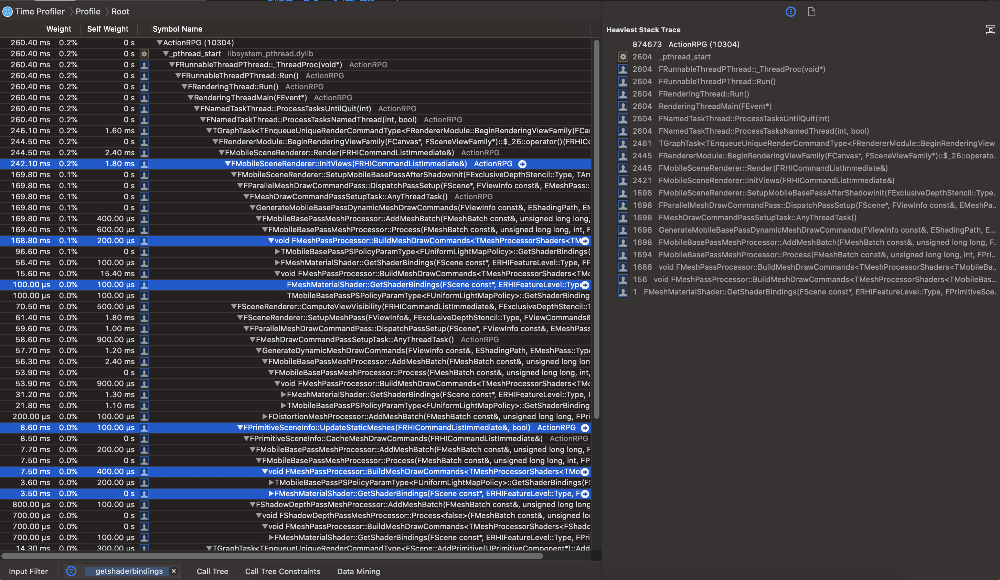

# [WIP] Unreal Source Explained

Unreal Source Explained (USE) is an Unreal source code analysis, based on profilers.  
For more infomation, see the [repo](https://github.com/donaldwuid/unreal_source_explained) in github.

## Contents

1. [Overview](main.md)
1. [Initialization](initialization.md)
1. [Loop](loop.md)
1. [Memory Management](memory.md)
1. [Thread Management](thread.md)
1. [Blueprint Visual Scripting](scripting.md)
1. [Rendering](rendering.md)
1. [Gameplay](gameplay.md)


## Rendering


### Rendering Pipeline

#### Basics

Unreal duplicates most rendering-related things into 2 threads, the game thread and the rendering thread.

You can memorize it by these patterns:

- `U**` are all in game thread,
	- all of their codes are in engine module,
- `F**` are all in rendering thread,
	- `F**Proxy` and `FMaterial`'s codes are all in game module,
	- others' codes are in render module.

| Game Thread | Rendering Thread||
|--|--|--|
| Engine Module | Engine Module | Rendering Module |
|`UWorld`||`FScene`|
|`ULevel`||
|`USceneComponent`||
|`UPrimitiveComponent`|`FPrimitiveSceneProxy`||
|||`FPrimitiveSceneInfo`|
||`F**SceneProxy`,<br>inehrited from `FPrimitiveSceneProxy`,<br> has `FVertexyFactory` and `UMaterialInterface`
|||`FSceneView`
|||`FSceneInfo`
|`ULocalPlayer`||`FSceneViewState`|
|||`FSceneRenderer`,<br>derived class: `FMobileSceneRenderer`|
|`ULightComponent`|`FLightSceneProxy`|
|||`FLightSceneInfo`|
|`UMaterialInterface`,<br>derived class: `UMaterial` and `UMaterialInstance` |`FMaterial`,<br>derived class: `FMaterialResource` and `FMaterialRenderProxy`|
|||`FShaderType`,<br>derived class: `FMaterialShaderType`|
|||`FShader`,<br>derived class: `FMaterialShader`|


#### New Mesh Drawing Pipeline

For better support of massive primitives, GPU driven pipeline and ray-tracing, Epic has refactored and introduce a new [Mesh Drawing Pipeline](https://docs.unrealengine.com/en-US/Programming/Rendering/MeshDrawingPipeline/index.html)(MDP) in 4.22. And Unreal give a [talk](https://www.youtube.com/watch?v=UJ6f1pm_sdU) about it.

The new pipeline is summarized by unreal as:


Compared to the old *immediate mode* pipeline, the new MDP is kinda *retain mode*. It adds new `FMeshDrawCommand` to cache the draw commands, then merge and sort them. `FMeshPassProcessor` replaces the old *Drawing Policy* to generate commands.

The new MDP is all about caching, and here is its 3 different caching code paths,


##### Mesh Batch


`FMeshBatch` cantains all infomations about **all passes** of one primitive, including the vertex buffer (in vertex factory) and material, etc.

```c++
/**
 * A batch of mesh elements, all with the same material and vertex buffer
 */
struct FMeshBatch
{
	TArray<FMeshBatchElement,TInlineAllocator<1> > Elements;
	...
	uint32 ReverseCulling : 1;
	uint32 bDisableBackfaceCulling : 1;
	/** 
	 * Pass feature relevance flags.  Allows a proxy to submit fast representations for passes which can take advantage of it, 
	 * for example separate index buffer for depth-only rendering since vertices can be merged based on position and ignore UV differences.
	 */
	uint32 CastShadow		: 1;	// Whether it can be used in shadow renderpasses.
	uint32 bUseForMaterial	: 1;	// Whether it can be used in renderpasses requiring material outputs.
	uint32 bUseForDepthPass : 1;	// Whether it can be used in depth pass.
	uint32 bUseAsOccluder	: 1;	// Hint whether this mesh is a good occluder.
	...

	/** Vertex factory for rendering, required. */
	const FVertexFactory* VertexFactory;

	/** Material proxy for rendering, required. */
	const FMaterialRenderProxy* MaterialRenderProxy;
	...
};
```

For static mesh batches, they are stored in their primitive, such as,

- `FPrimitiveSceneInfo* FPrimitiveSceneProxy::PrimitiveSceneInfo`
- `TArray<FStaticMeshBatch> FPrimitiveSceneInfo::StaticMeshes`

and they are collected once they are added to the scene, and cached,


For dynamic mesh batches, `FMeshElementCollector FSceneRenderer::MeshCollector`([link](https://github.com/EpicGames/UnrealEngine/blob/c1edbcc5f2d8d198b9bbbde906426a3733d8f134/Engine/Source/Runtime/Renderer/Private/SceneRendering.h#L1412)) stores an array of `FMeshBatch`.  
During each frame in `InitView()`, `FSceneRenderer` calls `FPrimitiveSceneProxy::GetDynamicMeshElements()` to generate the dynamic `FMeshBatch` ,


##### Mesh Draw Command

`FMeshDrawCommand`([link](https://github.com/EpicGames/UnrealEngine/blob/017efe88c610f06521a7f48b21e930c73e4f79ea/Engine/Source/Runtime/Renderer/Public/MeshPassProcessor.h#L442)) describes a mesh **pass** draw call, captured just above the RHI. It just contains the only data needed to draw.

```c++
class FMeshDrawCommand
{
public:
	/** Resource bindings */
	FMeshDrawShaderBindings ShaderBindings;
	FVertexInputStreamArray VertexStreams;
	FRHIIndexBuffer* IndexBuffer;

	/** PSO */
	FGraphicsMinimalPipelineStateId CachedPipelineId;

	/** Draw command parameters */
	uint32 FirstIndex;
	uint32 NumPrimitives;
	uint32 NumInstances;
	...
}
```

For static draw commands, they are stored in `FScene`, see more details in the following chain,

- `FScene* FSceneRenderer::Scene`
- `FCachedPassMeshDrawList FScene::CachedDrawLists[EMeshPass::Num];`
- `TSparseArray<FMeshDrawCommand> FCachedPassMeshDrawList::MeshDrawCommands`

For dynamic draw commands they are stored in the `FViewInfo`, see more details in the following chain,

- View, `TArray<FViewInfo> FSceneRenderer::Views`
- `TStaticArray<FParallelMeshDrawCommandPass, EMeshPass::Num> FViewInfo::ParallelMeshDrawCommandPasses`
- `FMeshDrawCommandPassSetupTaskContext FParallelMeshDrawCommandPass::TaskContext`,
- Dynamic draw command: `FDynamicMeshDrawCommandStorage FMeshDrawCommandPassSetupTaskContext::MeshDrawCommandStorage`
- `TChunkedArray<FMeshDrawCommand> FDynamicMeshDrawCommandStorage::MeshDrawCommands`

And the static and dynamic draw commands are built in the following calls,


Dynamic draw commands, since they are view-dependant and stored in `FViewInfo`, they are initiated from `FMobileSceneRenderer::InitViews()` or `FSceneRenderer::ComputeViewVisibility()`, and both of them go to `GenerateDynamicMeshDrawCommands()`.  
Static draw commands, since they ared stored in the `FScene`, they are initiated from `FScene::AddPrimitive()`, which of cause, right after the primitive is added to the scene.  
After that, both the dynamic and static draw commands share the same remaining code path from `FMobileBasePassMeshProcessor::AddMeshBatch()` to `FMeshPassProcessor::BuildMeshDrawCommands<..>()`.


For GPU Scene, it's disabled by default in mobile, you can enable it by setting `r.Mobile.SupportGPUScene=1` in your project's DefaultEngine.ini.

##### Shader Bindings

Shader binding binds a shader's resources to the shader. What is a shader binding? is it just the shader parameter layout description, or the shader argument resource? or both?

Shader bindings are stored in `FMeshDrawCommand`, as follows,

- `FMeshDrawShaderBindings FMeshDrawCommand::ShaderBindings`
- `TArray<FMeshDrawShaderBindingsLayout> FMeshDrawShaderBindings::ShaderLayouts`
- `class FMeshDrawSingleShaderBindings : public FMeshDrawShaderBindingsLayout`

Duing building the mesh draw commands, `FMeshPassProcessor::BuildMeshDrawCommands<..>()` pulls the shader binding data from the shader, as follows,


`FShaderParameterMapInfo`([link](https://github.com/EpicGames/UnrealEngine/blob/f1d65a58e687e4b9e0f71d7c661d9460c517e8f7/Engine/Source/Runtime/RenderCore/Public/Shader.h#L246)) describes the layout of shader's parameters. It contains parameters' base index and size of various resources (e.g., Uniform Buffers, Texture Samplers, SRVs and loose parameter buffers). It's serialized into `FShaderResource::ParameterMapInfo` during the game start up or the new level streamed in.

```c++
class FShaderParameterInfo
{
public:
	uint16 BaseIndex;
	uint16 Size;
	...
};
class FShaderParameterMapInfo
{
public:
	TArray<FShaderParameterInfo> UniformBuffers;
	TArray<FShaderParameterInfo> TextureSamplers;
	TArray<FShaderParameterInfo> SRVs;
	TArray<FShaderLooseParameterBufferInfo> LooseParameterBuffers;
	...
};
```

`FMeshDrawShaderBindingsLayout`([link](FMeshDrawShaderBindingsLayout)) provides some additional layout accessor of `FShaderParameterMapInfo`. 

`FMeshDrawSingleShaderBindings` inherits from `FMeshDrawShaderBindingsLayout`, and does the actual resource binding according to the layout.

### Acceleration
