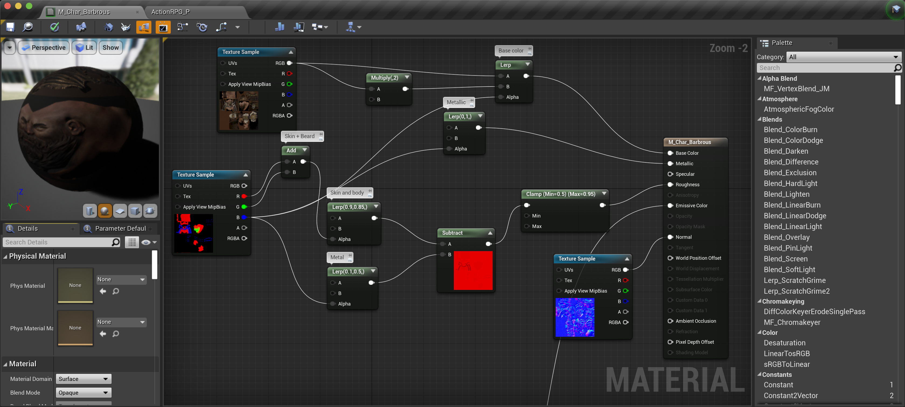
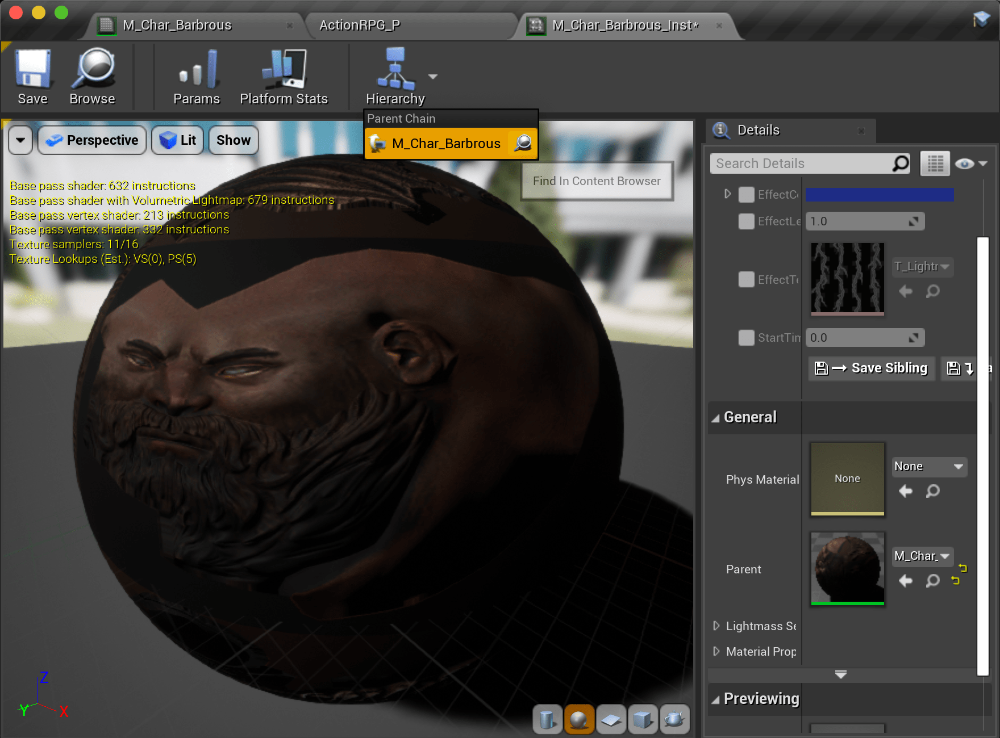
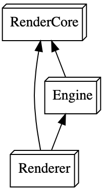
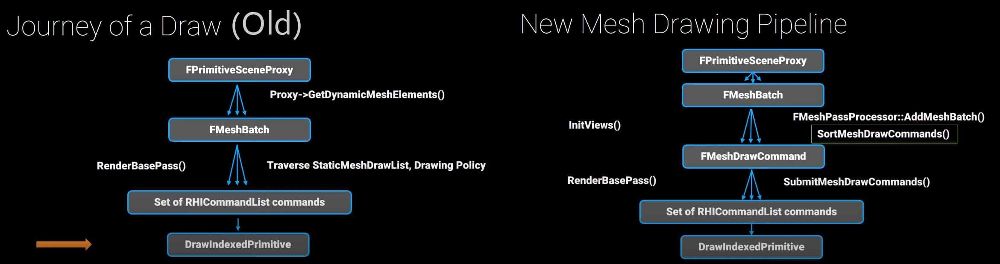
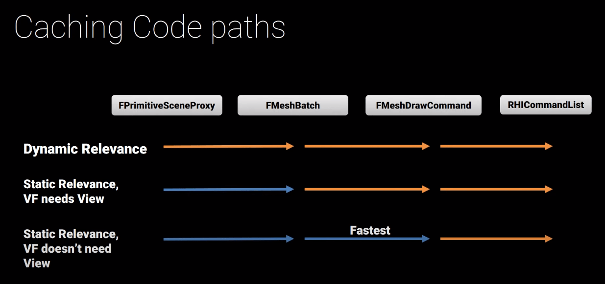
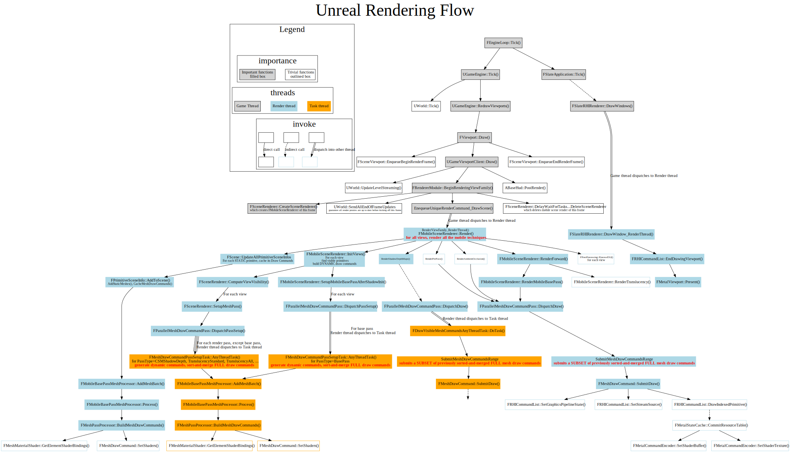
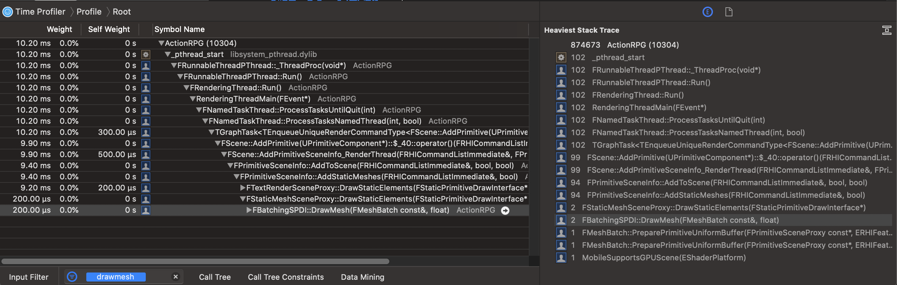
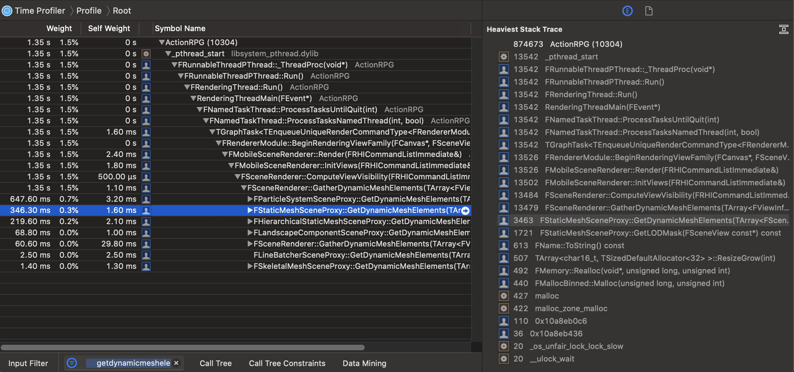
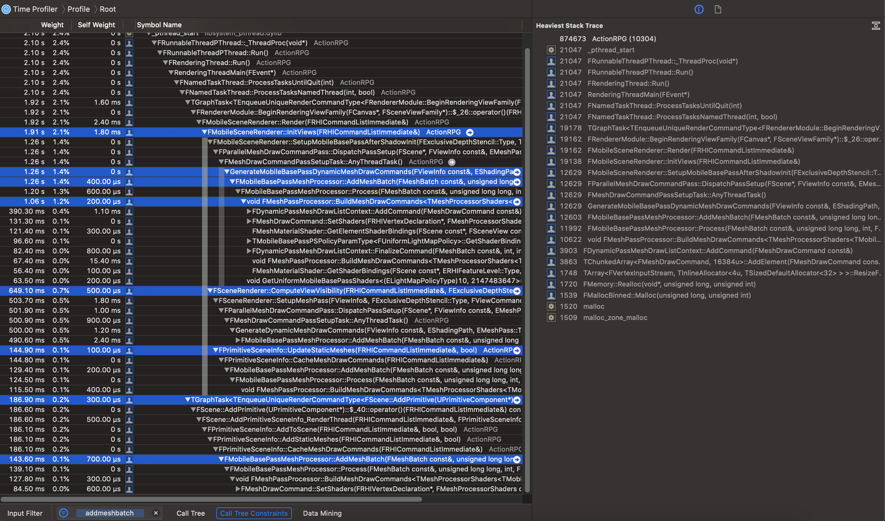

# [WIP] Unreal Source Explained

Unreal Source Explained (USE) is an Unreal source code analysis, based on profilers.  
For more infomation, see the [repo](https://github.com/donaldwuid/unreal_source_explained) in github.

## Contents

See [Table of Contents](toc.md) for the complete content list. Some important contents are listed below, 

- [Overview](main.md)
- [Initialization](initialization.md)
- [Loop](loop.md)
- [Memory Management](memory.md)
- [Thread Management](thread.md)
- [Blueprint Visual Scripting](scripting.md)
- [Rendering](rendering.md)
    - [Parallel Rendering](rendering_parallel.md)
    - [Rendering Resources](rendering_resource.md)
- [Gameplay](gameplay.md)


# Rendering

## Prepare

In order to debug your shaders in the GPU debuggers, you should modify Engine/Config/ConsoleVariables.ini:

```ini
; Uncomment to get detailed logs on shader compiles and the opportunity to retry on errors
r.ShaderDevelopmentMode=1

; Uncomment when running with a graphical debugger (but not when profiling)
r.Shaders.Optimize=0
r.Shaders.KeepDebugInfo=1
```

For GPU Scene, it's disabled by default in mobile, you can enable it by setting `r.Mobile.SupportGPUScene=1` in your project's DefaultEngine.ini.

## Basics


Like Blueprint, *Material Editor* is also a node-based visual scripiting envrironment, for creating *Material Shader*.



Each node is an *Expression*, you can use various kinds of expressions (e.g., Texture Sample, Add, etc.) to write your own shader logic. Exprssions eventually flow into the *Result Node* (e.g., M_Char_Barbrous above) via *Pin*s (e.g., Base Color, Metallic). Material shader can promote variables into *Parameter*s.

*Material Instance* is subclass of Material Shader. It's data oriented and only specify the input argument of parent material shader. Changes made to material shader will cause shader recompilation, while changes of material instance won't.


## Modules

Unreal duplicates most rendering-related things into 2 threads, the game thread and the rendering thread.

Most rendering codes are in 3 modules, Engine, Renderer and RenderCore. During C++ linking, 

- Renderer depends on Engine and RenderCore,([link](https://github.com/EpicGames/UnrealEngine/blob/c33049fcbde20fb59e44dfc32b25dc610561314c/Engine/Source/Runtime/Renderer/Renderer.Build.cs#L19))
- Engine only depends on RenderCore,([link](https://github.com/EpicGames/UnrealEngine/blob/f9b3324b32be95b1fd37235e7b7f2fbb502db285/Engine/Source/Runtime/Engine/Engine.Build.cs#L73))
- RenderCore doesn't depend on other two.



Following is some important rendering-related classes, you can summarize it by these patterns:

- `U**` are all in game thread,
	- all of their codes are in Engine module,
- `F**` are all in rendering thread,
	- `F**Proxy` and `FMaterial`'s codes are all in Engine module,
	- others' codes are in Renderer or RenderCore module.

| Game Thread | Rendering Thread| Rendering Thread|
|--|--|--|
| **Engine Module** | **Engine Module** | **Rendering Module** |
||
|**World (Scene):**|
|`UWorld`||`FScene`|
|`ULevel`||
|`USceneComponent`||
||
|**Primitive:**
|`UPrimitiveComponent`|`FPrimitiveSceneProxy`||
|||`FPrimitiveSceneInfo`|
||`F**SceneProxy`,<br>inehrited from `FPrimitiveSceneProxy`,<br> has `FVertexyFactory` and `UMaterialInterface`
||
|**View:**
|||`FSceneView`
|`ULocalPlayer`||`FSceneViewState`|
|||`FSceneRenderer`,<br>derived class: `FMobileSceneRenderer`|
||
|**Light:** 
|`ULightComponent`|`FLightSceneProxy`|
|||`FLightSceneInfo`|
||
|**Material and Shader:** 
|`UMaterialInterface`,<br>derived class: `UMaterial` and `UMaterialInstance` |`FMaterial`,<br>derived class: `FMaterialResource` and `FMaterialRenderProxy`|
|||`FShaderType`,<br>derived class: `FMaterialShaderType`|
|||`FShader`,<br>derived class: `FMaterialShader`|

Unreal uses [mtlpp](https://github.com/naleksiev/mtlpp), a C++ Metal wrapper, to glue its RHI codes and Metal APIs together.

## New Mesh Drawing Pipeline

For better support of massive primitives, GPU driven pipeline and ray-tracing, Epic has refactored and introduce a new [Mesh Drawing Pipeline](https://docs.unrealengine.com/en-US/Programming/Rendering/MeshDrawingPipeline/index.html)(MDP) in 4.22. And Epic gave a [talk](https://www.youtube.com/watch?v=UJ6f1pm_sdU) about it.

The new pipeline is summarized by Epic as:


Compared to the old *immediate mode* pipeline, the new MDP is kinda *retain mode*. It adds new `FMeshDrawCommand` to cache the draw commands, then merge and sort them. `FMeshPassProcessor` replaces the old *Drawing Policy* to generate commands.

The new MDP is all about caching. Here is its 3 different caching code paths,


## Unreal Rendering Flow

Here is my conclusion about Unreal Rendering Flow:



Which in summary is,

- on game thread, `FRendererModule::BeginRenderingViewFamily()` dispatches `FMobileSceneRenderer_Render()` to the render thread,
- `FMobileSceneRenderer::Render()` is the **"main" function** for all kinds of rendering techniques,
- In `FScene::UpdateAllPrimitiveSceneInfos()`, completely static prmitives are cache both `FMeshBatch` and `FMeshDrawCommand`, once they are `AddToScene()`ed.
- `FMobileSceneRenderer::InitViews()` computes visibility, and for static primitive whose vertex factory depends on the view, can only cahce its `FMeshBatch`, and generating `FMeshDrawCommand` in `InitViews()`
  - `InitViews()` also kicks off `FMeshDrawCommandPassSetupTask::AnyThreadTask()` to task thread to **sort-and-merge ALL** mesh draw commands, of this frame.
- later on, different rendering techiniques, `FMobileSceneRenderer::RenderMobileBasePass()` or `FMobileSceneRenderer::RenderTranslucency()` submit a sub-range draw command based on the **sorted-and-merged** mesh draw commands.
- At last, the frame buffer is presented on `FRHICommandList::EndDrawingViewport()`.


### Primitive Scene Proxy

`FPrimitiveSceneProxy`([link](https://github.com/EpicGames/UnrealEngine/blob/9cb729729cf2130ed4ccb2a71eae8818916f4892/Engine/Source/Runtime/Engine/Public/PrimitiveSceneProxy.h#L126)) is just the rendering thread counterpart of `UPrimitiveComponent`. Both of them is intended to be subclassed to support different primitive types, for example,

|`UPrimitiveComponent`|`FPrimitiveSceneProxy`|
|--|--|
|`UStaticMeshComponent`|`FStaticMeshSceneProxy`
|`USkeletalMeshComponent`|`FSkeletalMeshSceneProxy`|
|`UHierarchicalInstancedStaticMeshComponent`|`FHierarchicalStaticMeshSceneProxy`|
|`ULandscapeComponent`|`FLandscapeComponentSceneProxy`|
|...|...|

### Mesh Batch

1 `UStaticMesh` has several LODs (`FStaticMeshLODResources`, `InStaticMesh->RenderData->LODResources[InLODIndex]`).

1 LOD has several *Draw Section*s (`FStaticMeshSection`, `InStaticMesh->RenderData->LODResources[InLODIndex].Sections[InSectionIndex]`).
1 Draw Section usually generates 1 drawcall, which specify drawing which triangles with which material index.
```c++
struct FStaticMeshSection {
	/** The index of the material with which to render this section. */
	int32 MaterialIndex;

	/** Range of vertices and indices used when rendering this section. */
	uint32 FirstIndex;
	uint32 NumTriangles;
	uint32 MinVertexIndex;
	uint32 MaxVertexIndex;
	...
}
```

In `FStaticMeshSceneProxy::GetMeshElement()`, 1 Draw Section's actual rendering data is extracted into 1 corresponding 1 *Mesh Batch* (`FMeshBatch`) and mesh batch's 1 *Mesh Batch Element* (`FMeshBatchElement`).

1  `FMeshBatch` cantains all infomations about **all passes‘ information** of one primitive, including the vertex buffer (in vertex factory) and material, etc.
It has an array of `FMeshBatchElement`, **whose length is usually 1**. Each element describes **one pass' information**, such as instancing count, uniform buffer, index buffer, and first index into the index buffer.

```c++
/**
 * A batch of mesh elements, all with the same material and vertex buffer
 */
struct FMeshBatch
{
	TArray<FMeshBatchElement,TInlineAllocator<1> > Elements;
	...
	uint32 ReverseCulling : 1;
	uint32 bDisableBackfaceCulling : 1;
	/** 
	 * Pass feature relevance flags.
	 */
	uint32 CastShadow		: 1;	// Whether it can be used in shadow renderpasses.
	uint32 bUseForMaterial	: 1;	// Whether it can be used in renderpasses requiring material outputs.
	uint32 bUseForDepthPass : 1;	// Whether it can be used in depth pass.
	uint32 bUseAsOccluder	: 1;	// Hint whether this mesh is a good occluder.
	...

	/** Vertex factory for rendering, required. */
	const FVertexFactory* VertexFactory;

	/** Material proxy for rendering, required. */
	const FMaterialRenderProxy* MaterialRenderProxy;
	...
};
```

For static mesh batches, they are stored in their primitive, see the ownership chain (root at the top)

- `FPrimitiveSceneInfo* FPrimitiveSceneProxy::PrimitiveSceneInfo`
- `TArray<FStaticMeshBatch> FPrimitiveSceneInfo::StaticMeshes`

and they are collected once they are added to the scene, and cached,


For dynamic mesh batches, `FMeshElementCollector FSceneRenderer::MeshCollector`([link](https://github.com/EpicGames/UnrealEngine/blob/c1edbcc5f2d8d198b9bbbde906426a3733d8f134/Engine/Source/Runtime/Renderer/Private/SceneRendering.h#L1412)) stores an array of `FMeshBatch`.  
During each frame in `InitView()`, `FSceneRenderer` calls `FPrimitiveSceneProxy::GetDynamicMeshElements()` to generate the dynamic `FMeshBatch` ,



### Mesh Draw Command

`FMeshDrawCommand`([link](https://github.com/EpicGames/UnrealEngine/blob/017efe88c610f06521a7f48b21e930c73e4f79ea/Engine/Source/Runtime/Renderer/Public/MeshPassProcessor.h#L442)) describes a mesh's **one pass** draw call, captured between Mesh Batch (and Mesh Batch Element for IB, etc.) and the RHI. It just contains the only data needed to draw.

```c++
class FMeshDrawCommand
{
public:
	/** Resource bindings */
	FMeshDrawShaderBindings ShaderBindings;
	FVertexInputStreamArray VertexStreams;
	FRHIIndexBuffer* IndexBuffer;

	/** PSO */
	FGraphicsMinimalPipelineStateId CachedPipelineId;

	/** Draw command parameters */
	uint32 FirstIndex;
	uint32 NumPrimitives;
	uint32 NumInstances;
	...
}
```


Mesh draw commands are generated by these following calls,


In the calltree leaves in `FMeshPassProcessor::BuildMeshDrawCommands（）`[(link)](https://github.com/EpicGames/UnrealEngine/blob/d6c5e89118c7ae95e6dd12a9faaac5ef6b174e9e/Engine/Source/Runtime/Renderer/Public/MeshPassProcessor.inl#L118), `FMeshDrawCommand` are all created and extracted from `FMeshBatch` and `FMeshBatchElement`, like the following POI code snippet,

```c++
template<typename PassShadersType, typename ShaderElementDataType>
void FMeshPassProcessor::BuildMeshDrawCommands(
	const FMeshBatch& RESTRICT MeshBatch,
	uint64 BatchElementMask,
	const FPrimitiveSceneProxy* RESTRICT PrimitiveSceneProxy,
	const FMaterialRenderProxy& RESTRICT MaterialRenderProxy,
	const FMaterial& RESTRICT MaterialResource,
	PassShadersType PassShaders,
	const ShaderElementDataType& ShaderElementData, ...)
{
	const FVertexFactory* RESTRICT VertexFactory = MeshBatch.VertexFactory;
	const FPrimitiveSceneInfo* RESTRICT PrimitiveSceneInfo = PrimitiveSceneProxy ? PrimitiveSceneProxy->GetPrimitiveSceneInfo() : nullptr;

	FMeshDrawCommand SharedMeshDrawCommand;

	// almost all shaders, resources are from FMeshBatch::MaterialRenderProxy.
	FGraphicsMinimalPipelineStateInitializer PipelineState;
	PipelineState.PrimitiveType = (EPrimitiveType)MeshBatch.Type;
	PipelineState.ImmutableSamplerState = MaterialRenderProxy.ImmutableSamplerState;

	EVertexInputStreamType InputStreamType = EVertexInputStreamType::Default;
	if ((MeshPassFeatures & EMeshPassFeatures::PositionOnly) != EMeshPassFeatures::Default)				InputStreamType = EVertexInputStreamType::PositionOnly;
	if ((MeshPassFeatures & EMeshPassFeatures::PositionAndNormalOnly) != EMeshPassFeatures::Default)	InputStreamType = EVertexInputStreamType::PositionAndNormalOnly;

	FRHIVertexDeclaration* VertexDeclaration = VertexFactory->GetDeclaration(InputStreamType);

	SharedMeshDrawCommand.SetShaders(VertexDeclaration, PassShaders.GetUntypedShaders(), PipelineState);

	PipelineState.RasterizerState = GetStaticRasterizerState<true>(MeshFillMode, MeshCullMode);
	PipelineState.BlendState = DrawRenderState.GetBlendState();

	VertexFactory->GetStreams(FeatureLevel, InputStreamType, SharedMeshDrawCommand.VertexStreams);

	SharedMeshDrawCommand.PrimitiveIdStreamIndex = VertexFactory->GetPrimitiveIdStreamIndex(InputStreamType);

	int32 DataOffset = 0;
	if (PassShaders.VertexShader.IsValid()) {
		FMeshDrawSingleShaderBindings ShaderBindings = SharedMeshDrawCommand.ShaderBindings.GetSingleShaderBindings(SF_Vertex, DataOffset);
		PassShaders.VertexShader->GetShaderBindings(Scene, FeatureLevel, PrimitiveSceneProxy, MaterialRenderProxy, MaterialResource, DrawRenderState, ShaderElementData, ShaderBindings);
	}

	if (PassShaders.PixelShader.IsValid()) {
		FMeshDrawSingleShaderBindings ShaderBindings = SharedMeshDrawCommand.ShaderBindings.GetSingleShaderBindings(SF_Pixel, DataOffset);
		PassShaders.PixelShader->GetShaderBindings(Scene, FeatureLevel, PrimitiveSceneProxy, MaterialRenderProxy, MaterialResource, DrawRenderState, ShaderElementData, ShaderBindings);
	}

	const int32 NumElements = MeshBatch.Elements.Num();

	// POI: generates MeshDrawCommand for each BatchElement
	for (int32 BatchElementIndex = 0; BatchElementIndex < NumElements; BatchElementIndex++) {
		if ((1ull << BatchElementIndex) & BatchElementMask) {
			const FMeshBatchElement& BatchElement = MeshBatch.Elements[BatchElementIndex];
			FMeshDrawCommand& MeshDrawCommand = DrawListContext->AddCommand(SharedMeshDrawCommand, NumElements);

			DataOffset = 0;
			if (PassShaders.VertexShader.IsValid()) {
				FMeshDrawSingleShaderBindings VertexShaderBindings = MeshDrawCommand.ShaderBindings.GetSingleShaderBindings(SF_Vertex, DataOffset);
				FMeshMaterialShader::GetElementShaderBindings(PassShaders.VertexShader, Scene, ViewIfDynamicMeshCommand, VertexFactory, InputStreamType, FeatureLevel, PrimitiveSceneProxy, MeshBatch, BatchElement, ShaderElementData, VertexShaderBindings, MeshDrawCommand.VertexStreams);
			}

			if (PassShaders.PixelShader.IsValid()) {
				FMeshDrawSingleShaderBindings PixelShaderBindings = MeshDrawCommand.ShaderBindings.GetSingleShaderBindings(SF_Pixel, DataOffset);
				FMeshMaterialShader::GetElementShaderBindings(PassShaders.PixelShader, Scene, ViewIfDynamicMeshCommand, VertexFactory, EVertexInputStreamType::Default, FeatureLevel, PrimitiveSceneProxy, MeshBatch, BatchElement, ShaderElementData, PixelShaderBindings, MeshDrawCommand.VertexStreams);
			}

			int32 DrawPrimitiveId;
			int32 ScenePrimitiveId;
			GetDrawCommandPrimitiveId(PrimitiveSceneInfo, BatchElement, DrawPrimitiveId, ScenePrimitiveId);

			// POI: Initialize MeshDrawCommand from this BatchElement (IB, Offset, NumPrimitives)
			DrawListContext->FinalizeCommand(MeshBatch, BatchElementIndex, DrawPrimitiveId, ScenePrimitiveId, MeshFillMode, MeshCullMode, SortKey, PipelineState, &ShadersForDebugging, MeshDrawCommand);
		}
	}
}
```

For Static draw commands, they are initiated from `FScene::AddPrimitive()`, which of cause, right after the primitive is added to the scene. They are stored in `FScene`, see the ownership chain (root at the top),

- Scene: `FScene* FSceneRenderer::Scene`
- `FCachedPassMeshDrawList FScene::CachedDrawLists[EMeshPass::Num];`
- Static mesh draw commands: `TSparseArray<FMeshDrawCommand> FCachedPassMeshDrawList::MeshDrawCommands`

For static mesh whose vertex factory is view-dependant (shadow, etc.), their mesh draw commands are stored in `FViewInfo`, so these draw commands are generated in `FMobileSceneRenderer::InitViews()` or `FSceneRenderer::ComputeViewVisibility()`, and both of them go to `GenerateMobileBasePassDynamicMeshDrawCommands()`. Dynamic draw commands are stored in the `FViewInfo`, see the ownership chain (root at the top),

- View, `TArray<FViewInfo> FSceneRenderer::Views`
- `TStaticArray<FParallelMeshDrawCommandPass, EMeshPass::Num> FViewInfo::ParallelMeshDrawCommandPasses`
- `FMeshDrawCommandPassSetupTaskContext FParallelMeshDrawCommandPass::TaskContext`,
- Dynamic draw commands: `FDynamicMeshDrawCommandStorage FMeshDrawCommandPassSetupTaskContext::MeshDrawCommandStorage`
- `TChunkedArray<FMeshDrawCommand> FDynamicMeshDrawCommandStorage::MeshDrawCommands`


After that, both static and dynamic draw commands share the same remaining code path from `FMobileBasePassMeshProcessor::AddMeshBatch()` to `FMeshPassProcessor::BuildMeshDrawCommands<..>()`.

And in `FMeshDrawCommandPassSetupTask::AnyThreadTask()`, it finally handles movable mesh's mesh draw command.


TODO: `FMobileSceneRenderer::Render()`???