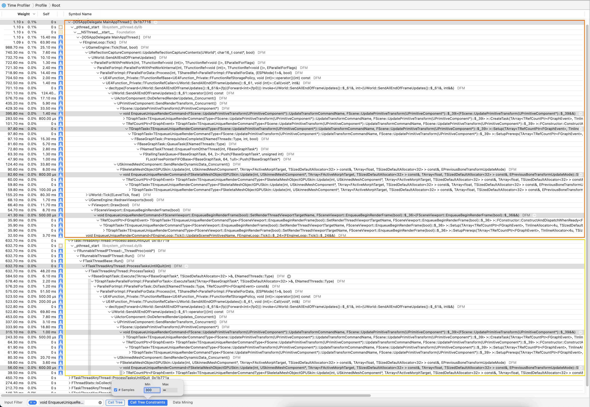
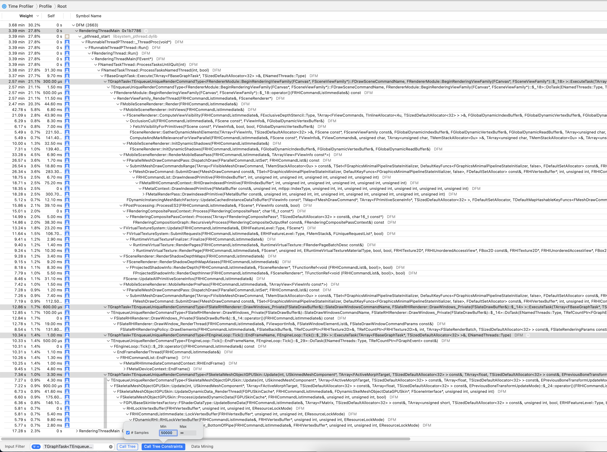
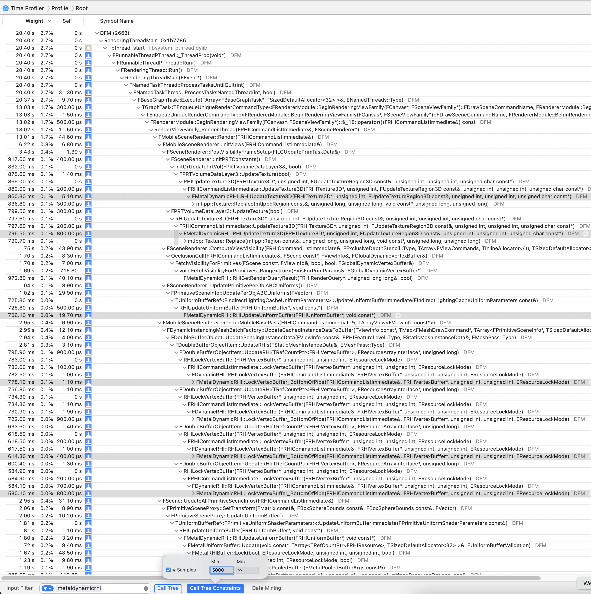
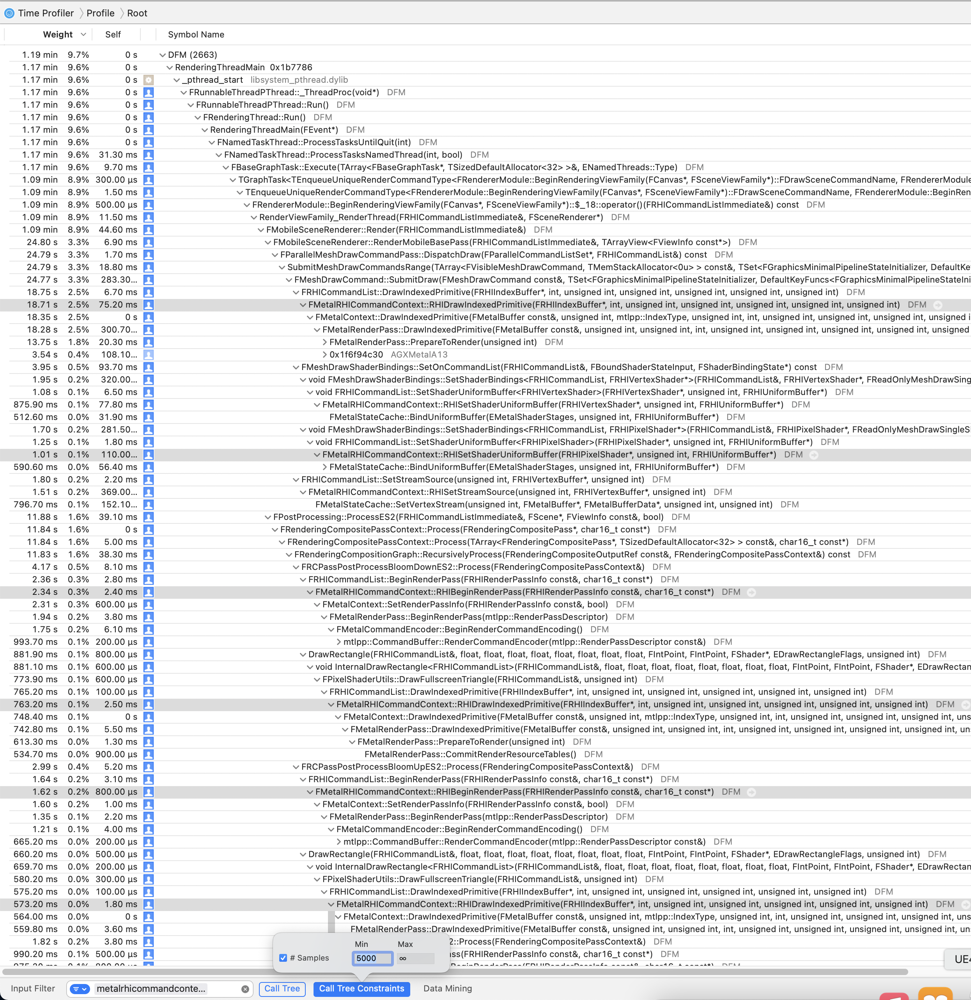
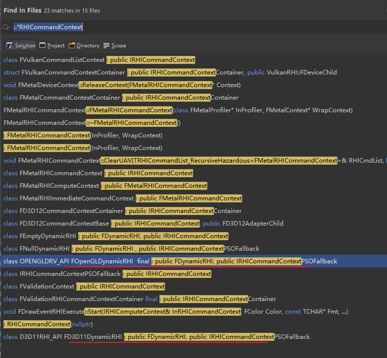
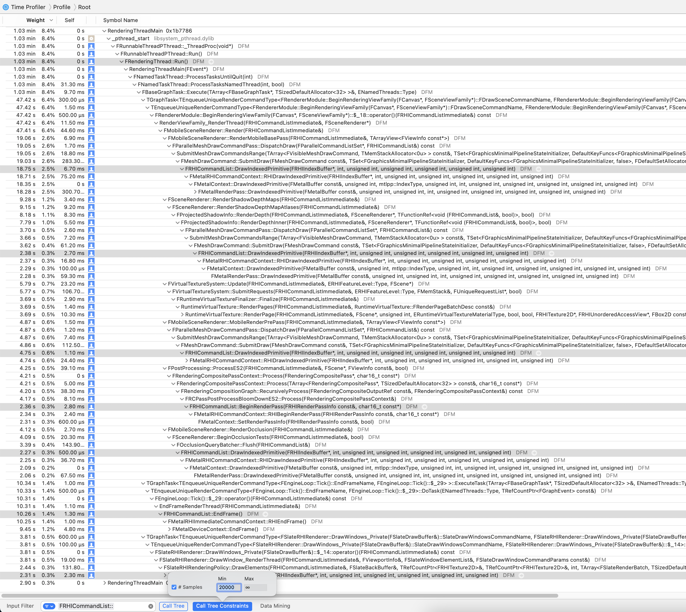
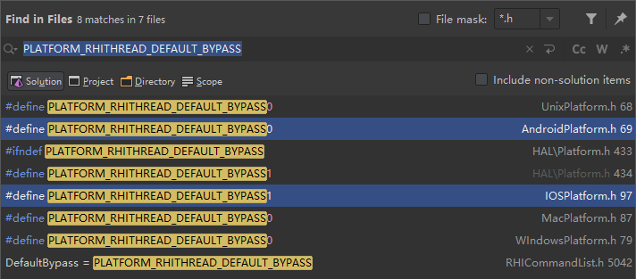

# [WIP] Unreal Source Explained

Unreal Source Explained (USE) is an Unreal source code analysis, based on profilers.  
For full Table of Contents and more infomation, see the [repo](https://github.com/donaldwuid/unreal_source_explained) in github.


# Parallel Rendering

## Render Commands

We usually create and enqueue a render command like this:
```c++
void DestroyRenderResource(FRenderResource* RenderResource) {
    ENQUEUE_RENDER_COMMAND(DestroySceneViewStateRenderResource)(
        [RenderResource](FRHICommandList&) {
            RenderResource->ReleaseResource();
            delete RenderResource;
        });
}
```


`ENQUEUE_RENDER_COMMAND`([link](https://github.com/EpicGames/UnrealEngine/blob/d3866ecfb425d911abd0d110ce43698606a255bf/Engine/Source/Runtime/RenderCore/Public/RenderingThread.h#L262)) creates a named (for easier debug) struct and calls `EnqueueUniqueRenderCommand()` with the lambda, hence, the above codes expand to these:

```c++
void DestroyRenderResource(FRenderResource* RenderResource) {
    struct DestroySceneViewStateRenderResourceName { 
        static const char* CStr() { return "DestroySceneViewStateRenderResource"; } 
        static const TCHAR* TStr() { return TEXT("DestroySceneViewStateRenderResource"); } 
    };
    
    // POI begin
    EnqueueUniqueRenderCommand<DestroySceneViewStateRenderResourceName>(
			[RenderResource](FRHICommandList&) {
				RenderResource->ReleaseResource();
				delete RenderResource;
			});
    // POI end
}
```

`EnqueueUniqueRenderCommand()`([link](https://github.com/EpicGames/UnrealEngine/blob/d3866ecfb425d911abd0d110ce43698606a255bf/Engine/Source/Runtime/RenderCore/Public/RenderingThread.h#L233)) will execute the lambda if it's in rendering thread. If not, it will use `TGraphTask<>` template to create a taskgraph's task to execute the lambda.

```c++

template<typename TSTR, typename LAMBDA>
FORCEINLINE_DEBUGGABLE void EnqueueUniqueRenderCommand(LAMBDA&& Lambda) {
	//QUICK_SCOPE_CYCLE_COUNTER(STAT_EnqueueUniqueRenderCommand);
	typedef TEnqueueUniqueRenderCommandType<TSTR, LAMBDA> EURCType;

	if (IsInRenderingThread()) {
		FRHICommandListImmediate& RHICmdList = GetImmediateCommandList_ForRenderCommand();
		Lambda(RHICmdList);
	}
	else {
		if (ShouldExecuteOnRenderThread()) {
			CheckNotBlockedOnRenderThread();
            // POI
		    TGraphTask<EURCType>::CreateTask().ConstructAndDispatchWhenReady(Forward<LAMBDA>(Lambda));
		}
		else { ... }
	}
}
```

Below is the time profiler filtered by `void EnqueueUniqueRenderCommand()` and only shows call tree whose samples count is more than 300 samples, which indicates their importance. We can know there are serveral threads, including game thread, are making lots of call to equeue render commands, e.g., `FScene::UpdatePrimitiveTransform()`, `FSkeletalMeshObjectGPUSkin::Update()`, `FSceneViewport::EnqueueBeginRenderFrame()`,



The task is of type `TEnqueueUniqueRenderCommandType`, which inherits from `FRenderCommand`, they are task with `ESubsequentsMode::FireAndForget`, hence they don't use task dependencies. And they needs to run in rendering thread.

Recall from the [Thread Management](thread.md)'s Task Grpah chapter that, TaskGrpah is a multi-threaded task graph framework. With `TGraphTask<EURCType>::CreateTask().ConstructAndDispatchWhenReady()` called, it create `TGraphTask` instance who holds an instance of `FRenderCommand`, and dispatch this `TGraphTask` instance into the queue. Then in rendering thread, the task is dequeued and its `DoTask()` is called, hence, the user's lambda is executed.

```c++
template<typename TSTR, typename LAMBDA>
class TEnqueueUniqueRenderCommandType : public FRenderCommand {
public:
	TEnqueueUniqueRenderCommandType(LAMBDA&& InLambda) : Lambda(Forward<LAMBDA>(InLambda)) {}

    // POI begin
	void DoTask(ENamedThreads::Type CurrentThread, const FGraphEventRef& MyCompletionGraphEvent) {
		TRACE_CPUPROFILER_EVENT_SCOPE_ON_CHANNEL_STR(TSTR::TStr(), RenderCommandsChannel);
		FRHICommandListImmediate& RHICmdList = GetImmediateCommandList_ForRenderCommand();
		Lambda(RHICmdList);
	}
    // POI end
private:
	LAMBDA Lambda;
};
```

Below is time profiler showing some call tree filtered by `TGraphTask<TEnqueueUniqueRenderCommandType` with great overhead (again, which indicating their importance). We can know they are all executing in the rendering thread, such as `FRenderModule::BeginRenderingViewFamily()`, `FEngineLoop::Tick()::EndFrameName`.



### Summary

User enqueues render commands into task graph's task queue. In rendering thread, render commands are dequeued and executed.

## RHI Commands

*RHI* stands for Render Haredware Interface, it's an abstraction of graphic APIs, so the rendering commands only depends RHI interfaces, rather not different platforms' GPU APIs.


Even if the game is starting up on a given platform (Windows/Android/iOS), it may still have to deceide which GPU API to be enabled (DirectX/OpenGL/Vulkan/Metal). `FDynamicRHI` is this API abstraction, and `FMetalDynamicRHI`, `FVulkanDynamicRHI`, etc. inherits from it. `FDynamicRHI* GDynamicRHI` is the global instance and initialized in `RHIInit()`([link](https://github.com/EpicGames/UnrealEngine/blob/070f4e2830c3f2ea51ac616c87599d08805fd1a1/Engine/Source/Runtime/RHI/Private/DynamicRHI.cpp#L223)), during `FEngineLoop::PreInitPreStartupScreen()`([link](https://github.com/EpicGames/UnrealEngine/blob/baf160a5a125a3ca2fd48f33d0312670a511f78d/Engine/Source/Runtime/Launch/Private/LaunchEngineLoop.cpp#L2599)), 

```c++
void RHIInit(bool bHasEditorToken) {
	if (!GDynamicRHI) {
		if (!FApp::CanEverRender()) {
			InitNullRHI();
		}
		else {
            // POI begins
			GDynamicRHI = PlatformCreateDynamicRHI();
            GDynamicRHI->Init();
            // POI ends
                ...
            }
        }
    }
}
```

Different platform has its own `PlatformCreateDynamicRHI()` implementation and returns corresponding `FDynamicRHI` instance.

`IRHICommandContext` is similar to `FDynamicRHI`, it's also an abstraction of GPU APIs hence inherited class `FVulkanCommandListContext`, `FMetalRHICommandContext`. But the context mainly handles things that can be paralelly encoded, such as those "draw" things. `FDynamicRHI` mainly handle the "resource" things.
Note that, their methods all begin with `RHI`, such as `FDynamicRHI::RHICreateUniformBuffer()`, `IRHICommandContext::RHIDrawIndexedPrimitive()`.

| `FDynamicRHI` | `IRHICommandContext` |
|--|--|
| mainly "resource" RHI commands | mainly "draw" RHI commands |
|||

In older APIs, OpenGL and DirectX11, their dynamic RHI implements both the `FDynamicRHI` and `IRHICommandContext`


Remember that each render command accepts an `FRHICommandList` instance argument, take the following render command ([link](https://github.com/EpicGames/UnrealEngine/blob/3808ee307e4bd2292a1e4b2c9868d9cfeaf38397/Engine/Source/Editor/UnrealEd/Private/FeedbackContextEditor.cpp#L378)) for example, it generates *RHI command* via direct call of `RHICmdList`'s member methods,
```c++

static void TickSlate(TSharedPtr<SWindow> SlowTaskWindow) {
    ...
    if (GIsRHIInitialized) {
        // POI
        ENQUEUE_RENDER_COMMAND(BeginFrameCmd)([](FRHICommandListImmediate& RHICmdList) { RHICmdList.BeginFrame(); });
    }

    // Tick Slate application
    FSlateApplication::Get().Tick();

    // End frame so frame fence number gets incremented
    if (GIsRHIInitialized) {
        // POI
        ENQUEUE_RENDER_COMMAND(EndFrameCmd)([](FRHICommandListImmediate& RHICmdList) { RHICmdList.EndFrame(); });
    }
    ...
}
```


However, most render command create new *RHI Command*s indirectly via further function calls, see the profiling call tree below, which is filtered by `FRHICommandList::` and high sample counts. We can know that those important RHI commands are created in all kinds of render commands in the rendering thread.





Take the most important command, `FRHICommandList::DrawIndexedPrimitive()`([link](https://github.com/EpicGames/UnrealEngine/blob/f08c1daafc7712356057b74ebe9f772678a9a00b/Engine/Source/Runtime/RHI/Public/RHICommandList.h#L3177)) for example,
```c++
void FRHICommandList::DrawIndexedPrimitive(FRHIIndexBuffer* IndexBuffer, int32 BaseVertexIndex, ...) {
    if (Bypass()) {
        // POI
        GetContext().RHIDrawIndexedPrimitive(IndexBuffer, BaseVertexIndex, ...);
        return;
    }
    // POI
    ALLOC_COMMAND(FRHICommandDrawIndexedPrimitive)(IndexBuffer, BaseVertexIndex, ...);
}
```

It says, if current run is bypassing the RHI command, then RHI command list will calls its *RHI Context* to execute the RHI call directly. Otherwise, RHI command list will allocate the RHI command instance and queue them up. 
By default, `Bypass()`([link](https://github.com/EpicGames/UnrealEngine/blob/f08c1daafc7712356057b74ebe9f772678a9a00b/Engine/Source/Runtime/RHI/Public/RHICommandList.h#L5058)) always returns true in iOS, that may due to iPhone's great single core house power. And it returns false in Android (for v4.27), which may have many cores available and suit for having a dedicated RHI thread to handles RHI commands.




So, let's have a look at `FRHICommandList`'s base class `FRHICommandListBase`: 
```c++
class RHI_API FRHICommandListBase : public FNoncopyable {
    ...
    // POI begins (context)
public:
	bool Bypass() const;
    
	void SetContext(IRHICommandContext* InContext) {
		Context = InContext;
        ...
	}
	FORCEINLINE IRHICommandContext& GetContext() { return *Context; }

private:
	IRHICommandContext* Context;
    // POI ends (context)

    // POI begins (rhi command queue)
public:
	FORCEINLINE_DEBUGGABLE void* AllocCommand(int32 AllocSize, int32 Alignment) {
		FRHICommandBase* Result = (FRHICommandBase*) MemManager.Alloc(AllocSize, Alignment);
		++NumCommands;
		*CommandLink = Result;
		CommandLink = &Result->Next;
		return Result;
	}

private:
	FRHICommandBase* Root;
	FRHICommandBase** CommandLink;
	uint32 NumCommands;
    // POI ends (rhi command queue)

    ...
};
```

`FRHICommandListBase` has mainly two items: a context and a command queue. And it stores a list of instances whose type inherits from `FRHICommandBase`, with the `Root` as the list tail and `CommandLink` the head.

There is one global command list `GRHICommandList`([link](https://github.com/EpicGames/UnrealEngine/blob/cdafed081955f371a0070ca2961b572ea87c06b9/Engine/Source/Runtime/RHI/Private/RHICommandList.cpp#L149)), it's feed into the render command argument via static function `FRHICommandListExecutor::GetImmediateCommandList()`([link](https://github.com/EpicGames/UnrealEngine/blob/93329d46d07d11635e41039065ad7396c67f5ebc/Engine/Source/Runtime/RenderCore/Private/RenderingThread.cpp#L1308)).

So, what is *Immediate Command List*? `FRHICommandList` wraps `IRHICommandContext` and provide "draw" methods. `FRHICommandListImmediate` inherits from `FRHICommandList` and providing additional `FDynamicRHI` methods about "resource". Hence is this following comparision table,
| RHI Command List | RHI | Meaning |
|--|--|--|
| `FRHICommandList` | `IRHICommandContext` | "draw" methods
| `FRHICommandListImmediate` | `IRHICommandContext` + `FDynamicRHI` | "draw" + "resource" methods


Note that, RHI Command list's member method names don't contain *RHI*, e.g., `FRHICommandListImmediate::CreateUniformBuffer()`, `FRHICommandList::DrawIndexedPrimitive()`.

### Summary
Render commands generate RHI commands. RHI commands may be executed in the rendering thread, or are queued up in the RHI command list and get executed in a dedicated RHI thread. RHI command list uses dyanmic RHI and RHI command context to run the actual GPU driver APIs.