# [WIP] Unreal Source Explained

Unreal Source Explained (USE) is an Unreal source code analysis, based on profilers.  
For more infomation, see the [repo](https://github.com/donaldwuid/unreal_source_explained) in github.

## Contents

See [Table of Contents](toc.md) for the complete content list. Some important contents are listed below, 

- [Overview](main.md)
- [Initialization](initialization.md)
- [Loop](loop.md)
- [Memory Management](memory.md)
- [Thread Management](thread.md)
- [Blueprint Visual Scripting](scripting.md)
- [Rendering](rendering.md)
    - [Rendering Resources](rendering_resource.md)
- [Gameplay](gameplay.md)


# Rendering Resources

## Resources Creation


To observe resource creation, the best view for us is the Allocation profiler. Below is the memory allocation summary of `IOAccelResourceCreate()`, which is the entrance of Metal's resource allocations. We can see that GPU memory is allocated for various kinds of resources, e.g., textures, encoders, (vertex and index) buffers and shaders, etc.

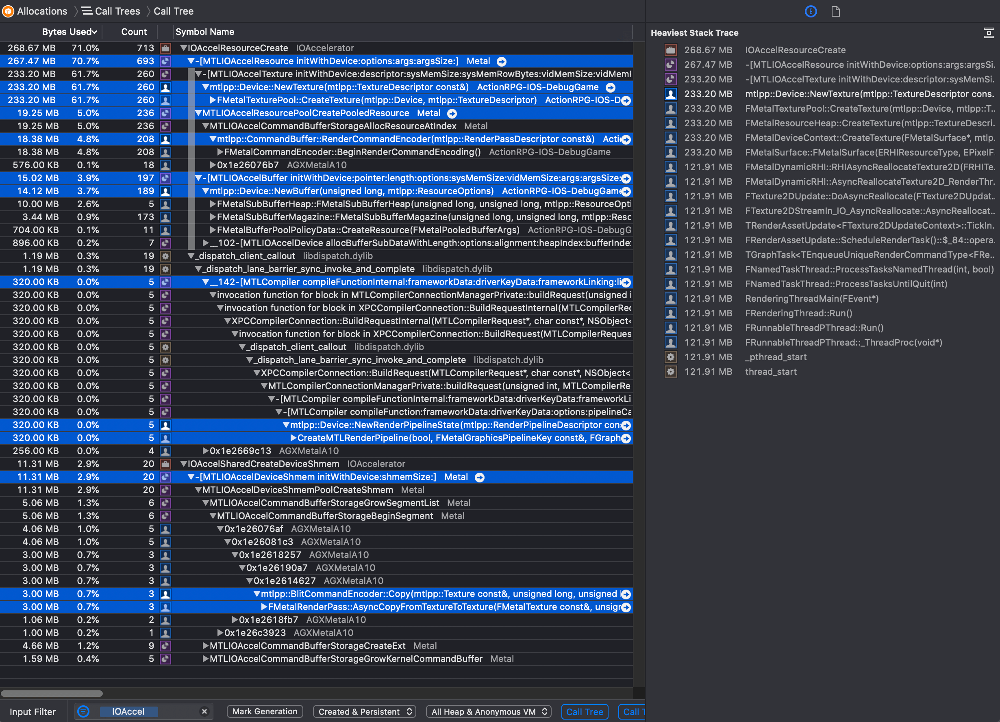
> Unreal uses [mtlpp](https://github.com/naleksiev/mtlpp), a C++ Metal wrapper, to glue its RHI codes and Metal APIs together, we can see almost all `IOAccelResourceCreate()` is called indirectly from `mtlpp`.

We can dig deeper and summerize by this following table.,

| Resource Allocation | Reference Variable | Engine API | RHI API<br>High Level | RHI API<br>Low Level | Wrapper API<br>(mtlpp) |Graphic API (Metal)
|--|--|--|--|--|--|--|
| Texture | `UTexture::TextureReference`([link](https://github.com/EpicGames/UnrealEngine/blob/070f44a07a30e84aa4fd2512873153adca166645/Engine/Source/Runtime/Engine/Classes/Engine/Texture.h#L840)) |`FTexture2DResource::InitRHI()`([link](https://github.com/EpicGames/UnrealEngine/blob/1c7a59e6d0464716a81d699e869de34cf0af9dfc/Engine/Source/Runtime/Engine/Public/TextureResource.h#L195)), etc.|`CreateTexture2D()`([link](https://github.com/EpicGames/UnrealEngine/blob/7a2cc9763c8cf1766337f4bae385ced20d49abad/Engine/Source/Runtime/RHI/Public/RHICommandList.h#L4192))| `FDynamicRHI::RHICreateTexture2D()`'s implementation([link](https://github.com/EpicGames/UnrealEngine/blob/3b09b8309ae4c80c2a29b4e83aa2258baf829320/Engine/Source/Runtime/RHI/Public/DynamicRHI.h#L717))|`mtlpp::Device::NewTexture()`|`MTLIOAccelTexture initWithDevice]`
| Vertex Buffer | `FVertexBuffer::VertexBufferRHI`([link](https://github.com/EpicGames/UnrealEngine/blob/3b4ff4c5771927f73ea309e1d15257587c36acf4/Engine/Source/Runtime/RenderCore/Public/RenderResource.h#L498)) | `FPositionVertexBuffer::InitRHI()`([link](https://github.com/EpicGames/UnrealEngine/blob/532dc5287ff9aff943f034e88117d5fc26bbc720/Engine/Source/Runtime/Engine/Private/PositionVertexBuffer.cpp#L247)),<br>`FColorVertexBuffer::InitRHI()`([link](https://github.com/EpicGames/UnrealEngine/blob/532dc5287ff9aff943f034e88117d5fc26bbc720/Engine/Source/Runtime/Engine/Private/Rendering/ColorVertexBuffer.cpp#L446)),<br>`FStaticMeshVertexBuffer::InitRHI()`([link](https://github.com/EpicGames/UnrealEngine/blob/532dc5287ff9aff943f034e88117d5fc26bbc720/Engine/Source/Runtime/Engine/Private/Rendering/StaticMeshVertexBuffer.cpp#L364)),<br>etc.|`RHICreateVertexBuffer()`([link](https://github.com/EpicGames/UnrealEngine/blob/7a2cc9763c8cf1766337f4bae385ced20d49abad/Engine/Source/Runtime/RHI/Public/RHICommandList.h#L5084))| `FDynamicRHI::RHICreateVertexBuffer()`'s implmentation([link](https://github.com/EpicGames/UnrealEngine/blob/3b09b8309ae4c80c2a29b4e83aa2258baf829320/Engine/Source/Runtime/RHI/Public/DynamicRHI.h#L551))|`mtlpp::Device::NewBuffer()`| `[MTLIOAccelBuffer initWithDevice]`
| Index Buffer | `FIndexBuffer::IndexBufferRHI`([link](https://github.com/EpicGames/UnrealEngine/blob/3b4ff4c5771927f73ea309e1d15257587c36acf4/Engine/Source/Runtime/RenderCore/Public/RenderResource.h#L570)) | `FRawStaticIndexBuffer::InitRHI()`<br>`FParticleIndexBuffer::InitRHI()`,<br>etc.|`RHICreateIndexBuffer()`([link](https://github.com/EpicGames/UnrealEngine/blob/7a2cc9763c8cf1766337f4bae385ced20d49abad/Engine/Source/Runtime/RHI/Public/RHICommandList.h#L5084))| `FDynamicRHI::RHICreateIndexBuffer()`'s implmentation([link](https://github.com/EpicGames/UnrealEngine/blob/3b09b8309ae4c80c2a29b4e83aa2258baf829320/Engine/Source/Runtime/RHI/Public/DynamicRHI.h#L532))|same as above | same as above 
| Uniform Buffer | `FPrimitiveSceneProxy::UniformBuffer`([link](https://github.com/EpicGames/UnrealEngine/blob/39c685b761f485bd861a2dc3988336c1e0540b45/Engine/Source/Runtime/Engine/Public/PrimitiveSceneProxy.h#L1079))<br>`FMaterialRenderProxy::UniformExpressionCache[]`([link](https://github.com/EpicGames/UnrealEngine/blob/534dd2cadda59f8d31f3dd8b80d5cd89f084a4f8/Engine/Source/Runtime/Engine/Public/MaterialShared.h#L1920)),<br>etc. | `FPrimitiveSceneProxy::UpdateUniformBuffer()`([link](https://github.com/EpicGames/UnrealEngine/blob/2a4b8997a44763a5417d82556dffcb6db2a0f2ec/Engine/Source/Runtime/Engine/Private/PrimitiveSceneProxy.cpp#L339))<br>`FMaterialRenderProxy::EvaluateUniformExpressions()`([link](https://github.com/EpicGames/UnrealEngine/blob/5ddcfbc323500f0fdb93a2d1c06cd5cbfb813ca5/Engine/Source/Runtime/Engine/Private/Materials/MaterialShared.cpp#L2387))<br>`TUniformBufferRef<TBufferStruct>::CreateUniformBufferImmediate()`([link](https://github.com/EpicGames/UnrealEngine/blob/410c720ac7c70747a68b46cf93fdc2b762206c42/Engine/Source/Runtime/RenderCore/Public/UniformBuffer.h#L22)),<br>etc.|`CreateUniformBuffer()`([link](https://github.com/EpicGames/UnrealEngine/blob/7a2cc9763c8cf1766337f4bae385ced20d49abad/Engine/Source/Runtime/RHI/Public/RHICommandList.h#L4020))| `FDynamicRHI::RHICreateUniformBuffer()`'s implmentation([link](https://github.com/EpicGames/UnrealEngine/blob/3b09b8309ae4c80c2a29b4e83aa2258baf829320/Engine/Source/Runtime/RHI/Public/DynamicRHI.h#L527))| same as above | same as above 
| Shader | `GGraphicsPipelineCache`([link](https://github.com/EpicGames/UnrealEngine/blob/aa9705149bf144a3d016174ab3ac46b5205ca4f1/Engine/Source/Runtime/RHI/Private/PipelineStateCache.cpp#L601)) |`FMeshDrawCommand::SubmitDraw()`([link](https://github.com/EpicGames/UnrealEngine/blob/54f8b2537d8743c2ccd0daea780dc6694ad38213/Engine/Source/Runtime/Renderer/Private/MeshPassProcessor.cpp#L1150)), etc.|`SetGraphicsPipelineState()`([link](https://github.com/EpicGames/UnrealEngine/blob/aa9705149bf144a3d016174ab3ac46b5205ca4f1/Engine/Source/Runtime/RHI/Private/PipelineStateCache.cpp#L303))|`FDynamicRHI::RHICreateGraphicsPipelineState()`([link](https://github.com/EpicGames/UnrealEngine/blob/3b09b8309ae4c80c2a29b4e83aa2258baf829320/Engine/Source/Runtime/RHI/Public/DynamicRHI.h#L499))|`mtlpp::Device::NewRenderPipelineState()`| `[MTLCompiler compileFunctionInternal]`
| RenderPass | `GRHICommandList`([link](https://github.com/EpicGames/UnrealEngine/blob/7d15cb2de6bc13add5af776a26ce6d3bb729aa41/Engine/Source/Runtime/RHI/Private/RHICommandList.cpp#L145)) |`FMobileSceneRenderer::Render()`([link](https://github.com/EpicGames/UnrealEngine/blob/a3f1a9134b3163561b1e7557fcfea7235ac2d9a3/Engine/Source/Runtime/Renderer/Private/MobileShadingRenderer.cpp#L610)), etc.|`BeginRenderPass()`([link](https://github.com/EpicGames/UnrealEngineÍ/blob/7a2cc9763c8cf1766337f4bae385ced20d49abad/Engine/Source/Runtime/RHI/Public/RHICommandList.h#L3468))|`IRHICommandContext::RHIBeginRenderPass()`'s implementation([link](https://github.com/EpicGames/UnrealEngine/blob/3b29852588abe7944213ab0480db6c80435f29ea/Engine/Source/Runtime/RHI/Public/RHIContext.h#L613))|`mtlpp::CommandBuffer::RenderCommandEncoder()`| `MTLIOAccelCommandBufferStorageAllocResourceAtIndex`

All resources are allocated insdie render thread. Vertex buffer, index buffer, and textures are allocated from various `InitRHI()`s since they all implement `FRenderResource::InitRHI()`([link](https://github.com/EpicGames/UnrealEngine/blob/3b4ff4c5771927f73ea309e1d15257587c36acf4/Engine/Source/Runtime/RenderCore/Public/RenderResource.h#L94)) abstract method.

For your information, below is the full call stack for various allocaiton,
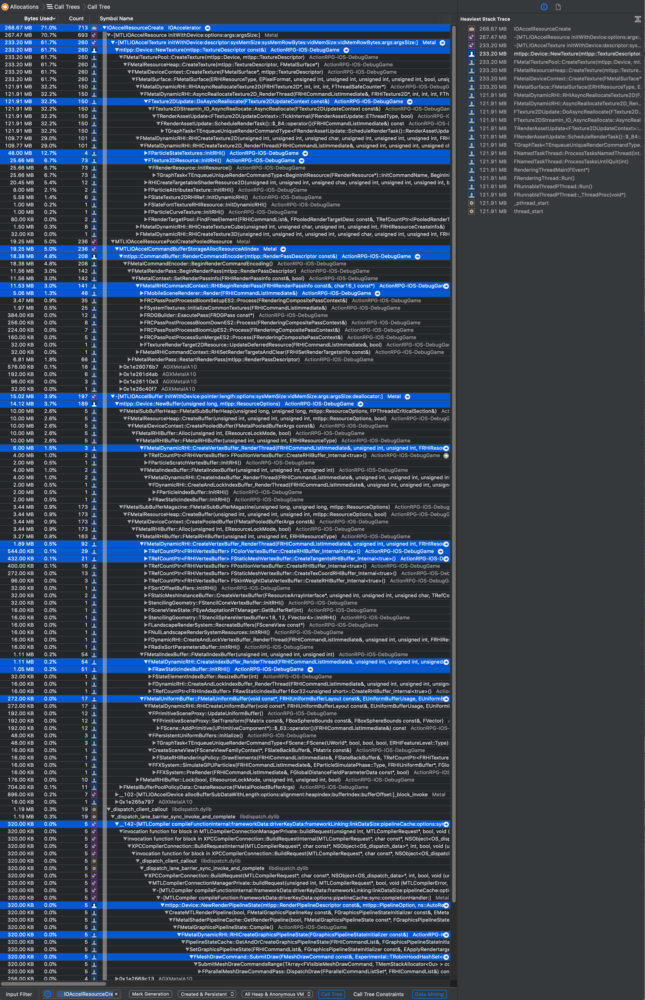


<!--
Rendering resources are allocated in render thread. 80% of memory are allocated from `FRenderAssetUpdate::ScheduleRenderTask()`, while other 20% are spread among different `InitRHI()`s
-->

## Resources and Uniform Buffer

So far, we know Unreal allocates various resources and use `FRenderResource`'s derived implementation to hold the resource reference. But, how does it pass resources from the material shader into the GPU?

Recall in the [Rendering Basics](rendering.md) chapter that Unreal's material has lots of expressions, such as texture sample node. So the key question is, how does one expression relate to the resource?

In `FUniformExpressionSet::FillUniformBuffer()`([link](https://github.com/EpicGames/UnrealEngine/blob/940eb3a4a629936395b5b5ef078792d8679f0cbf/Engine/Source/Runtime/Engine/Private/Materials/MaterialUniformExpressions.cpp#L435)), expressions' value is extracted and fill into `TempBuffer`.

```c++
void FUniformExpressionSet::FillUniformBuffer(const FMaterialRenderContext& MaterialRenderContext, uint8* TempBuffer, ...) const {
	...
	void* BufferCursor = TempBuffer;
	...
	// Dump vector expression into the buffer.
	for(int32 VectorIndex = 0;VectorIndex < UniformVectorExpressions.Num();++VectorIndex) {
		FLinearColor VectorValue(0, 0, 0, 0);
		UniformVectorExpressions[VectorIndex]->GetNumberValue(MaterialRenderContext, VectorValue);

		FLinearColor* DestAddress = (FLinearColor*)BufferCursor;
		*DestAddress = VectorValue;
		BufferCursor = DestAddress + 1;
	}
	// Cache 2D texture uniform expressions.
	for(int32 ExpressionIndex = 0;ExpressionIndex < Uniform2DTextureExpressions.Num();ExpressionIndex++) {
		const UTexture* Value;
		Uniform2DTextureExpressions[ExpressionIndex]->GetTextureValue(MaterialRenderContext,MaterialRenderContext.Material,Value);
		void** ResourceTableTexturePtr = (void**)((uint8*)BufferCursor + 0 * SHADER_PARAMETER_POINTER_ALIGNMENT);
		void** ResourceTableSamplerPtr = (void**)((uint8*)BufferCursor + 1 * SHADER_PARAMETER_POINTER_ALIGNMENT);
		BufferCursor = ((uint8*)BufferCursor) + (SHADER_PARAMETER_POINTER_ALIGNMENT * 2);
		...
		*ResourceTableTexturePtr = Value->TextureReference.TextureReferenceRHI;
		FSamplerStateRHIRef* SamplerSource = &Value->Resource->SamplerStateRHI;
		*ResourceTableSamplerPtr = *SamplerSource;
	}
	...
}
```

Where dose `TempBuffer` come from? From the call stack below, we can find out.

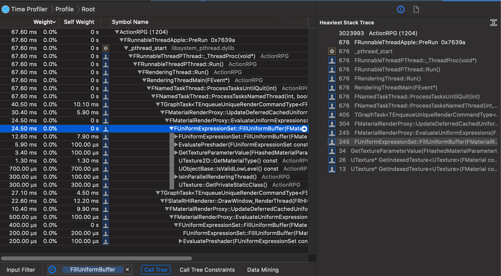

Expressions' value is recoreded in `FMaterialRenderProxy::UniformExpressionCache[]`([link](https://github.com/EpicGames/UnrealEngine/blob/534dd2cadda59f8d31f3dd8b80d5cd89f084a4f8/Engine/Source/Runtime/Engine/Public/MaterialShared.h#L1920)). That makes sense, because `FMaterialRenderProxy` is the render proxy of a material.

```c++
/**
 * A material render proxy used by the renderer.
 */
class ENGINE_VTABLE FMaterialRenderProxy : public FRenderResource {
public:
	/** Cached uniform expressions. */
	mutable FUniformExpressionCache UniformExpressionCache[ERHIFeatureLevel::Num];
	/** Cached external texture immutable samplers */
	mutable FImmutableSamplerState ImmutableSamplerState;


	/**
	 * Evaluates uniform expressions and stores them in OutUniformExpressionCache.
	 * @param OutUniformExpressionCache - The uniform expression cache to build.
	 * @param MaterialRenderContext - The context for which to cache expressions.
	 */
	void ENGINE_API EvaluateUniformExpressions(FUniformExpressionCache& OutUniformExpressionCache, const FMaterialRenderContext& Context, class FRHICommandList* CommandListIfLocalMode = nullptr) const;

	virtual bool GetVectorValue(const FMaterialParameterInfo& ParameterInfo, FLinearColor* OutValue, const FMaterialRenderContext& Context) const = 0;
	virtual bool GetScalarValue(const FMaterialParameterInfo& ParameterInfo, float* OutValue, const FMaterialRenderContext& Context) const = 0;
	virtual bool GetTextureValue(const FMaterialParameterInfo& ParameterInfo,const UTexture** OutValue, const FMaterialRenderContext& Context) const = 0;

	// FRenderResource interface.
	ENGINE_API virtual void InitDynamicRHI() override;
	ENGINE_API virtual void ReleaseDynamicRHI() override;
	ENGINE_API virtual void ReleaseResource() override;
	...
private:
	/** 
	 * Tracks all material render proxies in all scenes, can only be accessed on the rendering thread.
	 * This is used to propagate new shader maps to materials being used for rendering.
	 */
	ENGINE_API static TSet<FMaterialRenderProxy*> MaterialRenderProxyMap;
	...
};
```

`FUniformExpressionCache` wraps a `FUniformBufferRHIRef`, which essentially is a reference to `FUniformBufferRHI`([link](https://github.com/EpicGames/UnrealEngine/blob/f1d65a58e687e4b9e0f71d7c661d9460c517e8f7/Engine/Source/Runtime/RHI/Public/RHIResources.h#L363)). 

So, the key question is, what is a uniform buffer?

Unreal uses *Uniform Buffer* to represent *Constant Buffer* and *Resource Table* in RHI. Different graphic API implements `FUniformBufferRHI` to create the actual constant buffer and resource table.

From `UniformExpressionSet::FillUniformBuffer()` above, we know it fills binary streams into the content of `FUniformBufferRHI`. It fills color as value into the binary stream as `FLinearColor`, and it fills texture as pointer `void*` with `TextureReferenceRHI`. Note all `FXXXRHIRef` is of type `TRefCountPtr<XXX>`, and `TRefCountPtr` is just a plain object with only one (RHI object) pointer([link]((https://github.com/EpicGames/UnrealEngine/blob/aa9705149bf144a3d016174ab3ac46b5205ca4f1/Engine/Source/Runtime/Core/Public/Templates/RefCounting.h#L301))) and no virtual methods hence no vtable, hence this pointer is copied into the binary stream . See also [C++ Object Model](http://lifegoo.pluskid.org/upload/doc/object_models/C++%20Object%20Model.pdf) for the C++ memory layout details.

> Which also means, if we need to modify `TRefCountPtr` (What?!), we must keep its memory layout's first word is always this RHI pointer, do not add virtual functions or new data member before this pointer

After the uniform binary stream content is filled, the content is pass to the RHI to create a new, or update an existed, uniform buffer([link](https://github.com/EpicGames/UnrealEngine/blob/5ddcfbc323500f0fdb93a2d1c06cd5cbfb813ca5/Engine/Source/Runtime/Engine/Private/Materials/MaterialShared.cpp#L2383)).

```c++
void FMaterialRenderProxy::EvaluateUniformExpressions(FUniformExpressionCache& OutUniformExpressionCache, const FMaterialRenderContext& Context, ...) const
{
	...
	const FRHIUniformBufferLayout& UniformBufferLayout = UniformExpressionSet.GetUniformBufferLayout();
	FMemMark Mark(FMemStack::Get());
	uint8* TempBuffer = FMemStack::Get().PushBytes(UniformBufferLayout.ConstantBufferSize, SHADER_PARAMETER_STRUCT_ALIGNMENT);

	UniformExpressionSet.FillUniformBuffer(Context, OutUniformExpressionCache, TempBuffer, UniformBufferLayout.ConstantBufferSize);
	
	...

		if (IsValidRef(OutUniformExpressionCache.UniformBuffer)) {
			RHIUpdateUniformBuffer(OutUniformExpressionCache.UniformBuffer, TempBuffer);
		}
		else {
			OutUniformExpressionCache.UniformBuffer = RHICreateUniformBuffer(TempBuffer, UniformBufferLayout, UniformBuffer_MultiFrame);
		}
	...
	OutUniformExpressionCache.bUpToDate = true;
}
```

Note when creating, content binary stream's layout format is also pass to RHI to deserialize the uniform buffer.

Different graphic API has different implementation of `FRHIUniformBuffer`, and holds the actual GPU buffer. 
```c++
class FRHIUniformBuffer : public FRHIResource {
	...
	/** Layout of the uniform buffer. */
	const FRHIUniformBufferLayout* Layout;
	uint32 LayoutConstantBufferSize;
};
```


`FD3D11UniformBuffer`([link](https://github.com/EpicGames/UnrealEngine/blob/bbb956438811f8c7004e9d03eec17e8d83bf7ddb/Engine/Source/Runtime/Windows/D3D11RHI/Public/D3D11Resources.h#L676))'s `Resource` holds the actual D3D11 buffer pointer:
```c++
/** Uniform buffer resource class. */
class FD3D11UniformBuffer : public FRHIUniformBuffer {
public:
	/** The D3D11 constant buffer resource */
	TRefCountPtr<ID3D11Buffer> Resource;
	...
	/** Resource table containing RHI references. */
	TArray<TRefCountPtr<FRHIResource> > ResourceTable;
	...
private:
	class FD3D11DynamicRHI* D3D11RHI;
};
```

`FMetalUniformBuffer`([link](https://github.com/EpicGames/UnrealEngine/blob/ecdba1fc606e95e54cc776a7ee9ae66bed353604/Engine/Source/Runtime/Apple/MetalRHI/Public/MetalResources.h#L1064))'s `Buffer` hold the actual Metal buffer reference which stores the contant value.
```c++
class FMetalRHIBuffer;
class FMetalUniformBuffer : public FRHIUniformBuffer, public FMetalRHIBuffer {
	...
	/** Resource table containing RHI references. */
	TArray<TRefCountPtr<FRHIResource> > ResourceTable;
};

class FMetalRHIBuffer {
	...
	// balsa buffer memory
	FMetalBuffer Buffer;
	// A temporary shared/CPU accessible buffer for upload/download
	FMetalBuffer CPUBuffer;
	/** Buffer for small buffers < 4Kb to avoid heap fragmentation. */
	FMetalBufferData* Data;
	// Initial buffer size.
	uint32 Size;
	...
};
```

In Direct3D, it's created via `FD3D11DynamicRHI::RHICreateUniformBuffer()`([link](https://github.com/EpicGames/UnrealEngine/blob/e99c0b858e283af77f7ca78e249fd6376da0e33d/Engine/Source/Runtime/Windows/D3D11RHI/Private/D3D11UniformBuffer.cpp#L174)),
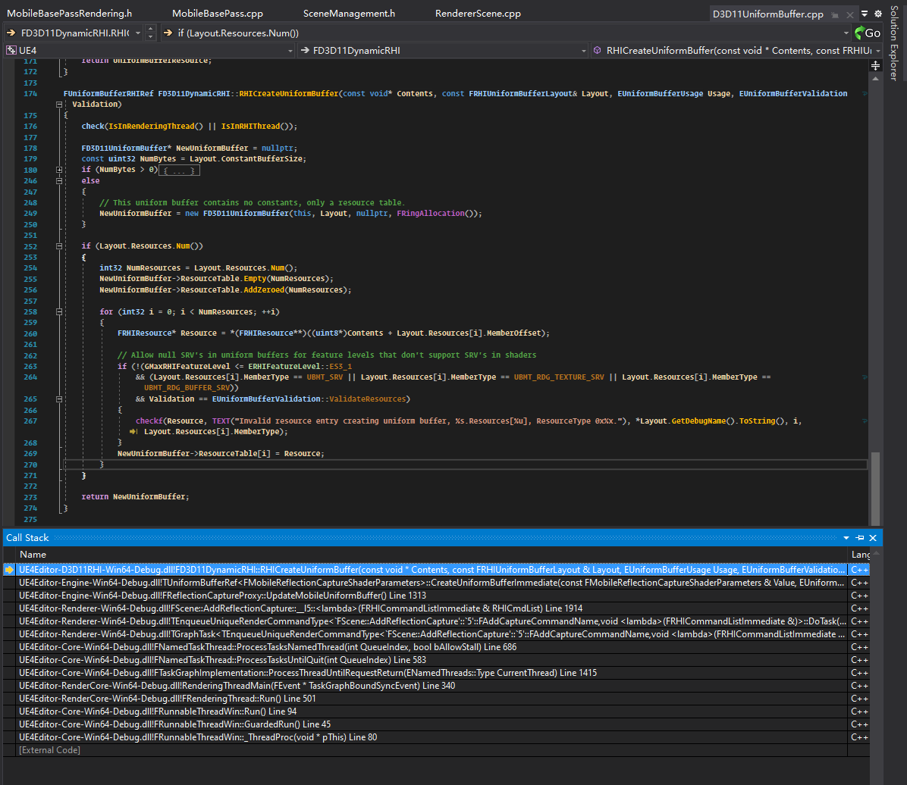

In iOS, `FMetalUniformBuffer::FMetalUniformBuffer()`([link](https://github.com/EpicGames/UnrealEngine/blob/f1d65a58e687e4b9e0f71d7c661d9460c517e8f7/Engine/Source/Runtime/Apple/MetalRHI/Private/MetalUniformBuffer.cpp#L177)) allocates about 120MB memory, which is huge.
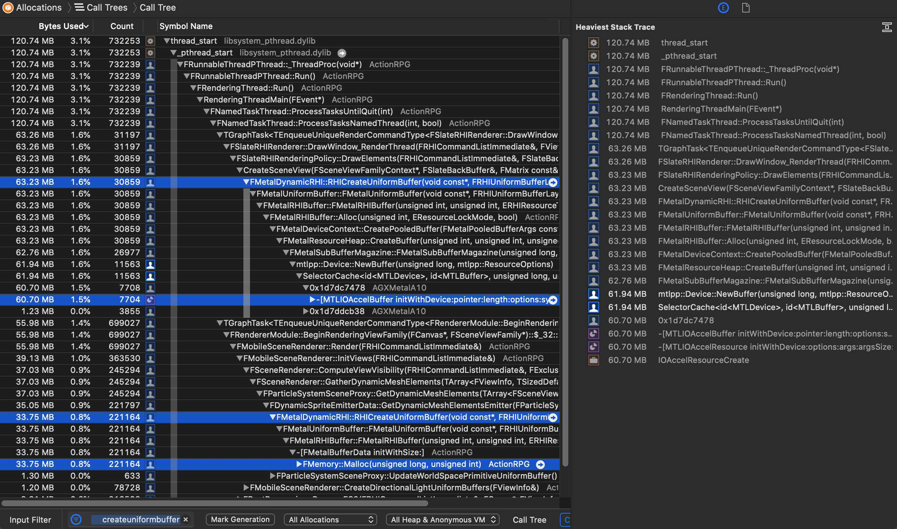

To sum up, again, Unreal uses uniform buffer to reference the constant values buffer and the `FRHIResource` table. The constant value buffer is allocated in the GPU memory. The `ResourceTable` is an `TArray<FRHIResource>` allocated in the heap to store used pointer to the various `FRHIResource` objects, such as `FRHITexture2D`('s actual implementation, e.g. `FMetalTexture2D`).


## Shader Resource Bindings

Now, we've known how various resources are allocated, and how they are recorded in the uniform buffer. The next question is, how does the uniform buffer is chosen, and bind the resource to the GPU. Who does the job to pass the actual resource argument to the shader?

The mechanism *Shader (Resource) binding* binds a shader's resources to the shader.

Shader bindings are stored in `FMeshDrawCommand`, see the ownership chain below,

Shader binding data:

- `FMeshDrawShaderBindings FMeshDrawCommand::ShaderBindings`
- `FData FMeshDrawShaderBindings::Data`([link](https://github.com/EpicGames/UnrealEngine/blob/2336049575bc9eb9ea553045df9b57b75c549a8f/Engine/Source/Runtime/Renderer/Public/MeshPassProcessor.h#L761))

Shader binding layout:

- `FMeshDrawShaderBindings FMeshDrawCommand::ShaderBindings`
- `TArray<FMeshDrawShaderBindingsLayout> FMeshDrawShaderBindings::ShaderLayouts`([link](https://github.com/EpicGames/UnrealEngine/blob/2336049575bc9eb9ea553045df9b57b75c549a8f/Engine/Source/Runtime/Renderer/Public/MeshPassProcessor.h#L745))
- `class FMeshDrawSingleShaderBindings : public FMeshDrawShaderBindingsLayout`
- `const FShaderParameterMapInfo& FMeshDrawShaderBindingsLayout::ParameterMapInfo`

During building the mesh draw commands, `FMeshPassProcessor::BuildMeshDrawCommands<..>()` pulls the shader binding data from the shader, as follows,


`FShaderParameterMapInfo`([link](https://github.com/EpicGames/UnrealEngine/blob/f1d65a58e687e4b9e0f71d7c661d9460c517e8f7/Engine/Source/Runtime/RenderCore/Public/Shader.h#L246)) describes the layout of shader's parameters. It contains parameters' base index and size, of various resources (e.g., Uniform Buffers, Texture Samplers, SRVs and loose parameter buffers). It's generated by shader compilation and reflection, it's serialized into `FShaderResource::ParameterMapInfo` during the game start up or the new level streamed in.

```c++
class FShaderParameterInfo
{
public:
	uint16 BaseIndex;
	uint16 Size;
	...
};
class FShaderParameterMapInfo
{
public:
	TArray<FShaderParameterInfo> UniformBuffers;
	TArray<FShaderParameterInfo> TextureSamplers;
	TArray<FShaderParameterInfo> SRVs;
	TArray<FShaderLooseParameterBufferInfo> LooseParameterBuffers;
	...
};
```

`FMeshDrawShaderBindingsLayout`([link](FMeshDrawShaderBindingsLayout)) references one `FShaderParameterMapInfo` and provides some additional layout accessors.   

```c++
/** Stores the number of each resource type that will need to be bound to a single shader, computed during shader reflection. */
class FMeshDrawShaderBindingsLayout
{
public:
	const FShaderParameterMapInfo& ParameterMapInfo;
	...
protected:
	inline uint32 GetUniformBufferOffset() const { return 0; }
	inline uint32 GetSamplerOffset() const
	{
		return ParameterMapInfo.UniformBuffers.Num() * sizeof(FRHIUniformBuffer*);
	}
	...
	friend class FMeshDrawShaderBindings;
};
```

`FMeshDrawSingleShaderBindings`([link](https://github.com/EpicGames/UnrealEngine/blob/f1d65a58e687e4b9e0f71d7c661d9460c517e8f7/Engine/Source/Runtime/Renderer/Public/MeshDrawShaderBindings.h#L93)) inherits from `FMeshDrawShaderBindingsLayout`, and does the actual resource binding according to the layout. Its `Data` is a pointer to the `FMeshDrawShaderBindings::Data`([link](https://github.com/EpicGames/UnrealEngine/blob/2336049575bc9eb9ea553045df9b57b75c549a8f/Engine/Source/Runtime/Renderer/Public/MeshPassProcessor.h#L761)), which is a binary stream recording shader resources' references. And its binding methods accept *Shader Resource Parameter* and the resource (value or pointer) and do the actual binding.

```c++
class FMeshDrawSingleShaderBindings : public FMeshDrawShaderBindingsLayout
{
private:
	uint8* Data;

public:
	template<typename UniformBufferStructType>
	void Add(const TShaderUniformBufferParameter<UniformBufferStructType>& Parameter, const TUniformBufferRef<UniformBufferStructType>& Value)
	{
		...
		// writes value to `Data` with correct offset
		WriteBindingUniformBuffer(Value.GetReference(), Parameter.GetBaseIndex());
	}
	...
	void AddTexture(
		FShaderResourceParameter TextureParameter,
		FShaderResourceParameter SamplerParameter,
		FRHISamplerState* SamplerStateRHI,
		FRHITexture* TextureRHI)
	{
		...
		// writes value to `Data` with correct offset
		WriteBindingTexture(TextureRHI, TextureParameter.GetBaseIndex());
		...
		WriteBindingSampler(SamplerStateRHI, SamplerParameter.GetBaseIndex());
	}
	...
};
```

Take the binding method `FMeshDrawSingleShaderBindings::WriteBindingUniformBuffer()`([link](https://github.com/EpicGames/UnrealEngine/blob/e96c209a4caf4de232dffe4c222197a6c7f461dc/Engine/Source/Runtime/Renderer/Public/MeshDrawShaderBindings.h#L287)) for example, it accept the input uniform buffer pointer, and the input parameter's `BaseIndex`, and find the array index in `ParameterMapInfo.UniformBuffers` for corresponding `BaseIndex`. If found, the uniform buffer pointer value is assigned to `Data`.

```c++
inline void WriteBindingUniformBuffer(FRHIUniformBuffer* Value, uint32 BaseIndex)
{
	int32 FoundIndex = -1;

	for (int32 SearchIndex = 0; SearchIndex < ParameterMapInfo.UniformBuffers.Num(); SearchIndex++)
	{
		FShaderParameterInfo Parameter = ParameterMapInfo.UniformBuffers[SearchIndex];

		if (Parameter.BaseIndex == BaseIndex)
		{
			FoundIndex = SearchIndex;
			break;
		}
	}

	// USE: If found the index, the value is written into `Data` with correct index.
	if (FoundIndex >= 0)
	{
		GetUniformBufferStart()[FoundIndex] = Value;
	}
}
```
So, the next 2 key questions are, the begninning and the termination of this shader resource flow:

1. the beginning: how does shader parameter layout (`FShaderParameterMapInfo`) is generated,
1. the termination: how does the shader binding data (`FMeshDrawShaderBindings::Data`, which records constant data and resource referneces) go to GPU.

For the second question, we can know from below image that, in Metal, the `Data` goes into Metal via the following stack, including `FMetalStateCache::CommitResourceTable()` and Metal's enocder set resource APIs.

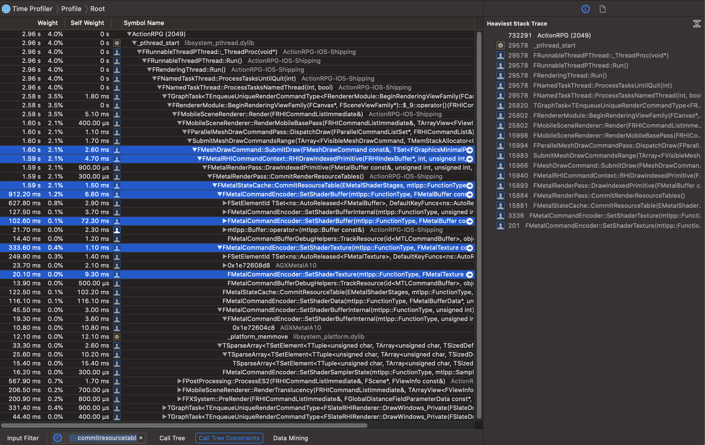
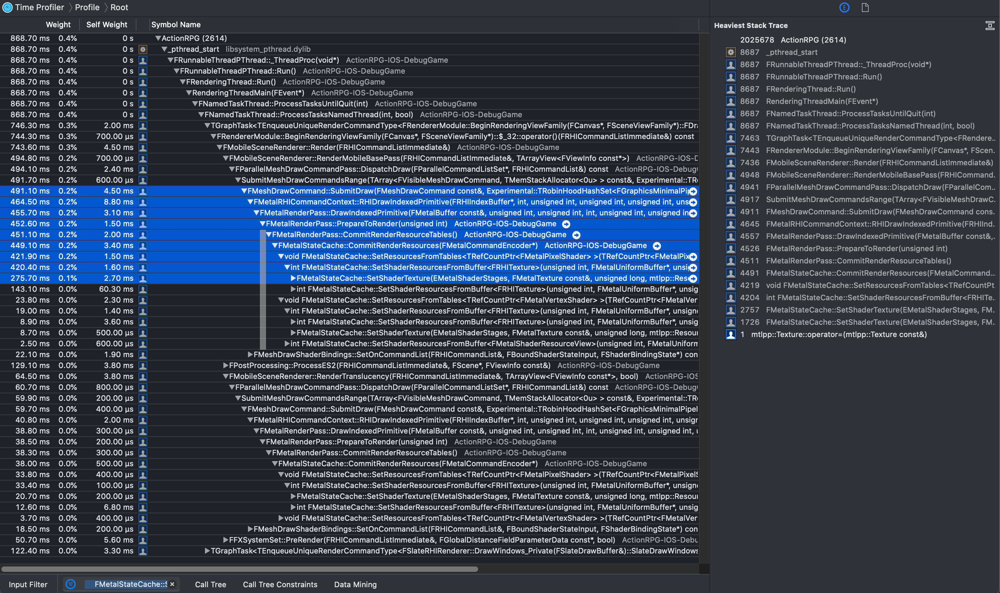

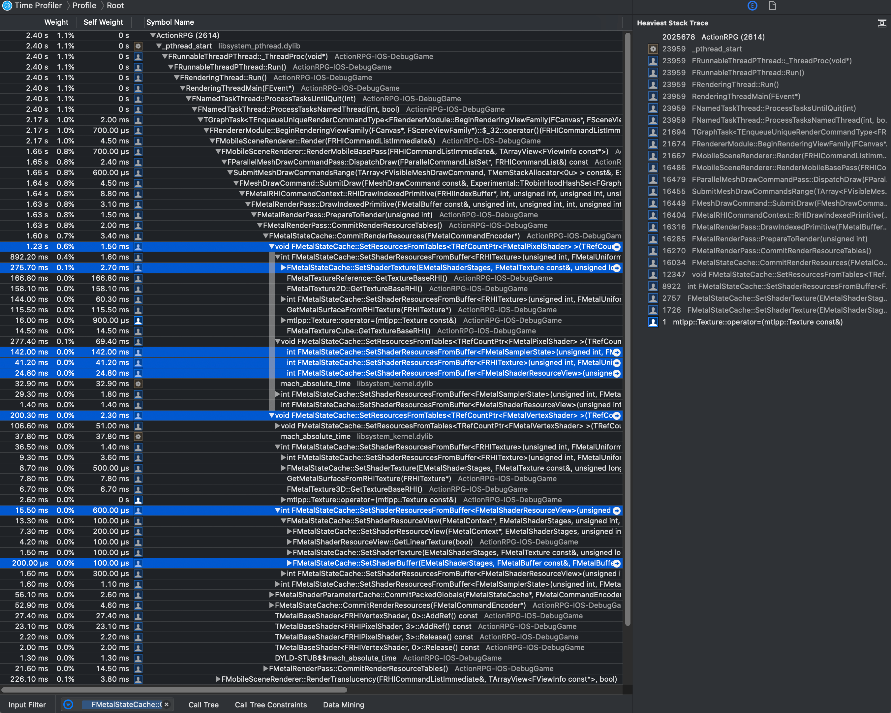


But since `BuildMeshDrawCommands<>()`([link](https://github.com/EpicGames/UnrealEngine/blob/697a6f07ef518d03ef3611efdafc2e9a89b0fc3c/Engine/Source/Runtime/Renderer/Public/MeshPassProcessor.inl#L10)) is the only place that do the shader bindings, how can it handles various different bindings? In fact, it's a template method, the template argument make it possible to handle it, see the snippet below,

```c++
template<typename PassShadersType, typename ShaderElementDataType>
void FMeshPassProcessor::BuildMeshDrawCommands(..., PassShadersType PassShaders, const ShaderElementDataType& ShaderElementData)
{
	...
	if (PassShaders.VertexShader)
	{
		FMeshDrawSingleShaderBindings ShaderBindings = SharedMeshDrawCommand.ShaderBindings.GetSingleShaderBindings(SF_Vertex);
		PassShaders.VertexShader->GetShaderBindings(..., ShaderElementData, ShaderBindings);
	}
	if (PassShaders.PixelShader) { ... }
	...

	const int32 NumElements = MeshBatch.Elements.Num();

	for (int32 BatchElementIndex = 0; BatchElementIndex < NumElements; BatchElementIndex++)
	{
		if ((1ull << BatchElementIndex) & BatchElementMask)
		{
			const FMeshBatchElement& BatchElement = MeshBatch.Elements[BatchElementIndex];
			FMeshDrawCommand& MeshDrawCommand = DrawListContext->AddCommand(SharedMeshDrawCommand);

			if (PassShaders.VertexShader)
			{
				FMeshDrawSingleShaderBindings VertexShaderBindings = MeshDrawCommand.ShaderBindings.GetSingleShaderBindings(SF_Vertex);
				PassShaders.VertexShader->GetElementShaderBindings(..., ShaderElementData, VertexShaderBindings);
			}
			if (PassShaders.PixelShader) { ... }
			...
		}
	}
}
```

Based on the input template argument `PassShadersType` and `ShaderElementDataType`, `BuildMeshDrawCommands<>()` can handle different passes and diffrent shader bindings, by calling the template's. 

Take `TMobileBasePassPSPolicyParamType<FUniformLightMapPolicy>::GetShaderBindings()`([link](https://github.com/EpicGames/UnrealEngine/blob/049c0e99ee7f4ff84404a17ad4b53daa85173daa/Engine/Source/Runtime/Renderer/Private/MobileBasePass.cpp#L433)) for example, which is the most common pixel shader parameter which handles lightmap,

```c++
void FUniformLightMapPolicy::GetPixelShaderBindings(
	const FPrimitiveSceneProxy* PrimitiveSceneProxy,
	const ElementDataType& ShaderElementData,
	const PixelParametersType* PixelShaderParameters,
	FMeshDrawSingleShaderBindings& ShaderBindings)
{
	FRHIUniformBuffer* PrecomputedLightingBuffer = nullptr;
	FRHIUniformBuffer* LightmapResourceClusterBuffer = nullptr;
	FRHIUniformBuffer* IndirectLightingCacheBuffer = nullptr;

	SetupLCIUniformBuffers(PrimitiveSceneProxy, ShaderElementData, PrecomputedLightingBuffer, LightmapResourceClusterBuffer, IndirectLightingCacheBuffer);

	ShaderBindings.Add(PixelShaderParameters->PrecomputedLightingBufferParameter, PrecomputedLightingBuffer);
	ShaderBindings.Add(PixelShaderParameters->IndirectLightingCacheParameter, IndirectLightingCacheBuffer);
	ShaderBindings.Add(PixelShaderParameters->LightmapResourceCluster, LightmapResourceClusterBuffer);
}
```

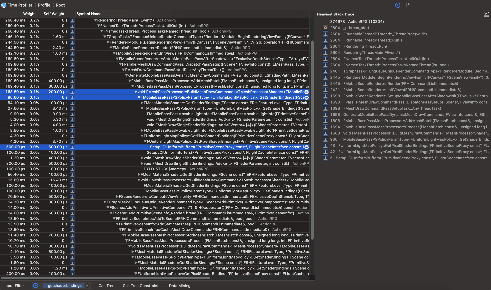

Its `ShaderElementData` is of type `const TMobileBasePassShaderElementData<FUniformLightMapPolicy>&`, therefore, it can handles custom shader bindings about lightmaps, i.e., it calls `FUniformLightMapPolicy::GetPixelShaderBindings()` with `ShaderElementData.LightMapPolicyElementData`.  


Note that the lightmap shader resources is recored in a "uniform buffer", which records resource "handle"s, not the resource data, see the image below,

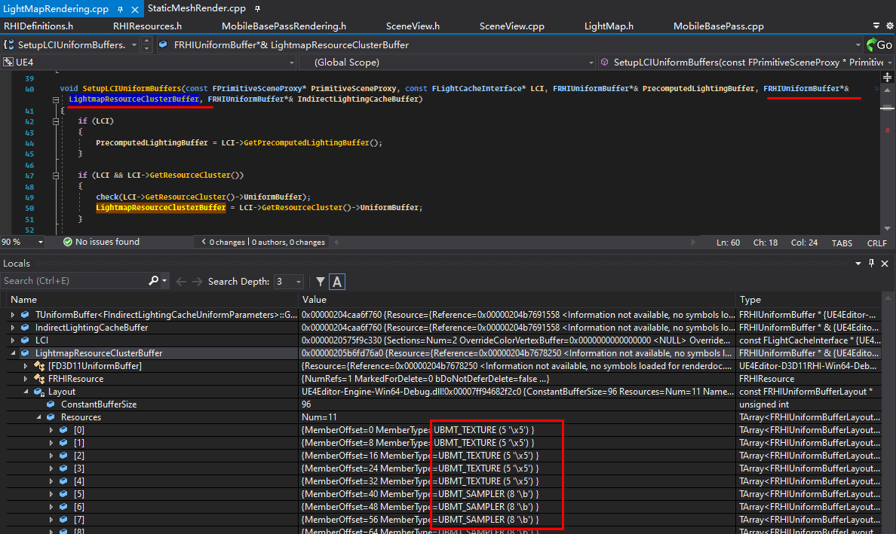

After the uniform buffer pointer is collected, `FUniformLightMapPolicy::GetPixelShaderBindings()` add them into the shader binding with *Shader Parameter* as the key.

The actual lightmap shader parameter is decaled as below([link](https://github.com/EpicGames/UnrealEngine/blob/948dcc11a7aec7a3d4a5a75ce96d56cbdcb45390/Engine/Source/Runtime/Engine/Public/SceneManagement.h#L666)),
```c++
BEGIN_GLOBAL_SHADER_PARAMETER_STRUCT(FLightmapResourceClusterShaderParameters,ENGINE_API)
	SHADER_PARAMETER_TEXTURE(Texture2D, LightMapTexture)
	SHADER_PARAMETER_TEXTURE(Texture2D, SkyOcclusionTexture) 
	SHADER_PARAMETER_SAMPLER(SamplerState, LightMapSampler) 
	SHADER_PARAMETER_SAMPLER(SamplerState, SkyOcclusionSampler) 
	...
END_GLOBAL_SHADER_PARAMETER_STRUCT()
```

That's the boilerplate to declare shader parameters in c++, see macro `BEGIN_SHADER_PARAMETER_STRUCT`([link](https://github.com/EpicGames/UnrealEngine/blob/f1d65a58e687e4b9e0f71d7c661d9460c517e8f7/Engine/Source/Runtime/RenderCore/Public/ShaderParameterMacros.h#L764)) and `BEGIN_GLOBAL_SHADER_PARAMETER_STRUCT`([link](https://github.com/EpicGames/UnrealEngine/blob/f1d65a58e687e4b9e0f71d7c661d9460c517e8f7/Engine/Source/Runtime/RenderCore/Public/ShaderParameterMacros.h#L782)) for more details.


In the end, these parameters are translated into the actual shader parameter, based on the actual graphic API, e.g., Metal in iOS:
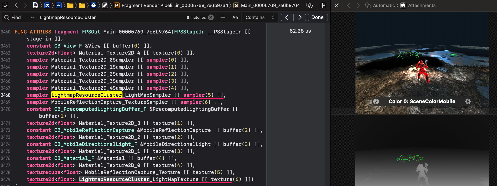
