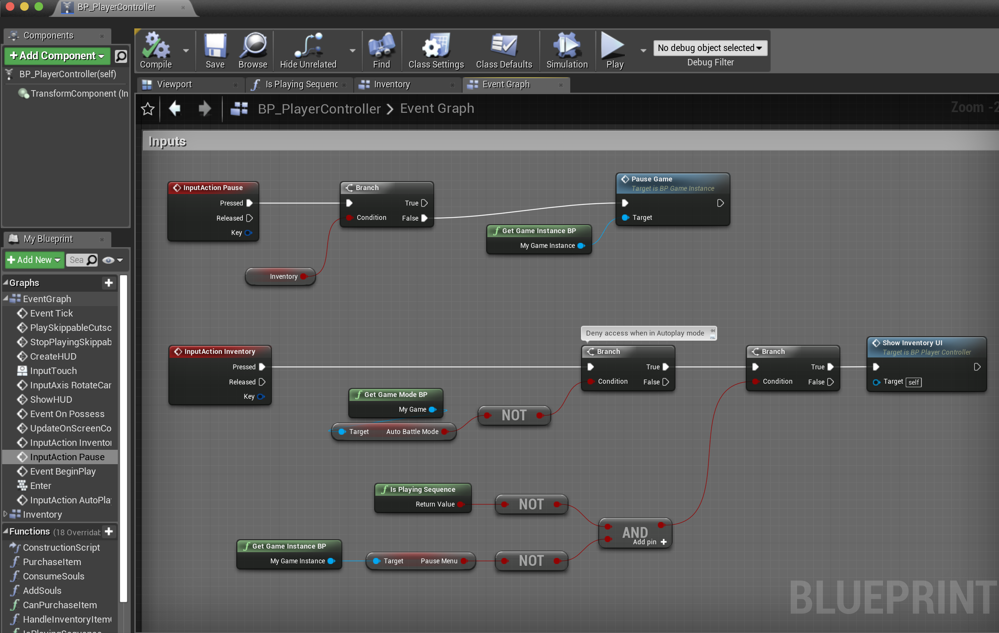
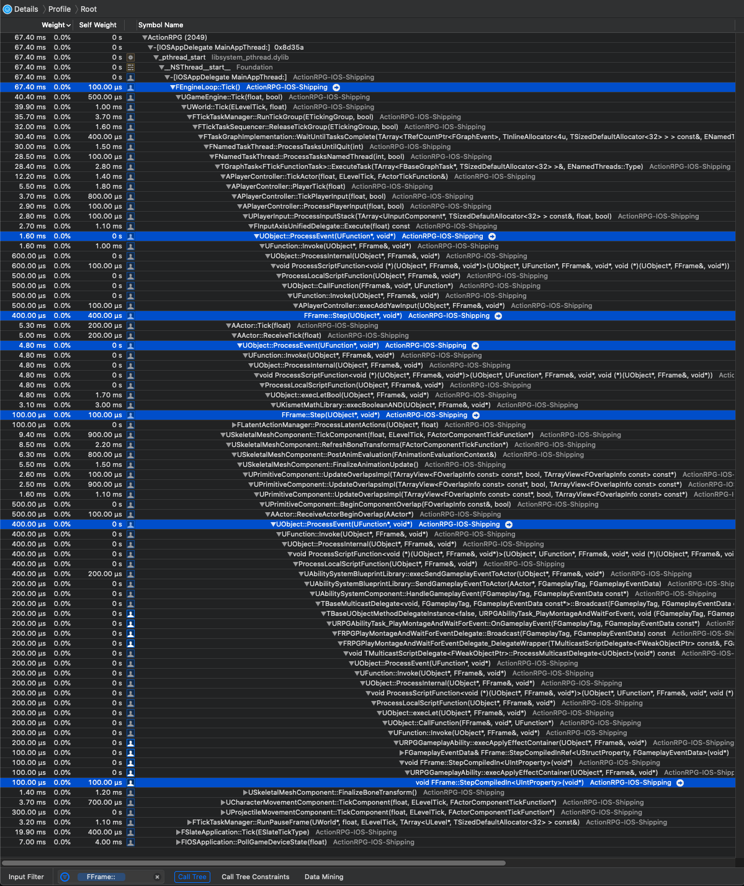

# [WIP] Unreal Source Explained

Unreal Source Explained (USE) is an Unreal source code analysis, based on profilers.  
For full Table of Contents and more infomation, see the [repo](https://github.com/donaldwuid/unreal_source_explained) in github.


# Blueprints Visual Scripting

*[Blueprints](https://docs.unrealengine.com/en-US/Engine/Blueprints/Overview/index.html)* is Unreal's visual scripting, it is usually used to write some high-level logic, such as gameplay, UI, etc.


Blueprints is [*event driven*](https://en.wikipedia.org/wiki/Event-driven_programming), and they usually look like this:

The above image is the a ActionRPG's **BP_PlayerController** blueprints event graphs.  
There are two red titled nodes, which are the events node: **InputAction Pause** and **InputAction Inventory**. Event nodes are the start porint of a graph, hence, there are two graphs in the image. The top graph is handling the logic when the pause event triggers, and the bottom graph is handling the inventory.

Like Java and C# having their [*process virtual machine*](https://en.wikipedia.org/wiki/Virtual_machine#Process_virtual_machines) (or just *virtual machine*, VM), Blueprints is also running on a Unreal implemented virtual machine.   
And the following image is the native call stacks of all blueprints of ActionRPG, including the above **BP_PlayerController**:

Important calls are highlighted. You may observe:
- they all start from `UObject::ProcessEvent()`, and end with `FFrame::StepXX()`;
- `FFrame` appears as the parameter all the way along the call stacks;

`FFrame`([link](https://github.com/EpicGames/UnrealEngine/blob/bf95c2cbc703123e08ab54e3ceccdd47e48d224a/Engine/Source/Runtime/CoreUObject/Public/UObject/Stack.h#L83)) is the most important class for the blueprints VM. It should have a better name **FCallStackFrame** to emphasize its relationship with VM and [*call stack frame*](https://en.wikipedia.org/wiki/Call_stack#Structure): each stack frame corresponds to a call to a subroutine wich has not yet termined with a return.   
Anyway, don't confuse that `FFrame` has nothing to do with rendering frame.  

Here is the key fields and methods of `FFrame`, each of its field is additionally commented:

```c++
//
// Information about script execution at one stack level.
//
struct FFrame : public FOutputDevice
{	
public:
	// Variables.
	// the function that is executing
	UFunction* Node;
	// the object that is executing ("this")
	UObject* Object;
	uint8* Code;
	uint8* Locals;

	/** Previous frame on the stack */
	FFrame* PreviousFrame;

	/** contains information on any out parameters */
	FOutParmRec* OutParms;

	/** Currently executed native function */
	UFunction* CurrentNativeFunction;

	...

public:

	// Constructors.
	FFrame( UObject* InObject, UFunction* InNode, void* InLocals, FFrame* InPreviousFrame = NULL, UField* InPropertyChainForCompiledIn = NULL );
	...

	// Functions.
	COREUOBJECT_API void Step( UObject* Context, RESULT_DECL );

	...
};
```

A `FFrame` holds the `UObject* Object` as the object that is executing, `UFunction* Node` and uses the `FFrame* PreviousFrame` to link to the previous stack frame.

There is actually no a concrete stack container of `FFrame` in runtime. The only two places where create the new `FFrame` are `UObject::ProcessEvent()`([link](https://github.com/EpicGames/UnrealEngine/blob/bf95c2cbc703123e08ab54e3ceccdd47e48d224a/Engine/Source/Runtime/CoreUObject/Private/UObject/ScriptCore.cpp#L1855)) and `ProcessScriptFunction()`([link](https://github.com/EpicGames/UnrealEngine/blob/bf95c2cbc703123e08ab54e3ceccdd47e48d224a/Engine/Source/Runtime/CoreUObject/Private/UObject/ScriptCore.cpp#L715)):

```c++
/*-----------------------------
	Virtual Machine
-----------------------------*/

/** Called by VM to execute a UFunction with a filled in UStruct of parameters */
void UObject::ProcessEvent( UFunction* Function, void* Parms )
{
	...

	uint8* Frame = NULL;
	...
	const bool bUsePersistentFrame = (NULL != Frame);
	if (!bUsePersistentFrame)
	{
		Frame = (uint8*)FMemory_Alloca(Function->PropertiesSize);
		// zero the local property memory
		FMemory::Memzero(Frame + Function->ParmsSize, Function->PropertiesSize - Function->ParmsSize);
	}

	// initialize the parameter properties
	FMemory::Memcpy(Frame, Parms, Function->ParmsSize);

	// Create a new local execution stack.
	FFrame NewStack(this, Function, Frame, NULL, Function->Children);

	...

	// Call native function or UObject::ProcessInternal.
	Function->Invoke(this, NewStack, ReturnValueAddress);
	
	...
}
```

```c++

// Helper function to set up a script function, and then execute it using ExecFtor.
// ...
template<typename Exec>
void ProcessScriptFunction(UObject* Context, UFunction* Function, FFrame& Stack, RESULT_DECL, Exec ExecFtor)
{
	...
	FFrame NewStack(Context, Function, nullptr, &Stack, Function->Children);
	
	...

	if( Function->Script.Num() > 0)
	{
		// Execute the code.
		ExecFtor( Context, NewStack, RESULT_PARAM );
	}
	...
}

```