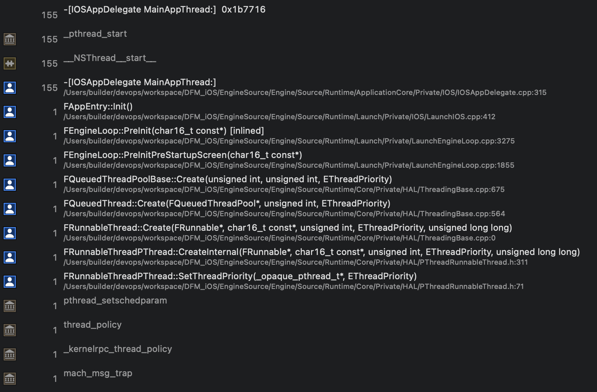
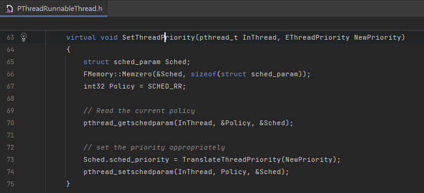
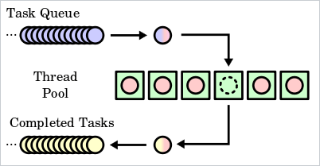
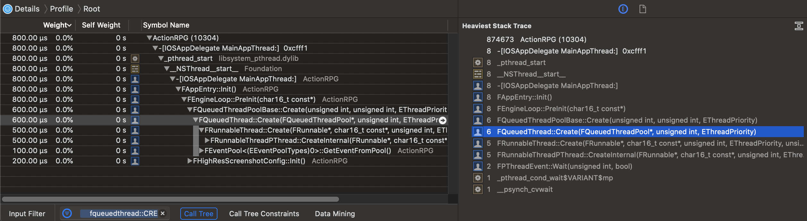
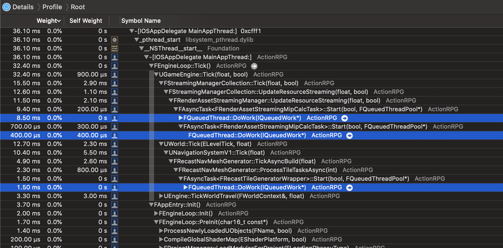
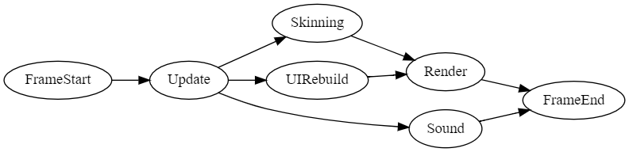
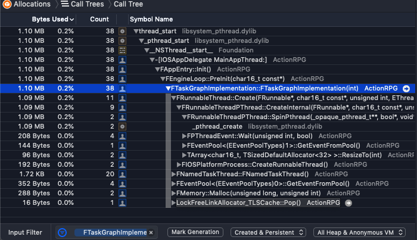
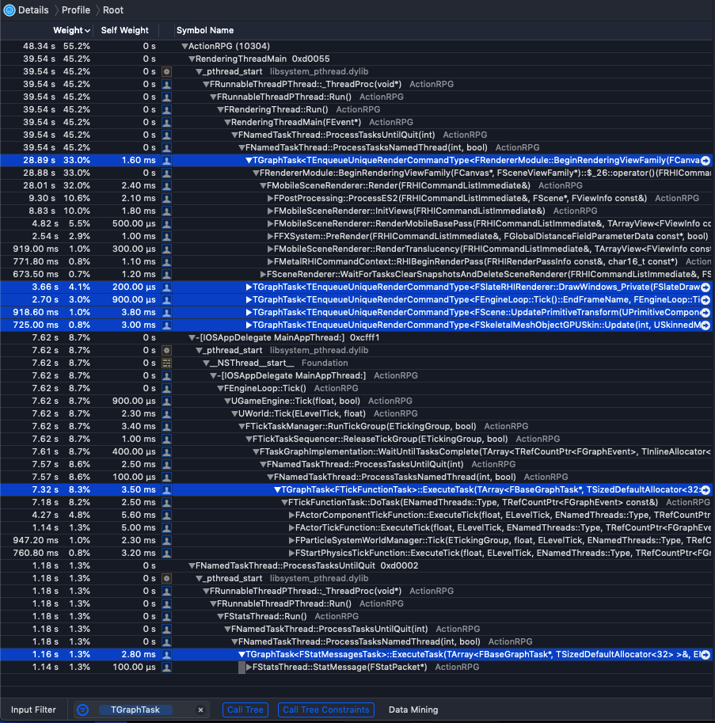

# [WIP] Unreal Source Explained

Unreal Source Explained (USE) is an Unreal source code analysis, based on profilers.  
For full Table of Contents and more infomation, see the [repo](https://github.com/donaldwuid/unreal_source_explained) in github.


# Thread Management

## RunnableThread and Runnable


`FRunnableThread`([link](https://github.com/EpicGames/UnrealEngine/blob/bf95c2cbc703123e08ab54e3ceccdd47e48d224a/Engine/Source/Runtime/Core/Public/HAL/RunnableThread.h#L19)) is a cross platfrom abstract "native thread" interface in Unreal. It has different implementaion in different OS, for example, `FRunnableThreadWin`([link](https://github.com/EpicGames/UnrealEngine/blob/bf95c2cbc703123e08ab54e3ceccdd47e48d224a/Engine/Source/Runtime/Core/Private/Windows/WindowsRunnableThread.h#L22)) in Windows, `FRunnableThreadPThread`([link](https://github.com/EpicGames/UnrealEngine/blob/bf95c2cbc703123e08ab54e3ceccdd47e48d224a/Engine/Source/Runtime/Core/Private/HAL/PThreadRunnableThread.h#L23)) in [POSIX-compliant](https://en.wikipedia.org/wiki/POSIX) OS, i.e., iOS and Android.

`FRunnable`([link](https://github.com/EpicGames/UnrealEngine/blob/bf95c2cbc703123e08ab54e3ceccdd47e48d224a/Engine/Source/Runtime/Core/Public/HAL/Runnable.h#L19))'s inherited class represets the actual running workload, e.g., `FRenderingThread`([link](https://github.com/EpicGames/UnrealEngine/blob/bf95c2cbc703123e08ab54e3ceccdd47e48d224a/Engine/Source/Runtime/RenderCore/Private/RenderingThread.cpp#L394)).

Each `FRunnableThread` runs **one** `FRunnable`.

Take the POSIX `FRunnableThreadPThread` for example, static function `_ThreadProc()`([link](https://github.com/EpicGames/UnrealEngine/blob/bf95c2cbc703123e08ab54e3ceccdd47e48d224a/Engine/Source/Runtime/Core/Private/HAL/PThreadRunnableThread.h#L161)) is the thread entry point and it calls every `FRunnableThreadPThread::Run()`, as follows.
```c++
/**
* The thread entry point. Simply forwards the call on to the right
* thread main function
*/
static void *STDCALL _ThreadProc(void *pThis) {
	FRunnableThreadPThread* ThisThread = (FRunnableThreadPThread*)pThis;
	...
	// run the thread!
	ThisThread->PreRun();
	ThisThread->Run();
	ThisThread->PostRun();

	pthread_exit(NULL);
	return NULL;
}
```


then, `FRunnableThreadPThread::Run()` calls `FRunnable::Run()`([link](https://github.com/EpicGames/UnrealEngine/blob/bf95c2cbc703123e08ab54e3ceccdd47e48d224a/Engine/Source/Runtime/Core/Private/HAL/PThreadRunnableThread.cpp#L25)).

RunnableThread and Runnable is the low-level thread management in Unreal. The following Async Task and Task Graph depend on Runnable.

### Thread priority and affinity

Priority determines **how** threads are scheduled amoung each other, you first? or he first.
Affinity determines **where** threads are running, the performant big core? or the power-efficent little core.

Thread's priority is usually set when they are created, as follow,




at the bottom, priority is set by `FRunnableThreadPThread::SetThreadPriority()`[(link)](https://github.com/EpicGames/UnrealEngine/blob/4.27/Engine/Source/Runtime/Core/Private/HAL/PThreadRunnableThread.h#L63) and it calls UNIX `pthread_setschedparam()` [(link)](https://developer.apple.com/library/archive/documentation/Darwin/Conceptual/KernelProgramming/scheduler/scheduler.html). It translate Unreal's `NewPriority` to platform's actual priority integer, then override current schedule parameter's `sched_priority`. And change the policy to `SCHED_RR` which means [*Round Robin*](https://en.wikipedia.org/wiki/Round-robin_scheduling) and each thread executes in equal time-interval and yield to next thread. Next thread is determined by the priority.



> But is `SCHED_RR` a good default policy for all threads? Maybe we should try `SCHED_OTHER` as default policy, and only set those more-realtime-like threads to be  `SCHED_RR`, such as main thread, render thread (and RHI thread if enabled).


Though Unreal implements thread affinity APIs, it doesn't call them by default and use default thread affinity. You can call them manually.

Android can use `FAndroidPlatformProcess::SetThreadAffinityMask()`[(link)](https://github.com/EpicGames/UnrealEngine/blob/4.27/Engine/Source/Runtime/Core/Private/Android/AndroidPlatformProcess.cpp#L80) to pin thread to a specific CPU core, it internally calls `__NR_sched_setaffinity`.

Though in iOS it also provides `FIOSPlatformProcess::SetThreadAffinityMask()`[(link)](https://github.com/EpicGames/UnrealEngine/blob/4.27/Engine/Source/Runtime/Core/Private/IOS/IOSPlatformProcess.cpp#L109), but note that macOS and iOS doens't support explicit thread to processor binding. They can only use [thread_policy_set()](https://developer.apple.com/library/archive/releasenotes/Performance/RN-AffinityAPI/index.html) to separate threads into different *affinity set*, i.e., threads with different should run on diffrent logical processors. Threads with default affinity are freely scheduled by system and tends to run on idle processors.
## Queued Thread and Async Task
Queued Thread and Async Task is Unreal's [*thread pool*](https://en.wikipedia.org/wiki/Thread_pool) implementation. All kinds of tasks are scheduled among a pool of threads.  


`FQueuedThreadPoolBase`([link](https://github.com/EpicGames/UnrealEngine/blob/bf95c2cbc703123e08ab54e3ceccdd47e48d224a/Engine/Source/Runtime/Core/Private/HAL/ThreadingBase.cpp#L599)) manages this task queue and thread queue, as follow,
```c++
/**
 * Implementation of a queued thread pool.
 */
class FQueuedThreadPoolBase : public FQueuedThreadPool {
protected:
	/** The work queue to pull from. */
	TArray<IQueuedWork*> QueuedWork;
	/** The thread pool to dole work out to. */
	TArray<FQueuedThread*> QueuedThreads;
	/** All threads in the pool. */
	TArray<FQueuedThread*> AllThreads;
	...
};
```

There are 4 threads pools([link](https://github.com/EpicGames/UnrealEngine/blob/bf95c2cbc703123e08ab54e3ceccdd47e48d224a/Engine/Source/Runtime/Core/Private/HAL/ThreadingBase.cpp#L19)) in maximum, but the most important is the `GThreadPool`, which is the default thread pool for most tasks.

`FQueuedThread`([link](https://github.com/EpicGames/UnrealEngine/blob/bf95c2cbc703123e08ab54e3ceccdd47e48d224a/Engine/Source/Runtime/Core/Private/HAL/ThreadingBase.cpp#L462)) inherits from `FRunnable`, it represents the task worker thread. Its `Run()` waits for its `DoWorkEvent`, if signaled, it runs its current `QueuedWork` by calling `IQueuedWork::DoThreadedWork()`, as follow,

```c++
class FQueuedThread : public FRunnable {
protected:
	/** The event that tells the thread there is work to do. */
	FEvent* DoWorkEvent;
	/** The work this thread is doing. */
	IQueuedWork* volatile QueuedWork;
	/** The pool this thread belongs to. */
	class FQueuedThreadPool* OwningThreadPool;
	/** My Thread  */
	FRunnableThread* Thread;

	virtual uint32 Run() override {
		while (!TimeToDie.Load(EMemoryOrder::Relaxed)) {
			// We need to wait for shorter amount of time
			bool bContinueWaiting = true;
			while( bContinueWaiting ) {
				// Wait for some work to do
				bContinueWaiting = !DoWorkEvent->Wait( 10 );
			}

			IQueuedWork* LocalQueuedWork = QueuedWork;
			QueuedWork = nullptr;
			FPlatformMisc::MemoryBarrier();
			while (LocalQueuedWork) {
				// Tell the object to do the work
				LocalQueuedWork->DoThreadedWork();
				// Let the object cleanup before we remove our ref to it
				LocalQueuedWork = OwningThreadPool->ReturnToPoolOrGetNextJob(this);
			} 
		}
		return 0;
	}
	...
	void DoWork(IQueuedWork* InQueuedWork) {
		// Tell the thread the work to be done
		QueuedWork = InQueuedWork;
		FPlatformMisc::MemoryBarrier();
		// Tell the thread to wake up and do its job
		DoWorkEvent->Trigger();
	}
};
```

`FEngineLoop::PreInit()`([link](https://github.com/EpicGames/UnrealEngine/blob/bf95c2cbc703123e08ab54e3ceccdd47e48d224a/Engine/Source/Runtime/Launch/Private/LaunchEngineLoop.cpp#L1804)) calls `FQueuedThreadPoolBase::Create()`([link](https://github.com/EpicGames/UnrealEngine/blob/bf95c2cbc703123e08ab54e3ceccdd47e48d224a/Engine/Source/Runtime/Core/Private/HAL/ThreadingBase.cpp#L655)) to creates `FQueuedThread`s. 


`IQueuedWork`([link](https://github.com/EpicGames/UnrealEngine/blob/bf95c2cbc703123e08ab54e3ceccdd47e48d224a/Engine/Source/Runtime/Core/Public/Misc/IQueuedWork.h#L16)) is the task interface, it can't be any simpler:
```c++
class IQueuedWork {
public:
	virtual void DoThreadedWork() = 0;
	virtual void Abandon() = 0;

public:
	virtual ~IQueuedWork() { }
};
```

<!--
`FQueuedThreadPoolBase` schedules each `IQueuedWork` into a `FQueuedThread`, each time the schedule start one work, it binds the work and thread into the `FQueuedThread`.
-->

`IQueuedWork`'s most important implementation is `FAsyncTask`([link](https://github.com/EpicGames/UnrealEngine/blob/bf95c2cbc703123e08ab54e3ceccdd47e48d224a/Engine/Source/Runtime/Core/Public/Async/AsyncWork.h#L207)).  
`FAsyncTask` is a template class, you can create your own async task class as the sample code in `FAsyncTask`'s comment([link](https://github.com/EpicGames/UnrealEngine/blob/bf95c2cbc703123e08ab54e3ceccdd47e48d224a/Engine/Source/Runtime/Core/Public/Async/AsyncWork.h#L156)). Various specific tasks start their work as the following.



## Task Graph
Parallel programming is hard, multithreaded programming in fine granularity is even harder, because you may spend lots of time to take care of locking, waiting, race condition in every detailed level. 

Task Graph is a parallel programming with coarse granularity, and it handles dependency among async tasks. A simplified task graph of a game may be depicted as follow:



We can divide the whole game into several big tasks, tasks in parallel can shared read some data but never shared write, tasks with dependency must finish in order. 

`FTaskGraphImplementation`([link](https://github.com/EpicGames/UnrealEngine/blob/bf95c2cbc703123e08ab54e3ceccdd47e48d224a/Engine/Source/Runtime/Core/Private/Async/TaskGraph.cpp#L1124)) is the most important manager of Task Graph, it manages an array of `FWorkerThread`s,
```c++
/**
*	FTaskGraphImplementation
*	Implementation of the centralized part of the task graph system.
*	These parts of the system have no knowledge of the dependency graph, they exclusively work on tasks.
**/
class FTaskGraphImplementation : public FTaskGraphInterface {
	...
	/** Per thread data. **/
	FWorkerThread		WorkerThreads[MAX_THREADS];
	/** Number of threads actually in use. **/
	int32				NumThreads;
	/** Number of named threads actually in use. **/
	int32				NumNamedThreads;
	/** Number of tasks thread sets for priority **/
	int32				NumTaskThreadSets;
	/** Number of tasks threads per priority set **/
	int32				NumTaskThreadsPerSet;
	...
}
```

`FWorkerThread`([link](https://github.com/EpicGames/UnrealEngine/blob/bf95c2cbc703123e08ab54e3ceccdd47e48d224a/Engine/Source/Runtime/Core/Private/Async/TaskGraph.cpp#L1100)) is a wrapper of the running thread and the task.
```c++
struct FWorkerThread {
	/** The actual FTaskThread that manager this task **/
	FTaskThreadBase*	TaskGraphWorker;
	/** For internal threads, the is non-NULL and holds the information about the runable thread that was created. **/
	FRunnableThread*	RunnableThread;
	/** For external threads, this determines if they have been "attached" yet. Attachment is mostly setting up TLS for this individual thread. **/
	bool				bAttached;
	...
};
```

`FTaskThreadBase`([link](https://github.com/EpicGames/UnrealEngine/blob/bf95c2cbc703123e08ab54e3ceccdd47e48d224a/Engine/Source/Runtime/Core/Private/Async/TaskGraph.cpp#L396)) implements `FRunnable`, and it has only two inherited class: 
- `FNamedTaskThread`([link](https://github.com/EpicGames/UnrealEngine/blob/bf95c2cbc703123e08ab54e3ceccdd47e48d224a/Engine/Source/Runtime/Core/Private/Async/TaskGraph.cpp#L570)), named task thread runs the engine built-in tasks, there are 5 named thread([link](https://github.com/EpicGames/UnrealEngine/blob/bf95c2cbc703123e08ab54e3ceccdd47e48d224a/Engine/Source/Runtime/Core/Public/Async/TaskGraphInterfaces.h#L51)): `StatsThread`, `RHIThread`, `AudioThread`, `GameThread` and `ActualRenderingThread`.
- `FTaskThreadAnyThread`([link](https://github.com/EpicGames/UnrealEngine/blob/bf95c2cbc703123e08ab54e3ceccdd47e48d224a/Engine/Source/Runtime/Core/Private/Async/TaskGraph.cpp#L838)), unnamed task thread runs the user defined tasks.

They both have its own internal `FThreadTaskQueue` implementation and queue instance as data member. And `FTaskGraphImplementation::QueueTask()` schedues tasks into the corresponding task queues.

```c++
virtual void QueueTask(FBaseGraphTask* Task, ENamedThreads::Type ThreadToExecuteOn, ENamedThreads::Type InCurrentThreadIfKnown = ENamedThreads::AnyThread) final override {
	...
	ENamedThreads::Type CurrentThreadIfKnown;
	if (ENamedThreads::GetThreadIndex(InCurrentThreadIfKnown) == ENamedThreads::AnyThread) {
		CurrentThreadIfKnown = GetCurrentThread();
	}
	else {
		CurrentThreadIfKnown = ENamedThreads::GetThreadIndex(InCurrentThreadIfKnown);
		checkThreadGraph(CurrentThreadIfKnown == ENamedThreads::GetThreadIndex(GetCurrentThread()));
	}
	{
		int32 QueueToExecuteOn = ENamedThreads::GetQueueIndex(ThreadToExecuteOn);
		ThreadToExecuteOn = ENamedThreads::GetThreadIndex(ThreadToExecuteOn);
		FTaskThreadBase* Target = &Thread(ThreadToExecuteOn);
		// POI begin
		if (ThreadToExecuteOn == ENamedThreads::GetThreadIndex(CurrentThreadIfKnown)) {
			Target->EnqueueFromThisThread(QueueToExecuteOn, Task);
		}
		else {
			Target->EnqueueFromOtherThread(QueueToExecuteOn, Task);
		}
		// POI end
	}
}
```

Named task thread are created in various places. But the unnamed task threads are created inside the constructor([link](https://github.com/EpicGames/UnrealEngine/blob/bf95c2cbc703123e08ab54e3ceccdd47e48d224a/Engine/Source/Runtime/Core/Private/Async/TaskGraph.cpp#L1200)) of `FTaskGraphImplementation`, we can observe this by the thread creation([link](https://github.com/EpicGames/UnrealEngine/blob/bf95c2cbc703123e08ab54e3ceccdd47e48d224a/Engine/Source/Runtime/Core/Private/Async/TaskGraph.cpp#L1253)):




You can create your own task as the demo code in `TGraphTask`'s comment([link](https://github.com/EpicGames/UnrealEngine/blob/bf95c2cbc703123e08ab54e3ceccdd47e48d224a/Engine/Source/Runtime/Core/Public/Async/TaskGraphInterfaces.h#L698)). Keep in mind that the task argument can not be references, but pointer is OK.  
The following image is the call stacks filtered by "TGraphTask", you may notice the both the render thread and the game thread use the task graph to accomplish many important tasks, even include the world ticking.

